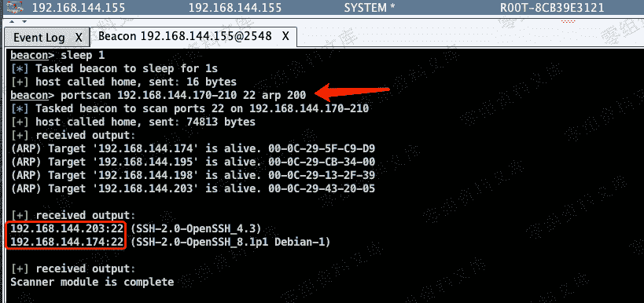
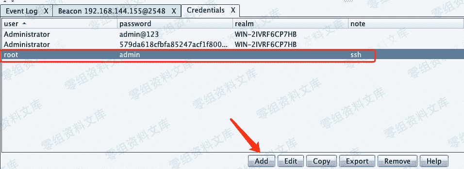
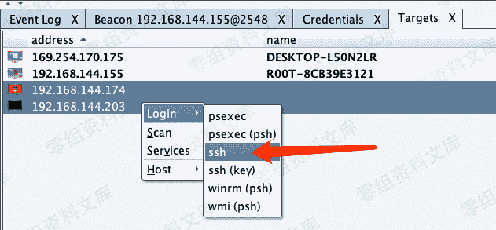
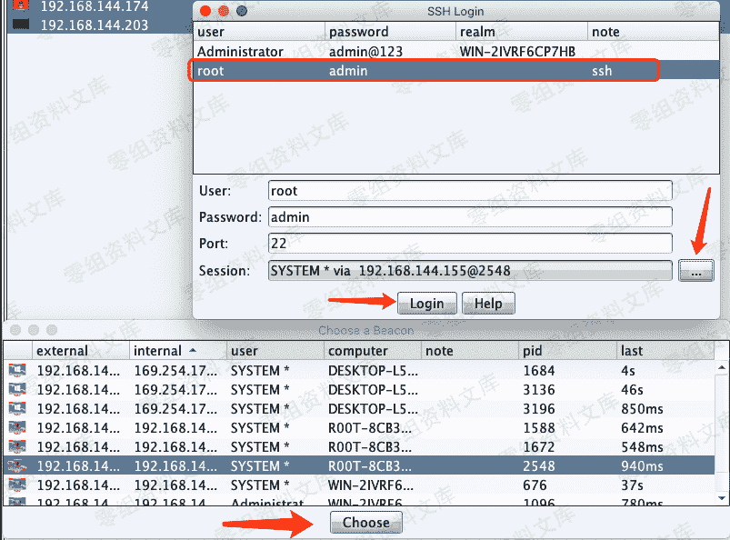
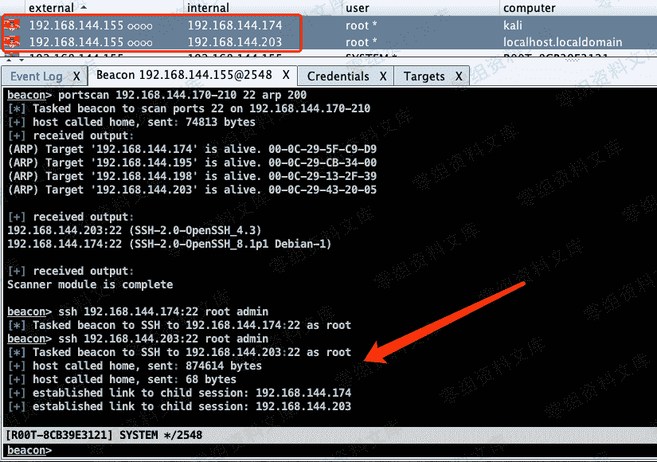
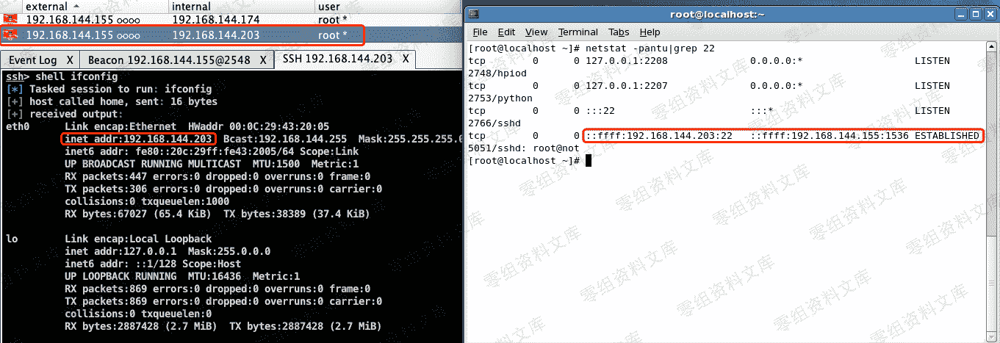

# Cobalt Strike SSH 登录

> 原文：[http://book.iwonder.run/Tools/Cobalt Strike/8.html](http://book.iwonder.run/Tools/Cobalt Strike/8.html)

ssh 批量登录比较简单，同样利用当前已上线的目标机进行登录。

```
beacon> portscan 192.168.144.170-210 22 arp 200 
```



> 在 Credentials 中添加 ssh 的口令信息。（ssh 口令可事先通过其他方式获取，不建议用此工具进行 ssh 爆破，效率慢）



> 选择 Login–>ssh 登录。



> 选择刚添加的 ssh 口令，主机 Session，即从哪台主机连接过去。



> ssh 成功登录后，就实现了 Linux 目标机的上线，在 Beacon 中可以看到执行的命令。若需要上线的 Linux 主机不多，可直接在 Beacon 中执行命令。



> 在 Linux 目标机中查看网络连接状态，实际是与之前已上线的 Windows 主机建立的连接。



