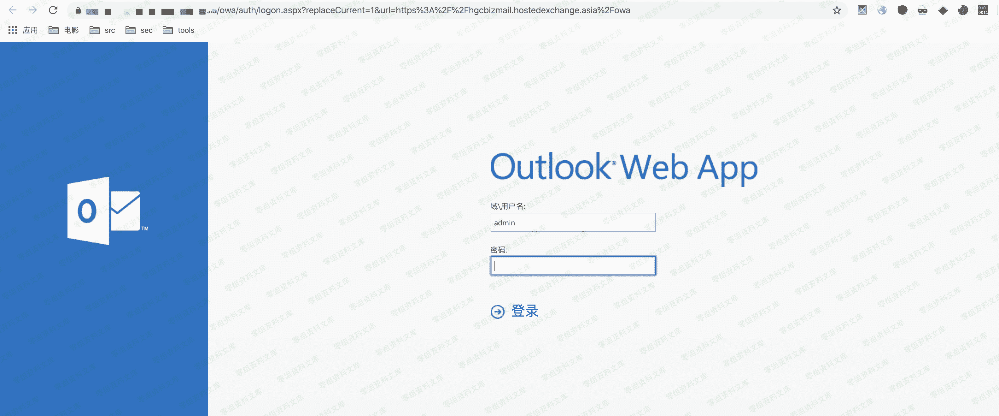
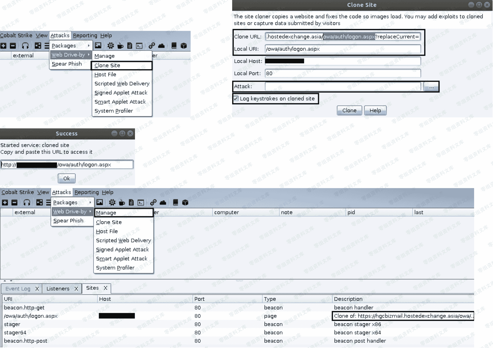

> 原文：[http://book.iwonder.run/Tools/Cobalt Strike/19.html](http://book.iwonder.run/Tools/Cobalt Strike/19.html)

## 利用钓鱼页面来搜集目标 owa 入口账号密码

用于演示的 owa 入口实例,如下:

```
https://0-sec.org/owa/auth/logon.aspx?replaceCurrent=1&url=https%3A%2F%2Fhgcbizmail.hostedexchange.asia%2Fowa 
```

> 原本的真网站长这个样子



> 既然是利用钓鱼页面来盗取账号密码,首先,肯定得先有个钓鱼页面才行,而在 CobaltStrike 中默认提供了一个 Clone Site 模块,就是专门用来干这事儿的,接着我们就来简单看下具体怎么用,其实非常简单,依次点击 "Attacks" -> " Web Drive-by" -> " Clone Site" 之后会弹出右边的对话框,在"Clone URL"中填上要克隆的页面的真实 url, "Local URL" 则是指定本地 url,这个尽量要和真实目标 url 保持像一点才行, "Local Host"保持默认, "Local Port" 保持默认, "Attack"的意思就是用指定的 CobaltStrike 链接[比如,选择我们之前生成的那个探针链接]去替换钓鱼页面中的所有链接[其实就是替换 a 标签中 href 的内容],这样不管目标点击钓鱼页面中的哪个链接时都会先跳到我们的恶意链接上,至于这个恶意链接是探针还是个木马下载链接,就完全看你的实际目的了,最后,记得把最下面的键盘记录选项也勾上,勾上这个以后,当目标访问我们的钓鱼页面从键盘上所输入的所有数据都会被回传至我们的 C2 服务器上,也正是通过这种方式来实现的实时键盘记录,其实本质就是用 js[不停捕捉键盘事件]回传的



> 最终生成好的钓鱼页面大概就是如下这个样子,之后的事情就是想办法把这个链接发给目标让他能看到点上就行

```
http://23.16.73.89/owa/auth/logon.aspx 
```

> 这是我们克隆的假网站


> 在目标点开了我们发给他的钓鱼页面链接,正常输入账号密码之后,CobaltStrike 团队服务器马上就会接收到他所键入的数据,如下,此时他只要一点击登录,就会跳到原来真实的入口链接上,对于一个非专业人员来讲,他可能并不太会去特别注意那个 url 的跳转变化,可能他会觉得只是刚刚密码输错了而已,但其实我们此时已经成功拿到了他的密码,目的已达成


