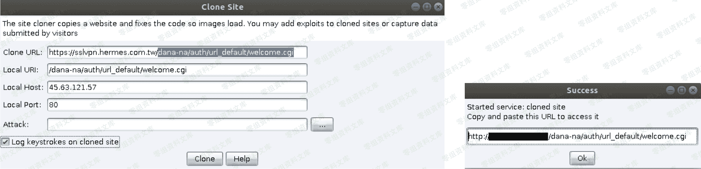

> 原文：[http://book.iwonder.run/Tools/Cobalt Strike/20.html](http://book.iwonder.run/Tools/Cobalt Strike/20.html)

## 利用钓鱼页面来搜集目标各类 vpn 入口账号密码

> 用于演示的 cisco vpn 入口实例,如下:

```
https://www.0-sec.org/dana-na/auth/url_default/welcome.cgi 
```

> 原本的真网站长这个样子


> 具体配置还是跟上面一模一样的流程,只不过这次换成了 vpn 入口的钓鱼页面



最终的 vpn 入口钓鱼页实际效果,如下

```
http://23.16.73.89:80/dana-na/auth/url_default/welcome.cgi 
```

> 这是我们克隆的假网站


> 当目标正常访问钓鱼页面并输入账号密码后,我们这边正常捕捉到账号密码数据


