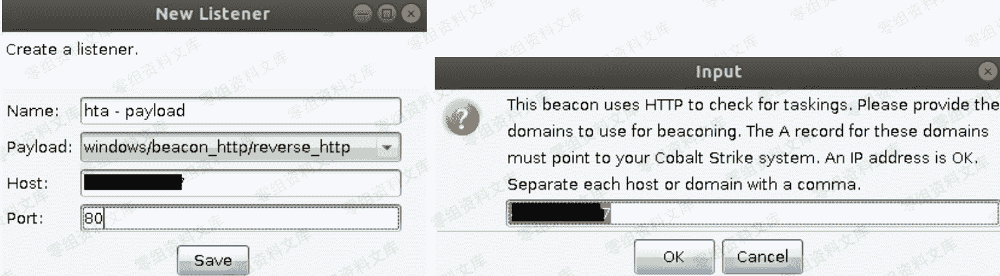
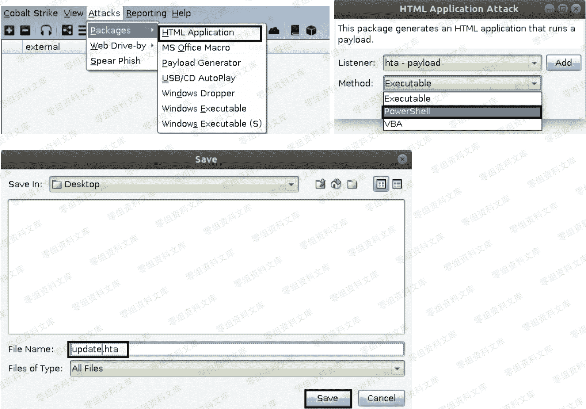
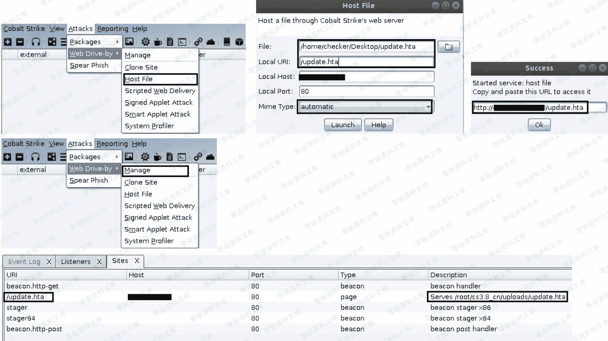
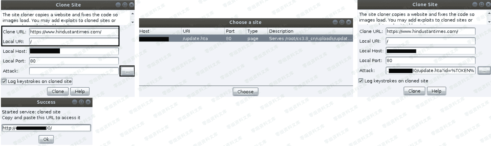
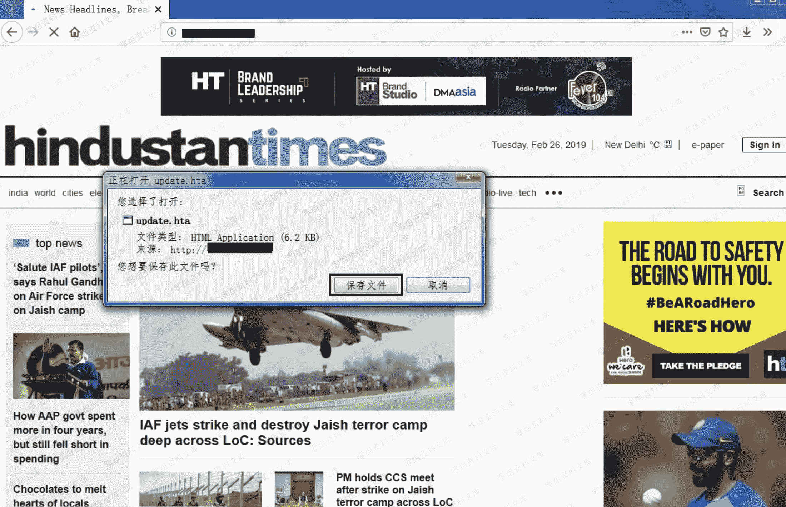
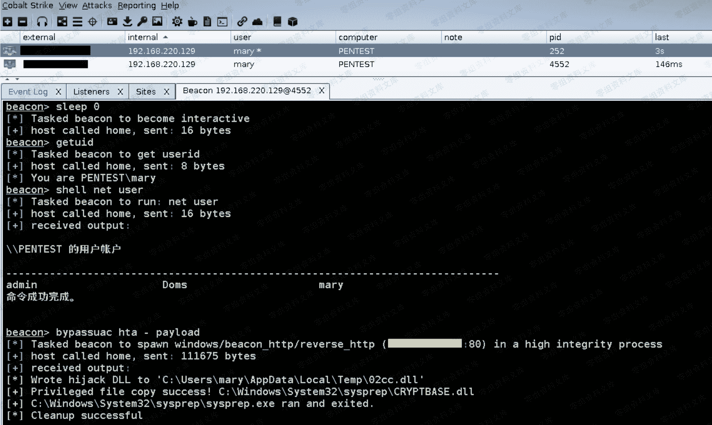
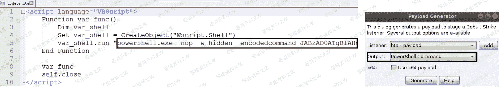

# Cobalt Strike 网页挂马

> 原文：[http://book.iwonder.run/Tools/Cobalt Strike/22.html](http://book.iwonder.run/Tools/Cobalt Strike/22.html)

## 第一步,先准备好木马 [ 即 payload ] 链接

> 创建监听器



> 由于是网页挂马,所以此处我们就直接生成一个 hta 的 payload, "Method "选择用 "PowerShell" [ win7 之后的系统建议直接用"powershell"],默认的"Executable"是利用 vbs 执行 shellcode[这对于一些老系统也许还行,但对于 win7 之后的系统执行会有些问题] ,生成过程如下



> 接着,利用 CobaltStrike 自带的"host file" [ 其实就相当于 CobaltStrike 自带的一个 web 服务器 ] 功能,把刚刚生成好的 hta payload 挂上去,生成钓鱼链接,当然啦,你也可以不用 hta,利用前几天爆的那个 winrar 的目录穿越漏洞挂个带马的 rar 压缩包上去也是一样的,都是一些实际利用思路,作为入门,我们大可先不用考虑那么多,还是那句话,先把工具走通,然后再学会变通,后面自然就游刃有余



> 最终生成的 payload 链接如下

```
http://71.26.83.17:80/update.hta 
```

## 第二步,准备钓鱼页面

> 具体步骤还还跟之前一样,只不过,这里多了一点,需要你在"Attack "那里,选择刚刚上面生成的那个 payload 链接,因为我们的最终目的是要挂马



> 最终生成的钓鱼页面链接如下

```
http://23.16.73.89:80 
```

## 第三步,想办法把这个 payload 链接发给目标

> 当目标一打开我们发给它的链接之后,就会自动提示下载 payload,实际效果如下



> 如果此时目标由于粗心或者误操作,万一真的就执行了我们的 hta payload,那后果可想而知,实战中,我们肯定也不会去直接用 bat,hta,vbs 或者 exe 之类的敏感后缀,现在是个浏览器都会弹个很醒目的框提示你风险,这样目标一看到很可能就不会去点了,实际上弄个压缩包都比这个好,当然啦,我们此处的目的还是为了让大家对一些基础钓鱼流程有个最简单的认知即可,照顾到一些新手朋友,暂时不去涉及的太多


> 特别注意,如果目标是像上面那样执行的 payload,那么弹回的这个 beacon shell 默认是没有被 bypassUAC 的,也就是说,接下来会有很多特权操作我们是没法做的,比如,抓个明文密码或者 hash,所以,得想办法先 bypass 一下 UAC 才行,此处可以直接用 cobaltstrike 自带的 bypassUAC 功能来尝试弹回一个有真正管理权限的 beacon shell,当然啦,因为是入门学习,目标机器上没有任何防护杀毒,直接这样 bypas 就可以把 beacon 弹回来,但实战中,几乎是不可能的,杀软肯定会拦截类似的权限提升操作,弟兄们知道便可,先不用想那么多,如下



> 最后,我们不妨再来简单看下这个 hta payload 里到底都是些什么东西,如下已经很明显了,其实就是利用 vbs 来执行 powershell payload,跟我直接生成的 powershell payload 并没有太大差别



