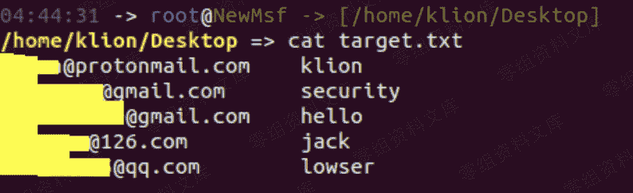
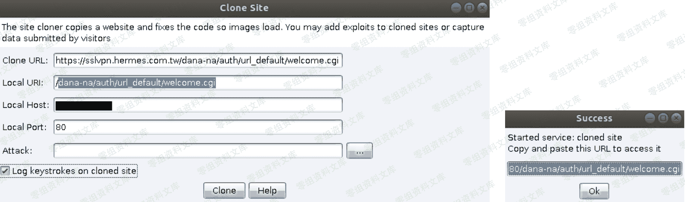
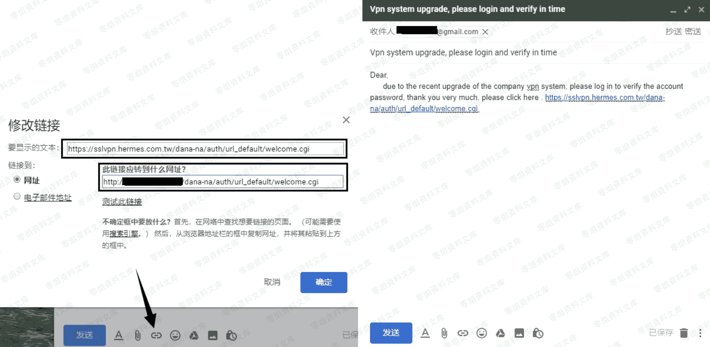
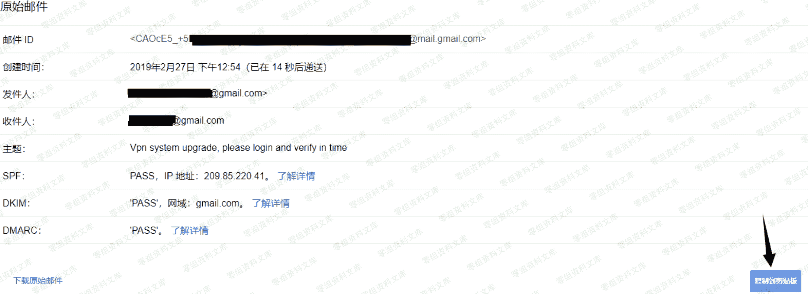
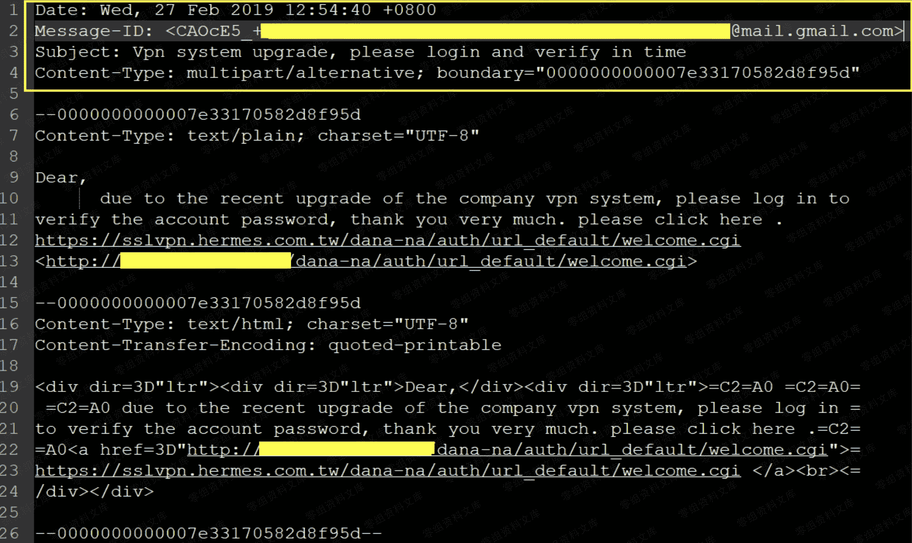
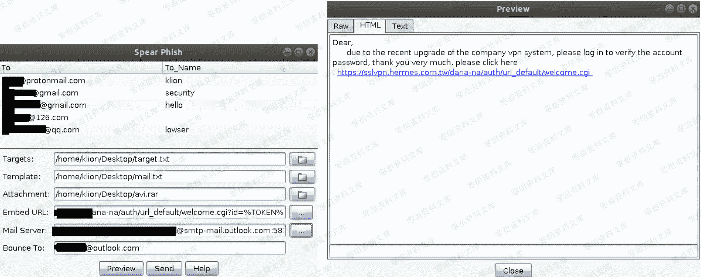
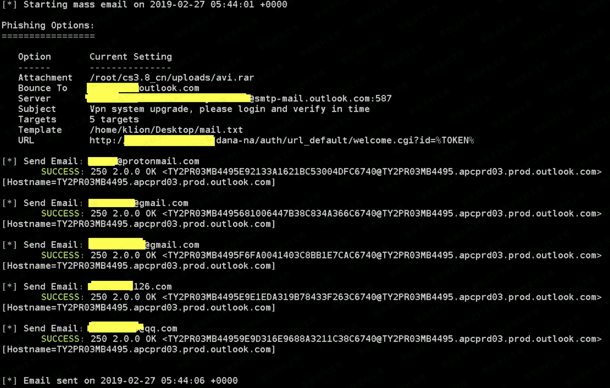
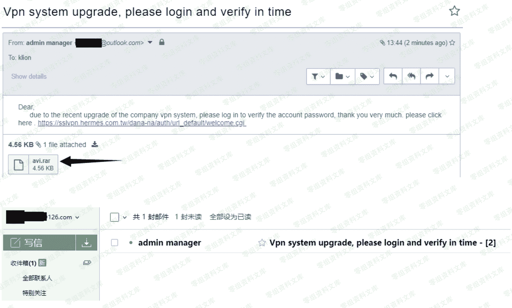

# Cobalt Strike 批量发送钓鱼邮件

> 原文：[http://book.iwonder.run/Tools/Cobalt Strike/23.html](http://book.iwonder.run/Tools/Cobalt Strike/23.html)

## 第一步,先准备好目标的邮箱列表

> 特别注意下此处的书写格式,前面是目标邮箱,后面紧跟着一个 TAB 键然后才是你想要的人名

```
# cat target.txt 
```



## 第二步,开始准备邮件模板和带有 payload 的附件

> 这个邮件模板具体改怎么搞呢? 其实有个很简单的方法,就是你可以先用自己的 gmail 或者其它任意邮箱,把钓鱼邮件先写好,然后随便给自己的另外一个邮箱先发一封[ 注: 此处全部暂以 gmail 为例再操作 ],然后再把收到的这个邮件的源码给抠出来再稍微处理下就是钓鱼模板了,因为此处还要发钓鱼链接,所以我们需要事先把这个钓鱼链接也一并准备好,如何生成钓鱼链接就不多说了,之前的文章已有详细说明



> 最终生成的钓鱼链接如下

```
http://12.91.67.23:80/dana-na/auth/url_default/welcome.cgi 
```

> 接下来的事情就很明了了,无非就是根据之前期搜集到的各种目标信息,想办法写钓鱼信,具体该怎么写,则要根据你自己的实际情况来,此处只是个简单的 demo,纯粹就是为了给弟兄们演示效果用的,切莫直接用于实战,写信的过程中唯一需要注意的就是, "要显示的文本" 那个地方要写真实的链接,而" 链接到" 则要写我们上面准备好的那个钓鱼链接,这样一来,只要不是专业人员看到这个链接都不会有太大的怀疑,写完信之后,把它发到我们的另一个 gmail 邮箱里



> 然后我们到另一个 gmail 邮箱去收信,看到的就是如下这个样子,当然啦,信内容确实比较简单,实战中也肯定不能这么干,此处主要目的还是为了快速给大家演示一下实际的发信效果,所以就没必要弄得那么精致了, 点击"显示原始邮件"


> 将原始邮件复制到剪切板上,因为我们后续还要再稍微处理下



> 处理过程也很简单,只需留下标题和正文就行,邮件头中的内容全部删掉即可,而后再将其另存为 txt,等会儿我们就用这个来作为发信模板



## 第三步,批量发送钓鱼信

> 在 cobaltStrike 中默认为我们提供了一个可用于批量发送钓鱼邮件的功能,即"Spear Phish",其实说白点,没啥实际的技术含量,无非就是要你指定一个 smtp 服务器的 ip,端口,一个有效的邮箱账号密码,然后就可以用这个邮件服务器来发信了,就这么简单,py 十来行代码足矣搞定,不同于之处就在于这个是用 java 写的,而且给你画了个好看的界面,看着更加友好易用了,仅此而已


> 大致介绍完咱们现在就来看下具体怎么去配置这个 smtp [ 因为是学习,此处我们就直接用 outlook 来发信,实战中你可以自己想办法去搭建邮件服务器来发,这样效果会相对更好一点,只是搭建油服的过程比较蛋疼一点]:

```
Targets 选择上面准备好的那个目标邮箱列表文件
Template 选择上面准备好的那个钓鱼邮件模板
Attachment 选择带有 payload 的 rar 压缩包 [比如,可以用最近的 rar 目录穿越漏洞来搞]
Embed URL 用上面准备好的那个钓鱼链接来替换邮件原文中所有 a 标签中的 href 地址
Mail server 指定用于发信的 smtp 服务器,因为此处我们是直接用 outlook 来发的,所以你只需指定 outlook smtp 域名,端口和你自己的 outlook 账号密码即可,当然啦,实战中肯定是要用匿名邮箱来发的,不可能直接用自己的
Bounce to 此处最好和你用于发信的那个邮箱完全保持一致,不然邮件可能发不出去 
```


> 一切配置准备完毕之后,不妨先来预览"Preview"下邮件正文效果,看到如下,没什么问题,就可以尝试点击"Sent"了



> 以下便是邮件发送成功后的实际效果



> 最后,我们再到各个邮箱去看看,刚发的钓鱼邮件到底有没有正常过来,很显然,已全部正常到达目标收件箱,特别注意 是正常达到收件箱而非垃圾箱




> 从上面我们看到,邮件附件和链接都是正常到达目标收件箱的,不妨顺手点下那个链接试试看,如下,也正如我们预期的那样,正常跳到了我们的钓鱼页面上,至此,一次相对完整的钓鱼邮件发送过程基本就算完了,之后的事情就是再想办法将之前提到的探针,payload 链接一并整合利用起来,便是一次相对完整的钓鱼攻击过程了,ok,都比较简单,就不多废话了,弟兄们一点点灵活变通就好了,确实也没啥太多的难点在里面


