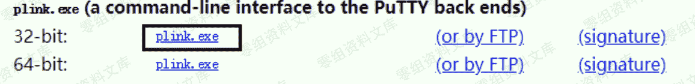
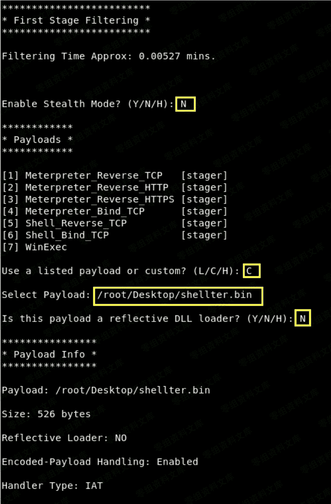
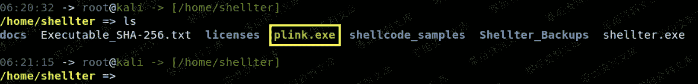
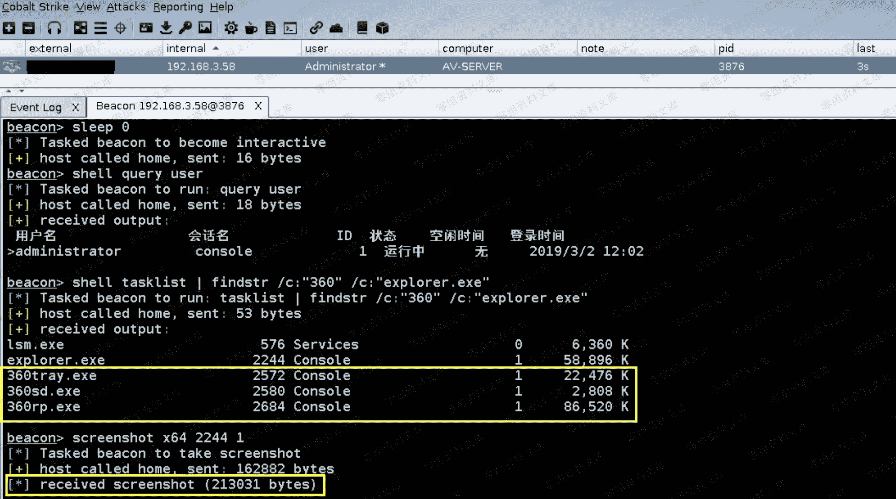

# Cobalt Strike beacon 免杀上线 [ 动态 shellcode 注入 ]

> 原文：[http://book.iwonder.run/Tools/Cobalt Strike/27.html](http://book.iwonder.run/Tools/Cobalt Strike/27.html)

> 模拟目标环境:
> 
> AV-Server 192.168.3.58 装有最新版 360 套装 [ 卫士 + 杀毒 ] 2008r2 64 位系统
> 
> 第一步,所谓的动态 shellcode,简单理解就是将 shellcode 放入现有正常的 PE 文件中,当 PE 文件被执行起来时我们的 shellcode 也一并被触发执行,这种利用方式通常可用在内网感染,或者用来替换目标桌面上的一些小工具来做些临时的权限维持[实战中几乎不会这么干],ok,废话不多讲,我们来直接看下具体使用,首先,生成好二进制数据格式 payload 如下


> 准备正常的 pe 文件模板,此处暂以 plink.exe 为例进行演示,下载地址如下,注意,要选择 32 位的

```
https://www.chiark.greenend.org.uk/~sgtatham/putty/latest.html 
```



> 第二步,利用 kali 自带的 wine 环境 [ 注意,也要用 32 位的 ],启动 shellter,选择"A"全自动注入模式,选择 PE 文件即"plink.exe",而后直接回车,注意它会把 PE 文件先自动备份一份到当前目录下的 Shellter_Backups 目录中

```
# wget https://the.earth.li/~sgtatham/putty/latest/w32/plink.exe
# wget https://www.shellterproject.com/Downloads/Shellter/Latest/shellter.zip
unzip shellter.zip
wine shellter.exe 
```


> 看到如下提示,直接回车即可


> 询问你是否要启用隐身模式,选择"N ",因为在实战中,我们通常并不想让它有界面弹出来[虽然 plink.exe 本身就是个命令行程序],然后关键的地方来了,payload 选择"C"[即自定义 payload],然后指定 payload 路径,也就是我们刚才在上面生成的那个 shellter.bin 文件,接着再回车两次就不用再人为干预了



> 最后,被注入有 shellcode 的 plink.exe 会在当前目录下,想办法把它丢到目标机器上去正常执行就行了



> 因为 plink.exe 本身就是个命令行程序,所以直接在 cmd 下执行即可

```
# plink.exe -h 
```


> 最终,看到 beacon shell 被正常弹回



