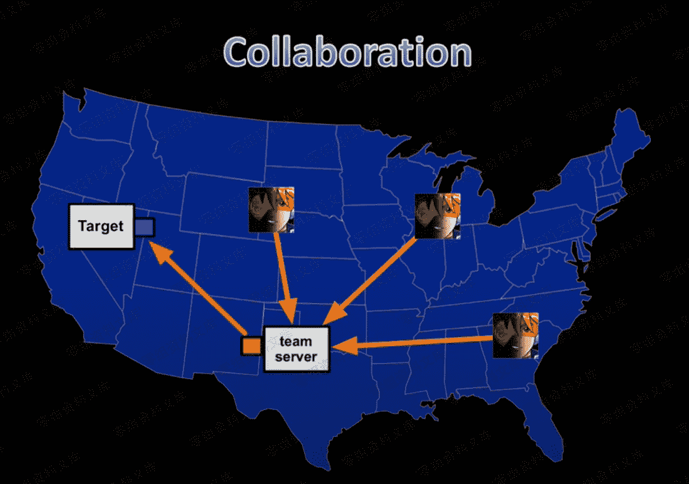
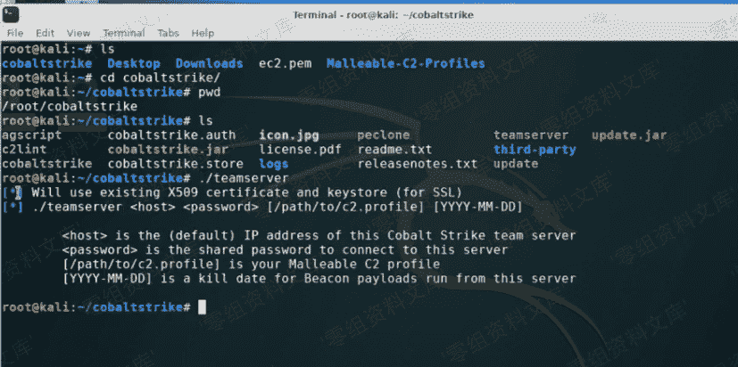
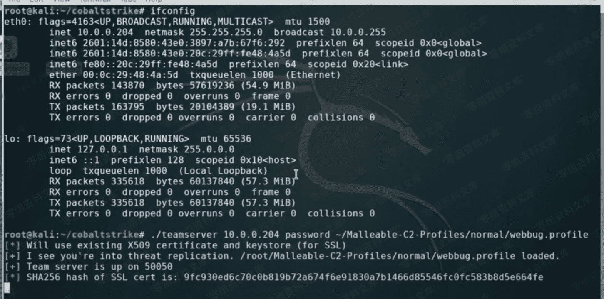
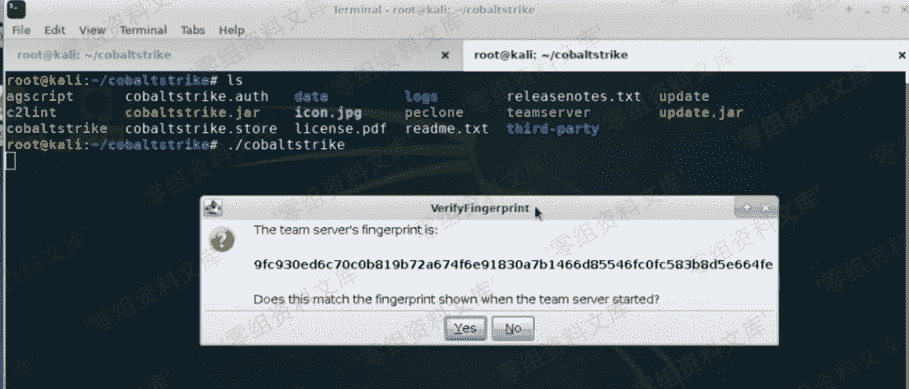
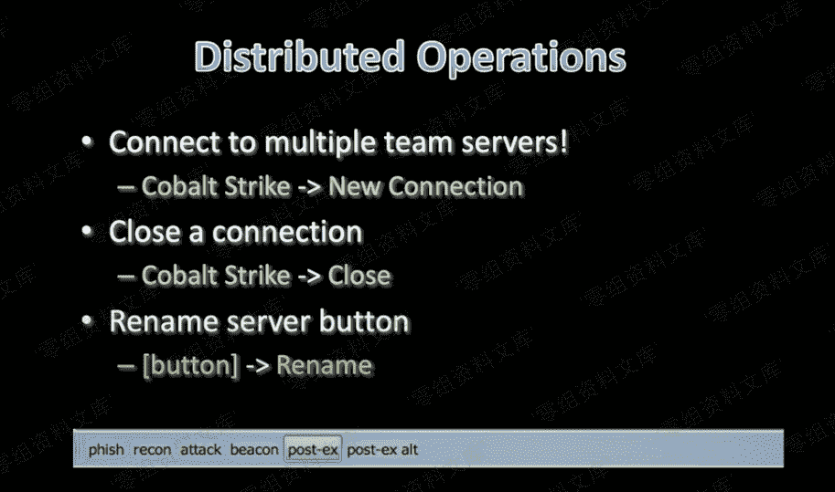

# Operations

> 原文：[http://book.iwonder.run/Tools/Cobalt Strike 4.0/1.Opearations/1.Operations.html](http://book.iwonder.run/Tools/Cobalt Strike 4.0/1.Opearations/1.Operations.html)

## 从红队角度看渗透难点

在一个红队的典型渗透过程中，一般来说按照顺序有四个目标，分别是：初始访问、代码执行、获取权限、后渗透。

在上边流程图中，首先给目标用户发送一份钓鱼邮件，这时候需要考虑绕过防病毒、沙箱技术、反垃圾邮件网关等安全防护设备，这些设备往往会动态监测附件中的恶意程序，此外，SPF、DKIM、Dmarc 更是让人感觉越来越头疼。
当目标用户运行附件中的恶意程序时，终端防护中心可能就要动态的检测判断附件是否为恶意程序，比如附件是一个 Word 文档，用户打开以后运行了文档中包含的宏，该宏会产生将 payload 注入子进程的操作，这个时候，杀毒软件就会发现异常，并强制终止此操作。
获取权限意味着要面对各种防火墙或者代理，甚至发现的代理指向了一个无效的域。即使穿透了代理，仍然需要想办法绕过各种流量安全监控，也许会暂时获得一个 shell，但是安全监控会通过溯源找到子进程，并公布恶意程序形成一个有效的威胁情报广播，导致所有努力付之东流。 下图是一个攻击链：

## 课程设计

第一课到第三课，主要解决以上提到的问题，如何获取目标权限。第一课重点讨论如何规划自己的 Teamserver，第二课主要通过配置监听器来了解 Cobalt Strike 的细节，第三课主要讲 malleable c2。第四课和第五课主要从武器化的角度讨论初始访问和代码执行的问题，介绍如何根据目标情况选择合适的 payload。第六课到第九课主要关注后渗透的内容。

## Cobalt Strike 介绍

Cobalt Strike 是针对协作模型达到分布式操作 Teamserver，主要用于团队作战，能让多个攻击者同时连接到 Teamserver，共享攻击资源、目标信息以及 session，提供了选择性和灵活性，通过课程将帮助你了解每一个选项的意义，以便可以正确的使用工具。
 要达到获取权限的目的，首先我们要了解工具特性和作用，这样在使用的时候我们就可以灵活的使用或者优化；其次要评估和理解我们面对的防御；第三是找到最优的方式来解决问题，绕过防御。按照这样的思路，也可以让蓝队的流程和整体的安全得到优化。
Cobalt Strike 的任务是缩小渗透测试工具和高级软件之间的差距，目标是推动安全测试，通过这款软件，不仅可以达到日常练兵模拟，以攻击者思维来规划防护，攻防循环，同时可以培养专业安全人员。

### Cobalt Strike 特性

*   Beacon：Beacon 是 Cobalt Strike 为高级攻击者建模的 Payload。使用 Beacon 通过 HTTP，HTTPS 或 DNS 出口网络。而且 Beacon 非常灵活，支持异步和交互式通信。异步通信既低又慢。Beacon 将通讯本地，下载任务，然后进入睡眠状态。交互式通信实时发生。
*   malleable c2：Cobalt Strike 最有用的功能之一就是可以修改 Beacon payload 的行为。通过修改框架内的各种默认值，操作者可以修改 Beacon 的内存占用，更改其检入的频率，甚至可以修改 Beacon 的网络流量。所有这些功能都是由 Malleable C2 配置文件控制，该配置文件在启动团队服务器时选择。
*   Aggressor Script：加载各种脚本，对客户端可修改可扩展，可以响应事件，横向移动自动化，更改产品生成可执行文件和 dll 的方式，甚至可以使用和生成 powershell 脚本。

    ### 启动 Cobalt Strike

    在 Cobalt Strike 的文件夹下包含了一个名为 Teamserver 的脚本来启动服务。
    `./ teamserver <ip address> <password> [profile]`
     
    通过执行文件夹下的 cobaltstrike 脚本启动客户端，
    `./cobaltstrike`
    

    ## 客户端连接多个 Teamserver

    连接多个 Teamserver 的好处除了便于操作外，更重要的是可以在多个 Teamserver 之间传递权限，比如使用临时服务器做横向移动，获取到了其他权限，但是第一台服务器存在比较高的安全风险，这样就可以有多个 Teamserver 来专门用于后渗透，即使第一台机器异常，不影响权限维持。
    
    具体连接多个 Teamserver 的方法如下图：
    
    

    ## Teamserver 模型

*   临时服务器
    发起对主机攻击以及 shell 反弹
    提权，完成权限维持
*   长期服务器
    低频数据通讯，以持续权限
    根据实际需求传递访问权限用于后渗透
*   后渗透服务器

## Teamserver 角色

在多目标网络的情况下，Teamserver 建议分为目标角色和管理角色。

*   目标角色负责特定网络的目标，突破、后渗透、横向移动、维护当前 Teamserver；
*   管理角色负责管理所有的网络访问权限，突破并接受目标角色的访问，如果有目标角色被删除权限或者需要其他访问权限，管理角色就需要向目标角色提供许可，其次管理角色需要维护全局 Teamserver。

    ## 团队角色

    建议将团队按照角色进行分工
*   一个团队致力于获取访问权限，目的是扩大立足点，这个团队需要考虑武器化、初始访问和横向移动；
*   专注于目标的后渗透组，他们通过文件系统、收集键盘记录、屏幕截图，获得拿下目标的机会；
*   本地访问管理角色，用户管理和保护 shell，根据需要搭建 Teamserver，并交接 session。

    ## 日志

    Cobalt Strike 可以通过时间或者 IP 排序，所有的操作和 payload 都会被保存到日志中，Cobalt Strike 的/logs 文件夹下保存了相关日志。

    ## 报告

    Cobalt Strike 可以将多个 Teamserver 的数据同步到同一个时间合并到一个日志模型中，这样就可以在不同的 Teamserver 上得到一个准确的时间排序。

