# C2

> 原文：[http://book.iwonder.run/Tools/Cobalt Strike 4.0/3\. C2/3\. C2.html](http://book.iwonder.run/Tools/Cobalt Strike 4.0/3\. C2/3\. C2.html)

## 运行 C2 代理


```
./teamserver [ip address] [password] [profile] 
```

### C2 代理的组成部分

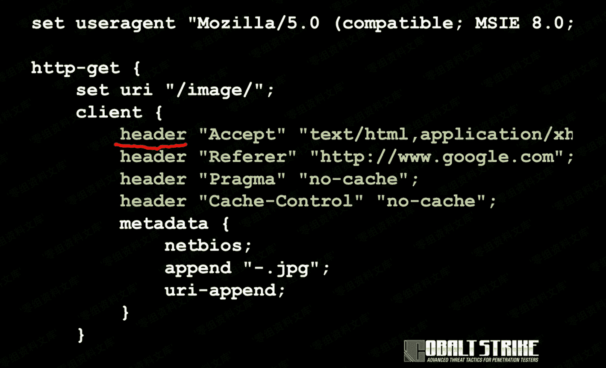

*   Options

*   Blocks

*   Extraneous Indicators
*   Transforms

## C2 与运转方式


*   http-get：负责储存加密的信息，同时服务器也会发送数据 Beacon，因为可以使用 http-get 进行服务器输出数据修改。
*   http-post：控制如何将 Beacon 发送到其他团队服务器。
*   http-stager：用于转换编码。
*   http-config：自定义配置 http 响应数据。
*   http-certificate：配置 SSL 证书。

## C2 更改代理设置


可以通过新建监听器的时候，在 Profile 里面进行自定义配置。

## C2 自定义配置

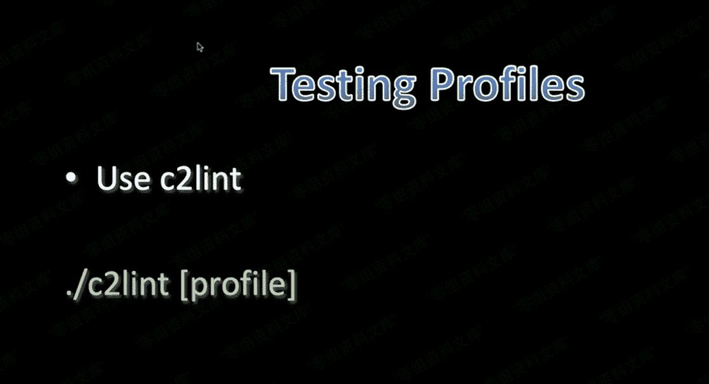

```
./c2lint [profile] 
```

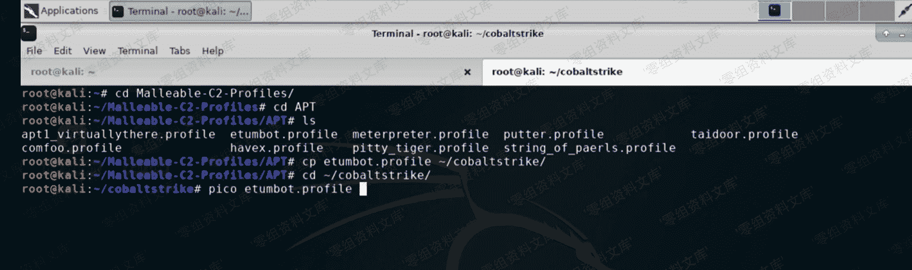

```
pico etumbot.profile 
```

首先打开文件，进行自定义编辑，编辑好后直接运行./c2lint xxx

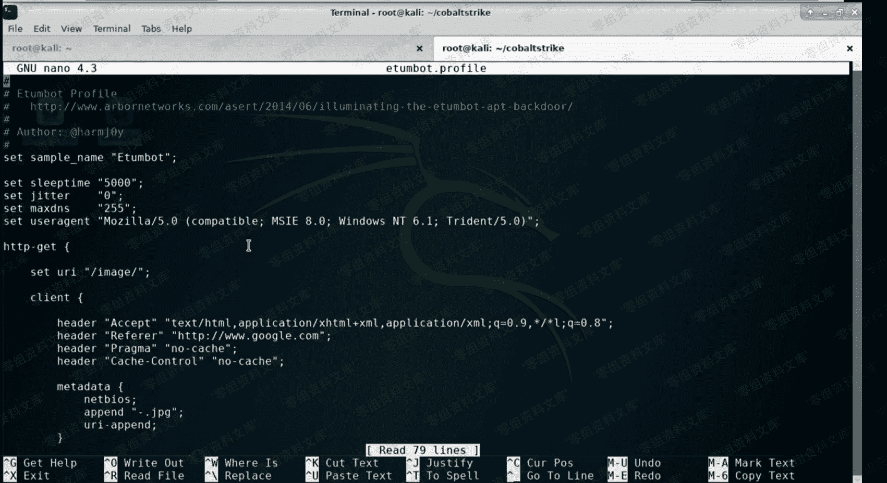

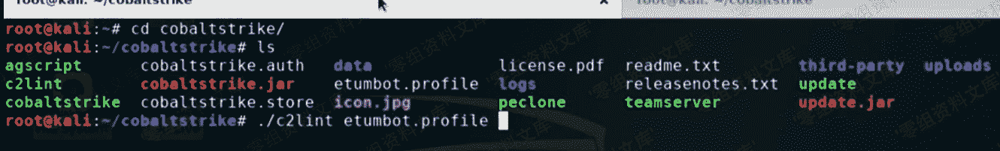

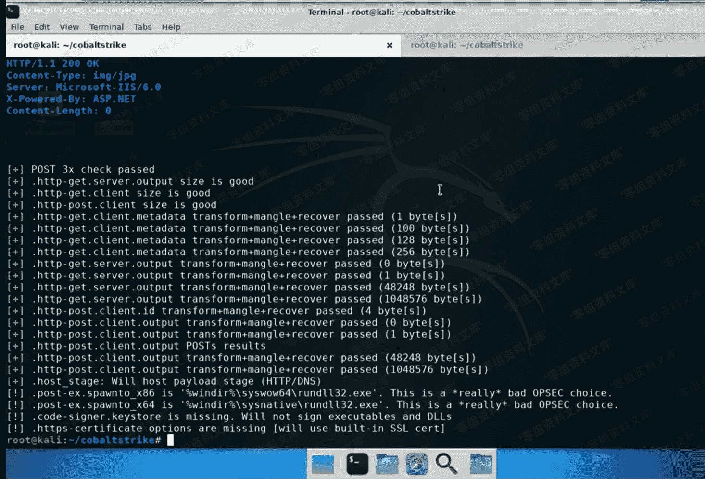

以上是成功运行的全部过程截图。C2 可以通过自定义 POST/GET 包的形式，未造成正常使用的数据包来逃逸防火墙的检测。


## C2 运行效果展示

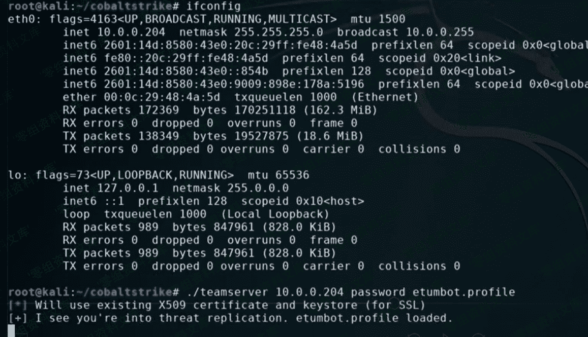

```
./teamserver [ip] [password] etumbot.profile 
```

### Deafault 效果展示

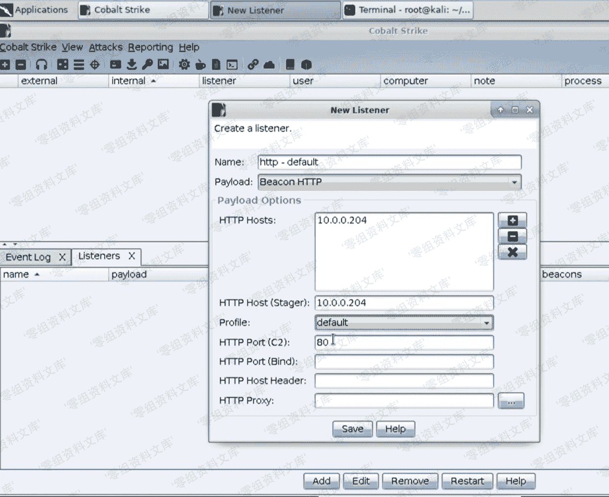


接下来再 Listener 里面配置上线信息，并生成 powershell 监听器。


并在 windows 客户端运行上线。

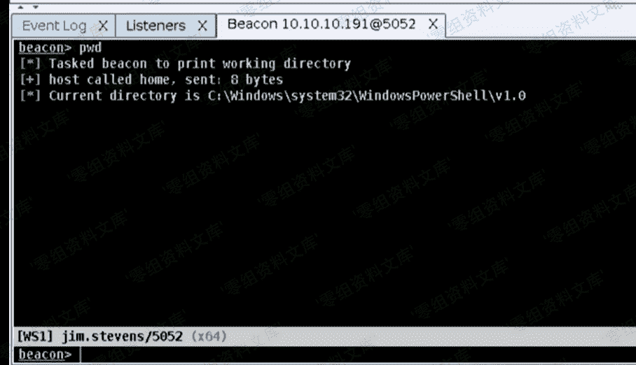我们再 Beacon 里面，执行一下命令。

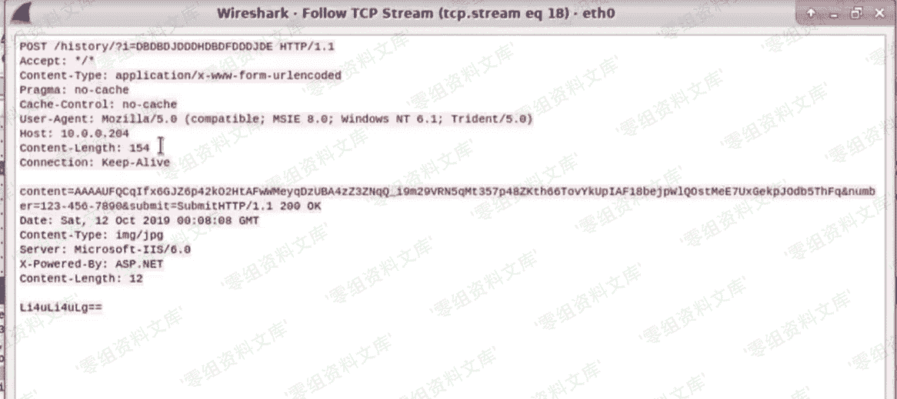

如上图所示，上面的 PWD 命令被我们未造成了一个普通的数据包。

### Get-only 效果展示


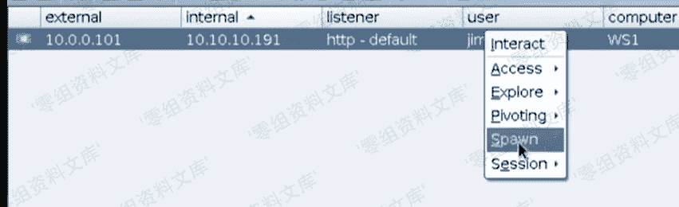

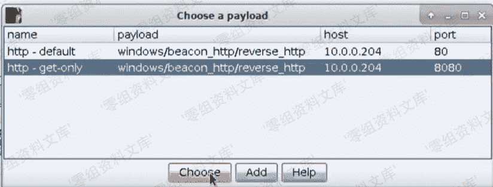


配置新的 Get-only 监视器，并且通过 Spawn 进行上线。

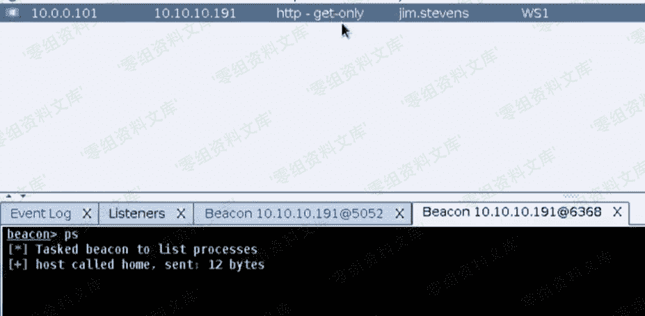

我们在 Beacon 里面执行 ps 命令。


这里可以看到数据包所展示的是一个正常流量的数据包。

