# Weaponzation

> 原文：[http://book.iwonder.run/Tools/Cobalt Strike 4.0/4.Weaponization/4.Weaponization.html](http://book.iwonder.run/Tools/Cobalt Strike 4.0/4.Weaponization/4.Weaponization.html)

## 介绍

首先探讨下“武器化”，按照我个人的理解用一把枪来做类比，一颗子弹或者一把空枪不足以构成威胁，同样的在 Cobalt Strike 将 payload 和可执行文件（EXE，DLL 或者 powershell 等）结合起来构成了武器化的概念。

在 Cobalt Strike 中首先解释几个概念：

*   artifact 可以理解为包含了 payload 的全功能被控制程序。
*   stage 本身是一段尽可能小的手工优化过的汇编程序，连接到主控制端，按照主控制端的要求对大的 payload 进行下载。
*   payload 是指一段任意大小的，与位置无关的代码，被 stage 执行。Cobalt Strike 中许多攻击和工作流都将 payload 用多个 stage 实现投递。 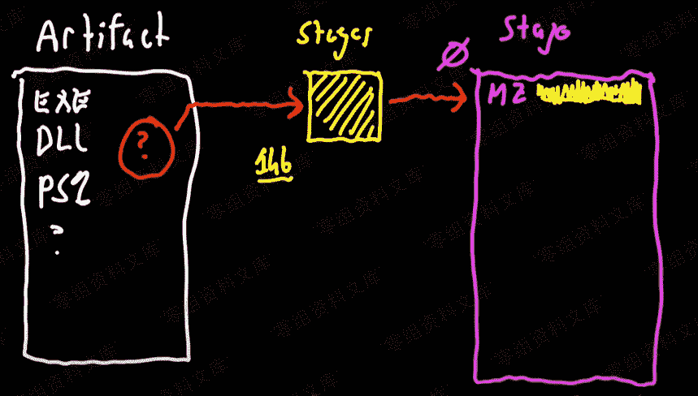
    
    在上边两个图中表现了两种 artifact 的执行方式，一种是将 payload 用 stage 实现投递，另外一种方式是 payload 直接被运行在内存中。

## 可执行文件和 DLLs

*   生成一个可执行文件或者 DLL 的方法
    Attacks->Packages->Windows EXE(s)
*   如何执行 DLL 文件
    首先生成一个和目标机器匹配的 dll 文件（x86 或者 x64），然后在目标机器上使用 rundll32.exe 启动生成的 dll 并运行 startw 函数即可。

    > rundll32.exe artifact.dll,startw

## 托管文件

*   托管一个文件
    Attacks->Web Drive-by->Host File
*   管理或者删除托管文件
    Attacks->Web Drive-by->Manage
*   查看 web 活动
    View->Web Log
*   一些防御措施
    针对 curl,wget 和 lynx 返回 404
*   以下为托管文件的具体操作
    
     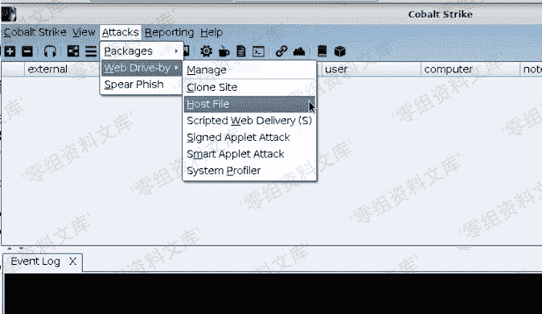
    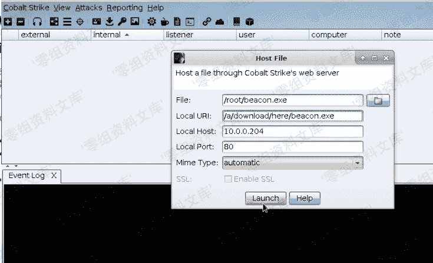

## Artifact Kit

Cobalt Strike 使用 Artifact Kit 生成可执行文件和 DLL，是一款商业框架，用于构建可绕过某些防病毒，具体下载方式 Help->Arsenal。

### Artifact Kit 工作原理

*   混淆 shellcode 并将其嵌套于二进制文件中，这种混淆可以绕过识别恶意代码的杀毒软件。
*   突破防病毒沙箱 AV 检测，Artifact Kit 是可执行文件和 DLL 模板的集合，它依赖于反病毒产品不会模拟的某些行为来恢复二进制文件内的 shellcode。
    

    ### Artifact Kit 使用步骤

*   Help->Arsenal 下载 Artifact Kit，这个是需要授权的。下载完成后解压并执行文件夹中 build.sh，该脚本在 Linux 上执行。
    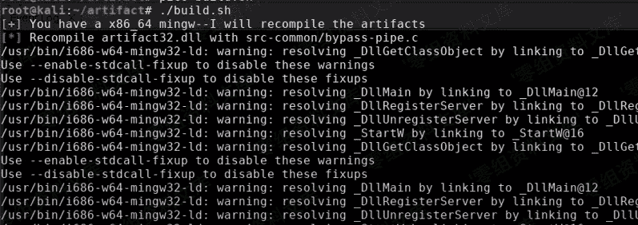
*   导入脚本，Cobalt Strike->Script Manager,从该文件夹中加载 artifact.cna 脚本，然后按照生成可执行文件的步骤操作即可。  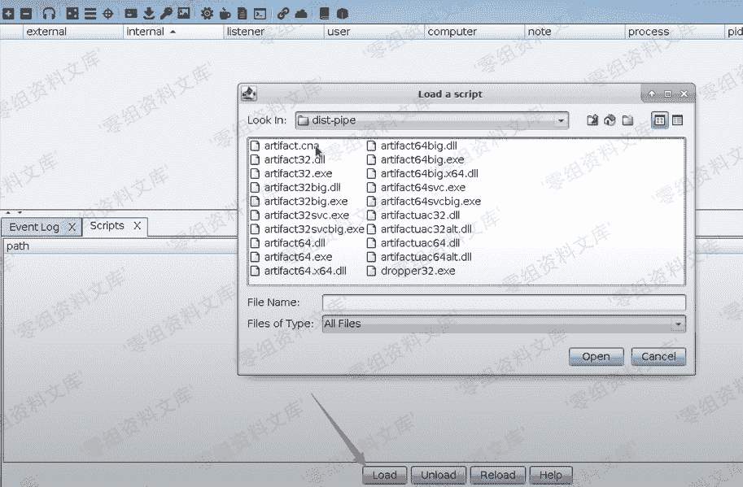 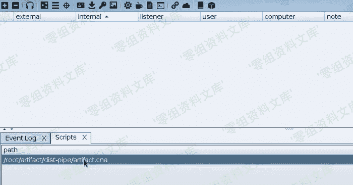

## Scripted Web Delivery

利用 powershell、bitsadmin、python、regsvr32 远程下马，提供的单行程序将允许攻击者快速获得目标主机的会话。

*   Attacks->Web Drive-by->Scripted Web Delivery
    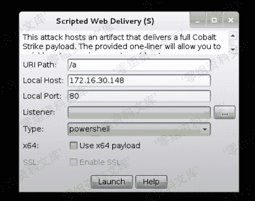

## Resource Kit

Resource Kit 是 Cobalt Strike 改变 Cobalt Strike 在其工作流程中使用的 HTA，Powershell，Python，VBA 和 VBS 脚本模板的方法。
下载方法 Help->Arsenal 下载 Resource Kit，这个同样需要授权，下载完成后将 resources.cna 脚本加载使用，然后按照生成可执行文件的步骤操作即可。
 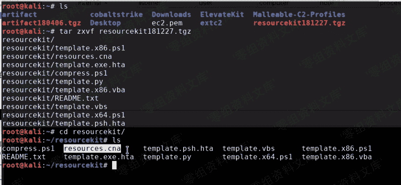 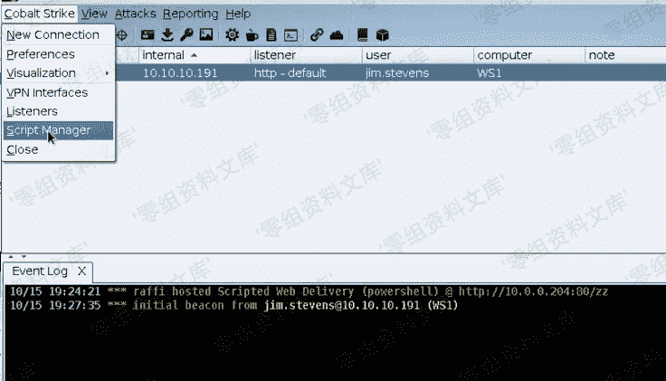 

## 用户驱动攻击

在用户驱动攻击中包括了 HTML、Java Signed Applet 攻击、office 宏、windows 木马程序，这些攻击方式可以根据实际灵活变更，比如通过 Resource Kit 可以修改 HTML 以及 office 宏，通过 Applet Kit 修改 Java Signed Applet 攻击，通过 Artifact Kit 修改 windows 木马等。

## msf 运行 32 位 Beacon

*   在 Cobalt Strike 中新建一个监听
*   在 msf 中选择一个客户端攻击木马
*   将 payload 设置为 http 或者 https
*   将 LHOST 和 RHOST 设置为 Beacon 监听地址及端口
*   设置 DisablePayloadHeadler 为 True
*   设置 PrependMigrate 为 TRUE
*   生成一个木马，使用 Cobalt Strike 加载生成一个 payload，目标及其访问后获得 Beacon
    
    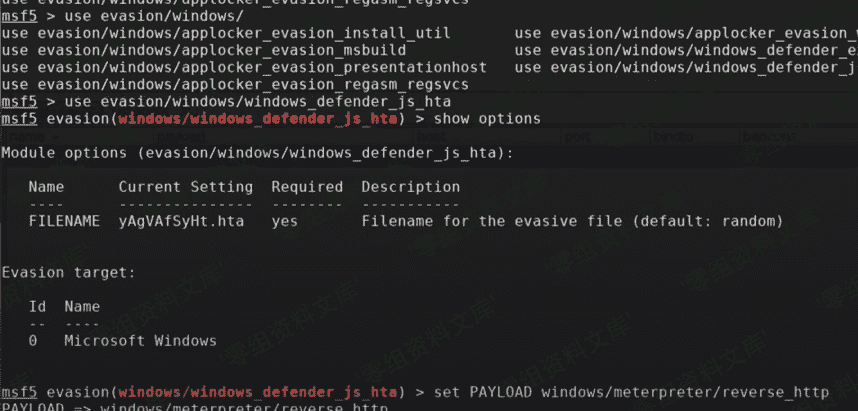 
    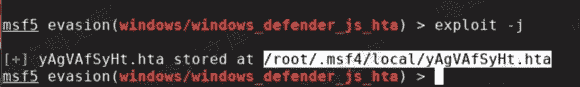
    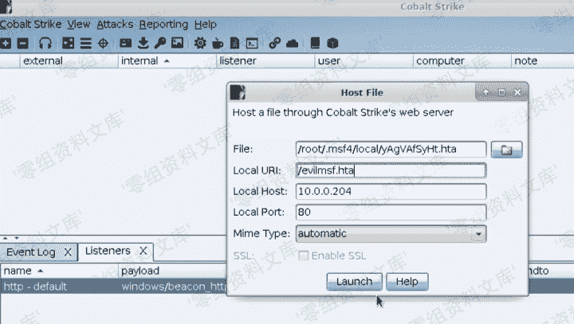
    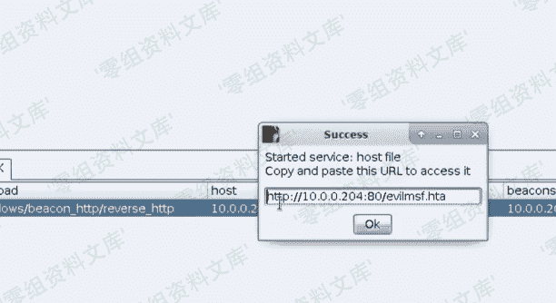

## 自定义武器化

*   Attacks->Packages->Windows EXE(S) 生成一个现成的木马
*   Attacks->Packages->Payload Generator 生成一个 payload
*   使用第三方 artifact 或者工具
*   自己写脚本集成到 Cobalt Strike

## 行为检测与绕过

回到攻击链，我们现在讨论的目标是代码执行 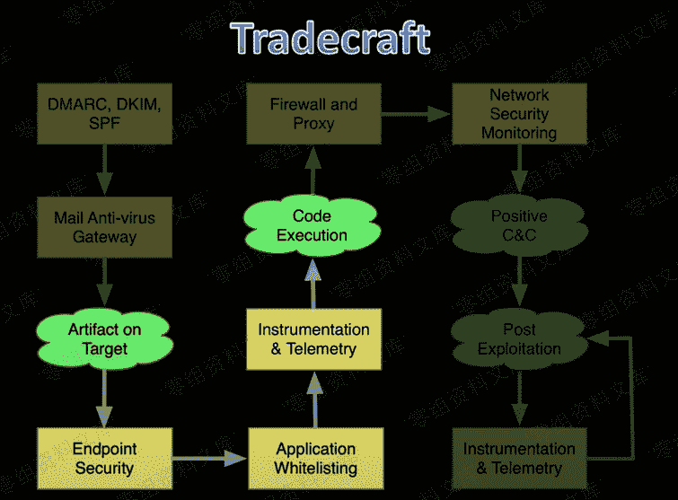
如下图所示，四个环节都可能被检测到：

*   在攻击链的第一部分依旧是 artifact 这样一个包含了 payload 的全功能被控制程序，函数或者一些特征码会被检测到；
*   一旦我们的 artifact 在目标机器上运行，那我们就会看到一些行为，比如我们刚好有个 office 宏运行在一个临时的进程中，并且将我们的 payload 注入到进程中，这个时候会产生的行为可能就会被检测到，比如启动一个程序、注入一个新的或者已经存在的进程、写文件；
*   我们成功注入进程后，我们所有的操作会在内存中进行，根据 payload 占据内存和线程的属性也可能会被检测到；
*   进程行为也会被检测，比如 explorer.exe,notepad.exe 等进程做出了一些非常规的动作，或者还有些常见的被滥用应用程序检测。
    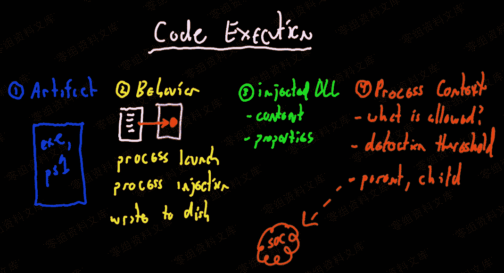
    那么针对以上可能被检测到的点我们应该如何绕过
*   对于函数或者特征码以及注入进程的操作一般使用混淆来绕过
*   对于写文件、进程行为检测一般采用规避的方式
*   对于启动程序应该采用欺骗父进程的方式
*   此外对于 payload 检测同样应该采用规避的方式

## 内存检测及绕过

检测方式一般如下：

*   查找与内存映射文件没有关联的线程开始地址。
*   内存权限，读写权限是攻击工具中常见的模式，有时候内存区域的执行权限与内存映射文件无关，都会被严格检测。
*   内存内容也会被检测，比如一个 PE 文件或者与常见技术有关系的特征码等。

绕过方式:

*   修改 artifact 启动地址
*   artifact 避免使用读写执行权限
*   避免使用 stagers
*   在 Malleable C2 的配置文件中设置 userwx 为 false
*   开启 stomping 模块
*   设置 image_size_x86 以及 image_size_x64
*   使用 prepend 实现 PE 在内存中的偏移量
*   设置 obfuscate 为 true
*   设置 cleanup 为 true
*   使用 strrep 来编辑字符串
*   设置 sleep_mask 为 true

# Artifact 行为一览表

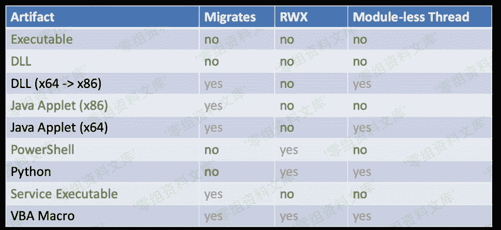

