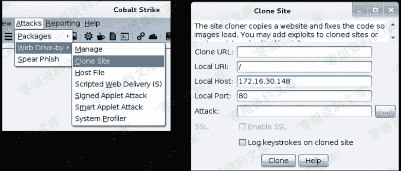
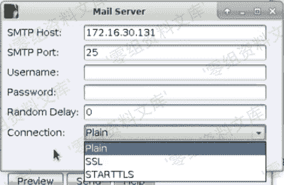
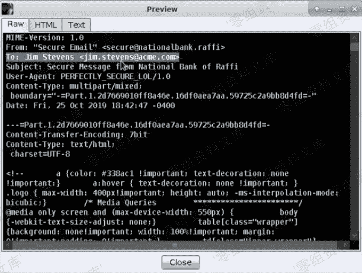

# 5 Initial Access(初始化访问)

> 原文：[http://book.iwonder.run/Tools/Cobalt Strike 4.0/5.Initial Access/5.Initial Access.html](http://book.iwonder.run/Tools/Cobalt Strike 4.0/5.Initial Access/5.Initial Access.html)

这里主要说明怎样将一个武器化的文件投送到目标主机，并且让受害者打开它。

## 0x01 Client-side Attack（客户端主机侧攻击）

一开始我们需要拿到一台目标环境内的主机作为入口，然后才能进行权限提升、横向移动等操作。

`Client-side Attack`是指你利用一个可以命令执行的漏洞或者是桌面程序的特性，从而能够控制目标主机去访问攻击者控制的内容。

一般来说，处于内网主机的网络外层是部署了防火墙的，如果我们需要从外网访问内网，那么我们可以这样做：

先设计一个钓鱼情景，然后根据这个情景去设计一个武器化的文件，接着设计好邮件并把该文件作为附件放到邮件中，最后发送给目标邮件帐户。如果目标主机打开了这个文件，那么我们就可以获得一个攻击的入口点。

### 客户端主机侧的攻击步骤如下

1.  收集目标的用户信息：基于开源情报进行主动和被动信息收集，尽可能多地去了解你的目标。
2.  基于收集到的客户端主机信息，搭建一个与其环境一致的虚拟机
3.  使用这个虚拟机寻找最好的攻击方式。当然，采取最好的攻击方式需要你收集到足够详细的信息，这样就可以提前知道你会遇到哪些问题，比如说可以利用的软件版本信息等。
4.  尝试使用一个比较正常的场景来伪装我们的攻击方式，然后诱骗受害者打开我们进行过武器化的文档。
5.  将这个文档打包好，通过邮件发送给你的目标。

### Cobalt Strike 工具介绍：

#### 1\. System Profiler

System Profiler 是一个用于客户端主机侧攻击的伪装工具，它是一个 Web 应用程序。

`Redirect URL`是指任何一个用户访问`System Profiler`之后都会被设置跳转到这个 URL。
建议不要勾选`Use java Applet to get information`
查看`System profiler`的结果：

你可以在这看到操作系统的浏览器及版本信息，有可能会获取到目标机的内网 IP。这里的 IE 是`11.0.19203`版本，可以根据这个来判断目标系统的补丁程序级别。

#### 2\. Website Clone Tool


Cobal Strike 可以根据给定的`Clone URL`进行网站克隆。如果你需要进行浏览器或者是浏览器插件的漏洞利用，那么你可以通过上图的`Attack`在网页内嵌入一个 iframe 标签来进行利用。Cobal Strike 还支持键盘记录器。

## 0x02 Spear Phishing

进行的步骤如下：

1.  创建一个目标列表，如下所示
    `<tab>`是指键盘上的`tab`

    ```
    jim.stevens@acme.com<tab>Jim Stevens  
    whatta.hogg@acme.com<tab>Whatta Hogg 
    ```

2.  创建一个模板 从你的邮箱中找一份邮件，然后点击列表中的查看消息源（或者是邮件导出、查看邮件原文等），如下图所示，然后将内容保存到本地。


Cobalt Strike 有几个模板可以用来定制化邮件： |Token|描述| |:----:|:----:| |%URL%|嵌入的 URL| |%To_Name%|目标的名称| |%To%|目标的邮箱地址| 对于每一封钓鱼邮件，这里的`To`都需要修改成目标列表中的邮箱地址，Cobal Strike 会根据目标列表对`To`的内容进行替换。另外，这里的`Date`和附件内容之后也会被修改掉。注意，如果你只是将邮件发给某个人进行钓鱼，那么`From`这个 header 修不修改都可以，如果不是，那么建议你修改`From`这个 header 以避免对情报收集产生影响。`Bounce To`是将发件人修改为这个值。

**Attacks -> Spear Phish** 


点击`Preview`可以查看到修改后的邮件正文


1.  选择一个邮件服务器来发送邮件
    这里有两种选择：
    （1）在本地搭建一个 SMTP 服务器：
    Cobal Strike 连接到服务器的 25 端口（SMTP 服务端口），然后 Cobal Strike 会把消息发给本地 SMTP 服务器，接着 SMTP 服务器会去查询接收邮件的域名的 DNS 解析记录和 MX 记录（邮件交换记录），然后本地 SMTP 服务器就会连接到目标域名的邮件服务器进行后续的邮件发送操作了
    （2）通过云邮件服务提供商来使用我们用来钓鱼的域名：
    Cobal Strike 的 phishing tool 可以提供认证选项来连接到云邮件服务提供商。Cobal Strike 将邮件发给云邮件服务提供商后，它会去查询目标的 MX 记录，然后与目标域名的邮件服务器进行通信，将邮件发给目标地址。
2.  汇总所有的东西，然后将邮件发送给目标主机的邮箱

## 0x03 Tradecraft(社工)

现在对用户使用钓鱼这个行为已经越来越难实现了，尤其是那些将邮件服务部署在云服务商的企业。首先，你得绕过垃圾邮件过滤器，还得遵循电子邮件认证协议等规则（SPF、DKIM、DMARC 等）。由于邮件附件是一个武器化的文件，你还得绕过反病毒网关的检测，甚至有些软件还带有沙箱功能，会尝试打开这个文件并追踪其行为。

### 对邮件头的 From 进行伪造

邮件头的 From 头的值是用户收到邮件后在邮件客户端上看到的发件人


*   使用`dig +short MX [domain]`查看目标邮件服务器的 MX 记录
*   建议你确保`From`header 与`Bounce To`的内容一致，这样就可以让`From`和`Mail From`在信封里的内容一致，否则某些服务器在对邮件进行检查时，就会把邮件归类到垃圾邮件或者可疑邮件，甚至是恶意邮件。
*   了解目标域名是否使用了 SPF。当你与目标邮件服务器建立连接，想要发送邮件时，目标的邮件服务器就会去 txt 记录里查询你的域名，然后再查看 SPF 记录，SPF 记录就会列出允许一个列表，列表里包含了允许使用你的域名发送邮件的一些 IP。如果检查发现 from 里的 IP 不在这个列表里，那么 SPF 校验就会认定失败，邮件伪造就会失败。如果目标邮件服务器使用了 SPF，那么使用域名伪造（任意伪造发件人）是行不通的。

    ```
    dig +short TXT domain.com # 查询某个域名的 SPF 记录 
    ```

*   另外一种反电子邮件欺骗的机制是 DKIM（域名密钥识别邮件标准）。

    > 参考百度百科：DKIM 的基本工作原理同样是基于传统的密钥认证方式，他会产生两组钥匙，公钥(public key)和私钥(private key)，公钥将会存放在 DNS 中，而私钥会存放在寄信服务器中。数字签名会自动产生，并依附在邮件头中，发送到寄信者的服务器里。公钥则放在 DNS 服务器上，供自动获得。收信的服务器，将会收到夹带在邮件头中的签名和在 DNS 上自己获取公钥，然后进行比对，比较寄信者的域名是否合法，如果不合法，则判定为垃圾邮件

*   DMARC 是基于 SPF 和 DKIM 推出的一个电子邮件安全协议，它可以设置当 SPF 和 DKIM 校验失败后的操作，你可以执行以下命令来查看服务器的 DMARC 配置。

    ```
    dig +short TXT _dmarc.domain.com 
    ```

    ### 注意事项

*   不要让你的邮件被识别为垃圾邮件：
    （1）尽量使用一个可信度比较高的域名作为邮件服务器
    （2）在 targets list 里最好写上目标的名字
    （3）确保`From`和`Mail From`的内容一致
    （4）避免使用可疑的 URL，比如 IP 地址
    （5）为你的域名配置好 SPF、DKIM 和 DMARC，这样可以增加你的域名的可信度
*   不要让你的邮件被过滤掉
    （1）不要在附件里放上可执行文件（比如 exe 和 dll 文件）
    （2）不要在附件里放上任何已经被杀毒软件识别的文件

    ## 0x04 Assume Breach（假设钓鱼成功）

    
    准备一个 win7 虚拟机，在虚拟机里模拟好真实环境后，再进行练习操作，最后再传输 payload 进行执行。接着就是内网主机端口扫描，使用`make_token`命令创建一个 token 来传递凭据，然后是内网横向移动技术

