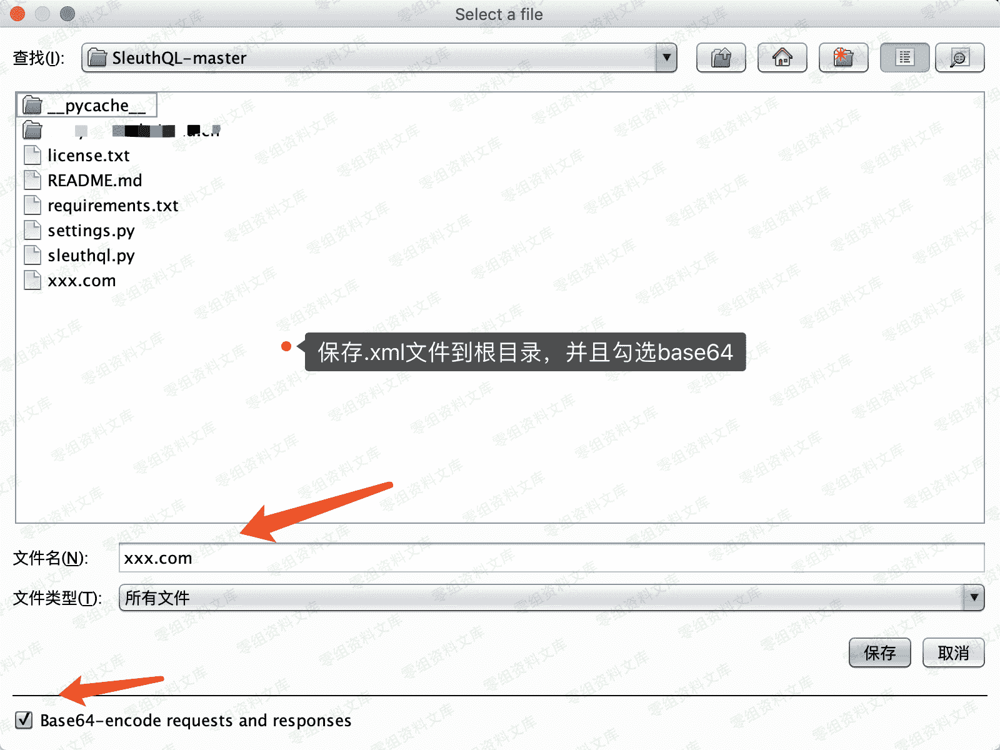
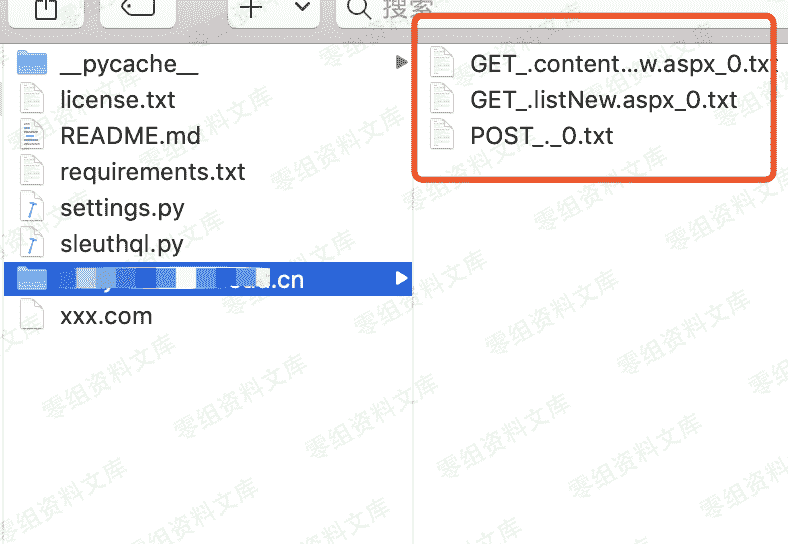
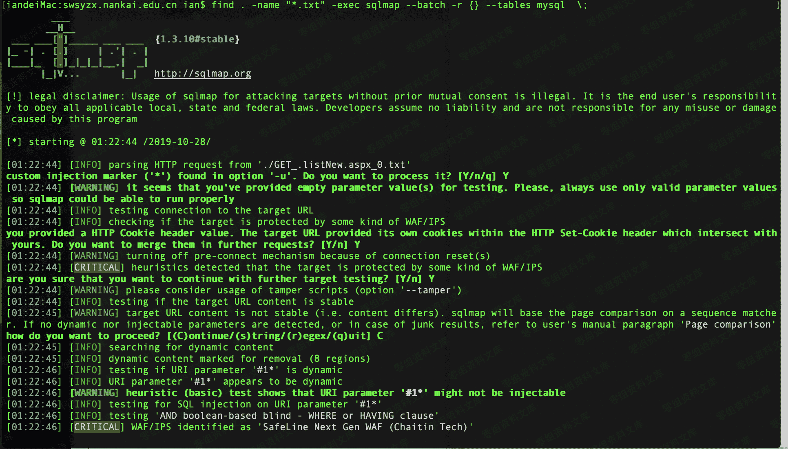

# SleuthQL

> 原文：[http://book.iwonder.run/Tools/Sqlmap+burpsuit 辅助批量注入验证/1.html](http://book.iwonder.run/Tools/Sqlmap+burpsuit 辅助批量注入验证/1.html)

[https://github.com/ianxtianxt/SleuthQL](https://github.com/ianxtianxt/SleuthQL)

## 0x01 SleuthQL 介绍

SleuthQL 是基于 python3 所开发的一款，用于批量爬行站点可能存在 sql 的地址。并且可以配合 burp+sqlmap 进行批量注入。

简单的说就是用 burp 采集网站路径以及页面，sqlmap 跑全部可能存在 uid 注入的接口。

## 0x02 使用方法

参考参数：

```
Options:
  -h, --help            show this help message and exit
  -d DOMAINS, --domains=DOMAINS
                        Comma separated list of domains to analyze. i.e.:
                        google.com,mozilla.com,rhinosecuritylabs.com
  -f PROXY_XML, --xml=PROXY_XML
                        Burp proxy history xml export to parse. Must be base64
                        encoded.
  -v, --verbose         Show verbose errors that occur during parsing of the
                        input XML. 
```

### 1、首先先用 burp 爬行整个网站




### 2、接下来直接执行 py

```
python3 sleuthql.py -d www.0-sec.org -f xxx.com 
```


这里会以 txt 的形式保存到本地



采用 sqlmap 进行批量测试

```
find . -name "*.txt" -exec sqlmap --batch -r {} --tables mysql  \; 
```



