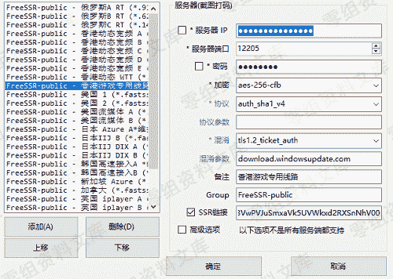
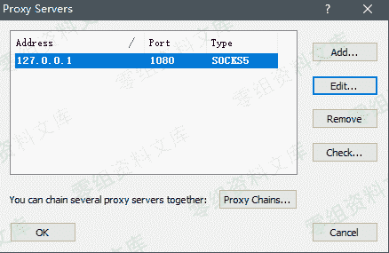
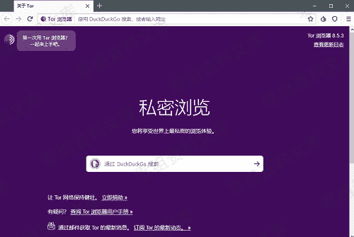
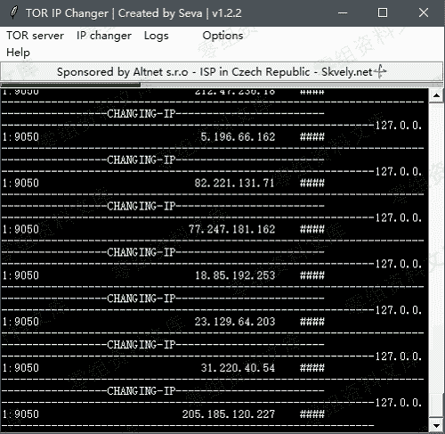

# Tor-IP-Changer 实现 Sqlmap 自动切换代理 IP

> 原文：[http://book.iwonder.run/Tools/Sqlmap proxy/1.html](http://book.iwonder.run/Tools/Sqlmap proxy/1.html)

[https://github.com/ianxtianxt/tor-ip-changer/](https://github.com/ianxtianxt/tor-ip-changer/)

使用工具：

小飞机、Proxifier、Tor Browser、Tor IP Changer、Sqlmap

操作步骤：

首先连上小飞机



配置 Proxifier 配置代理服务器



配置代理规则


此时你已经是全局代理状态了


配置并打开 Tor 浏览器（不要关闭）



打开 Tor IP Changer

点击 TOR server -> Start，等待软件自动配置完成

点击 Options -> Settings -> Interval(IP 切换间隔时间，越快越不稳）-> Save

点击 IP changer -> Start，如下图所示即为成功



Sqlmap 命令

```
sqlmap.py -u url --tor --tor-type="SOCKS5" 
```

