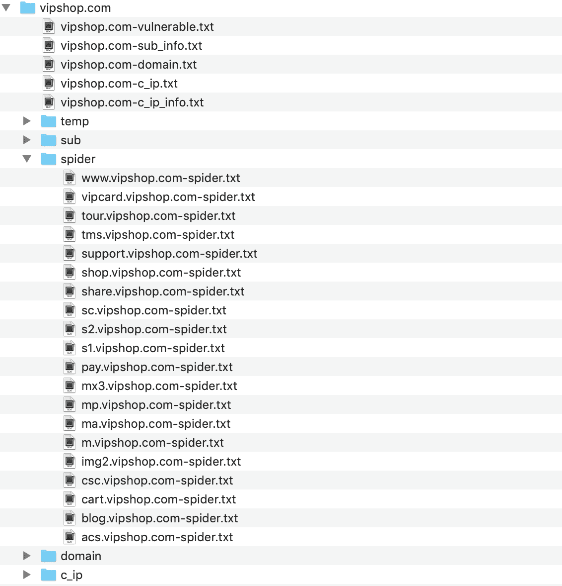
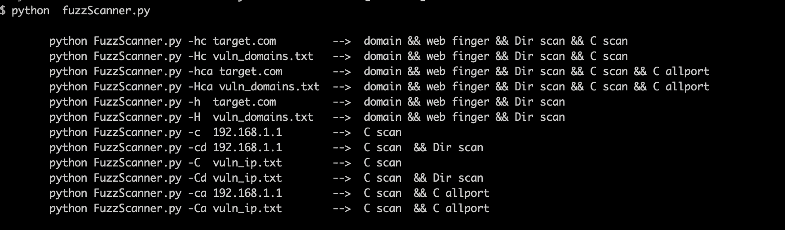
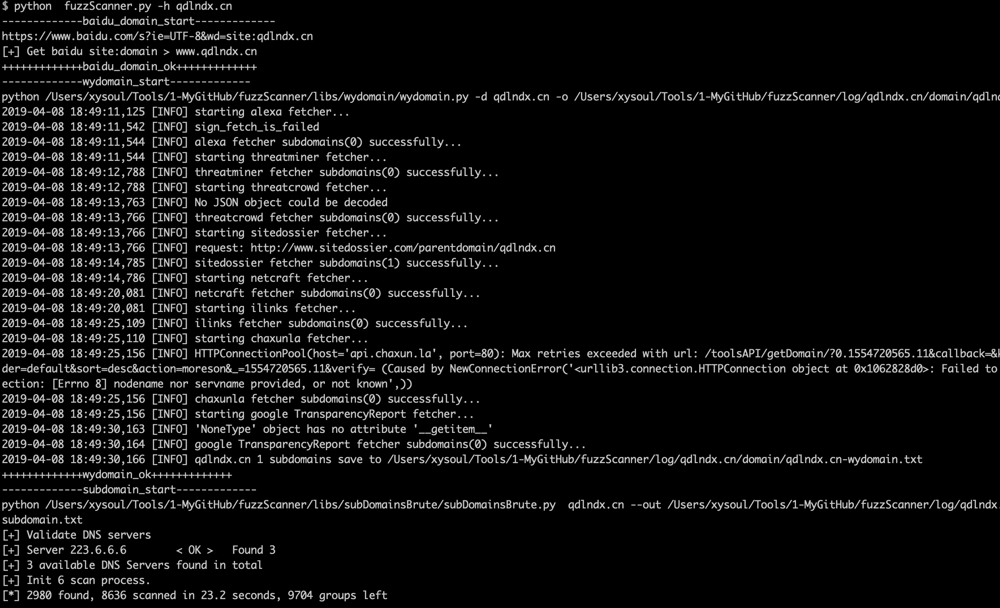
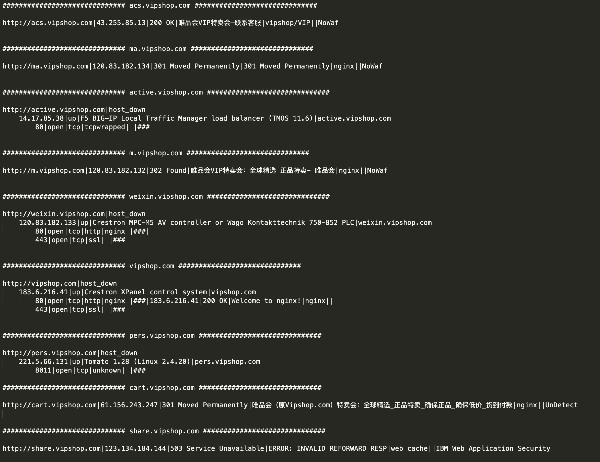

# FuzzScanner

> 原文：[http://book.iwonder.run/Tools/子域名扫描/FuzzScan.html](http://book.iwonder.run/Tools/子域名扫描/FuzzScan.html)


一个用来进行信息搜集的工具集，主要是用于对网站子域名、开放端口、端口指纹、c 段地址、敏感目录、链接爬取等信息进行批量搜集。

fuzzScanner 可用于批量快速的搜集网站信息，比别人更快一步的发现其他端口的应用或者网站管理后台等，也适合 src 漏洞挖掘的前期信息搜集。

开发初衷比较简单，当时正在参加一些攻防演练，需要快速的对目标网站进行子域名发现、端口扫描、目录扫描等，手头上有一些分散的工具，比如 lijiejie 的 subdomains、子域名挖掘机、dirsearch 等等，但当目标任务量比较大时，这些重复性的工作就会比较费时费力，所以就有了这么个集合十八种杀人武器于一身的“超级武器”——fuzzScanner。

```
因为当时着急用，所以很多功能的实现都是直接命令行调用的其他工具，再次非常感谢 wydomain、WhatWeb、subDomainsBrute、dirsearch、wafw00f 等开源平台。 
```

# Change_Log

*   [2018-04-05] 对多线程进行了优化，对异常进行了预处理
*   [2018-04-03] 完成基础功能

# 安装

## 常规安装

平台开发和运行都是在 linux 环境下，windows 未测试，wydomain、WhatWeb、subDomainsBrute、dirsearch、wafw00f 等工具均已放在 libs 目录下，默认可直接调用。

使用比较简单：

从 github 上拖下来

```
git clone https://github.com/TideSec/FuzzScanner 
```

安装 requirements.txt 依赖

```
pip install -r requirements.txt 
```

安装 ruby 环境，以便运行 whatweb

```
sudo yum install ruby    # CentOS, Fedora, 或 RHEL 系统
sudo apt-get install ruby-full # Debian 或 Ubuntu 系统 
```

安装 namp

```
yum install nmap  # CentOS, Fedora, 或 RHEL 系统
apt-get install nmap  # Debian 或 Ubuntu 系统 
```

运行脚本，因为调用 nmap 需要 root 权限，所以需要 sudo。

```
sudo python FuzzScanner.py 
```

## docker 镜像

为了避免部署的各种问题，直接做了个镜像放在了阿里云上，docker 直接 pull 下来就可以。

```
docker pull registry.cn-hangzhou.aliyuncs.com/secplus/tide-fuzzscanner:1.0 
```

使用 docker images 查看 docker 镜像信息

```
root@Docker:~# docker images
REPOSITORY                                                   TAG                 IMAGE ID            CREATED             SIZE
registry.cn-hangzhou.aliyuncs.com/secplus/tide-fuzzscanner   1.0                 52341fc71d0a        5 minutes ago       1.36GB 
```

创建 docker 并进入 docker

```
docker run --name fuzzscanner -t -i 52341fc71d0a /bin/bash 
```

执行 fuzzscanner

```
root@Docker:~# docker run --name fuzzscanner -t -i 52341fc71d0a /bin/bash
[root@a7edd0d9fdad /]# cd /root/FuzzScanner/
[root@a7edd0d9fdad FuzzScanner]# python FuzzScanner.py 

        python FuzzScanner.py -hc target.com         -->  domain && web finger && Dir scan && C scan
        python FuzzScanner.py -Hc vuln_domains.txt   -->  domain && web finger && Dir scan && C scan
        python FuzzScanner.py -hca target.com        -->  domain && web finger && Dir scan && C scan && C allport
        python FuzzScanner.py -Hca vuln_domains.txt  -->  domain && web finger && Dir scan && C scan && C allport
        python FuzzScanner.py -h  target.com         -->  domain && web finger && Dir scan
        python FuzzScanner.py -H  vuln_domains.txt   -->  domain && web finger && Dir scan
        python FuzzScanner.py -c  192.168.1.1        -->  C scan
        python FuzzScanner.py -cd 192.168.1.1        -->  C scan  && Dir scan
        python FuzzScanner.py -C  vuln_ip.txt        -->  C scan
        python FuzzScanner.py -Cd vuln_ip.txt        -->  C scan  && Dir scan
        python FuzzScanner.py -ca 192.168.1.1        -->  C scan  && C allport
        python FuzzScanner.py -Ca vuln_ip.txt        -->  C scan  && C allport 
```

# 使用

使用比较简单，参数设置说明。

```
python FuzzScanner.py -hc target.com         -->  domain && web finger && Dir scan && C scan 
                                                  设置单个目标网站，子域名枚举 && web 指纹识别 && 目录枚举 && C 段扫描

python FuzzScanner.py -Hc vuln_domains.txt   -->  domain && web finger && Dir scan && C scan
                                                  从文件读取单个或多个目标网站，子域名枚举 && web 指纹识别 && 目录枚举 && C 段扫描

python FuzzScanner.py -hca target.com        -->  domain && web finger && Dir scan && C scan && C allport
                                                  设置单个目标网站，子域名枚举 && web 指纹识别 && 目录枚举 && C 段全端口扫描

python FuzzScanner.py -Hca vuln_domains.txt  -->  domain && web finger && Dir scan && C scan && C allport
                                                  从文件读取单个或多个目标网站，子域名枚举 && web 指纹识别 && 目录枚举 && C 段全端口扫描

python FuzzScanner.py -h  target.com         -->  domain && web finger && Dir scan
                                                  设置单个目标网站，子域名枚举 && web 指纹识别 && 目录枚举 

python FuzzScanner.py -H  vuln_domains.txt   -->  domain && web finger && Dir scan
                                                  从文件读取单个或多个目标网站，子域名枚举 && web 指纹识别 && 目录枚举

python FuzzScanner.py -c  192.168.1.1        -->  C scan
                                                  设置单个 IP，进行 C 段地址探测

python FuzzScanner.py -cd 192.168.1.1        -->  C scan  && Dir scan
                                                  设置单个 IP，进行 C 段地址探测并对 web 服务进行目录枚举

python FuzzScanner.py -C  vuln_ip.txt        -->  C scan
                                                  从文件读取单个或多个目标 IP 地址，进行 C 段地址探测

python FuzzScanner.py -Cd vuln_ip.txt        -->  C scan  && Dir scan
                                                  从文件读取单个或多个目标 IP 地址，进行 C 段地址探测并对 web 服务进行目录枚举

python FuzzScanner.py -ca 192.168.1.1        -->  C scan  && C allport
                                                  设置单个 IP，进行 C 段地址探测和全端口扫描

python FuzzScanner.py -Ca vuln_ip.txt        -->  C scan  && C allport
                                                  从文件读取单个或多个目标 IP 地址，进行 C 段地址探测和全端口扫描 
```

# 主要功能

*   子域名枚举

当输入目标站点域名后，会使用以下 4 种方式进行子域名的枚举。

```
1、百度链接爬取，会使用 site：xxx.com 为关键字爬取所有子域名；
2、网站友链爬取，会对自身 3 层链接目录进行爬取，搜集子域名；
3、本利想对 chaxunla、aizhan 之类的子域名查询接口进行查询，后来发现猪猪侠的 wydomain 已经实现了这个功能，就直接调用了 wydomain；
4、使用了 subdomains 进行子域名的暴力枚举 
```

*   端口扫描

端口扫描和指纹获取主要依赖于 nmap，主要过程如下。该流程类似之前的另一个扫描器[https://github.com/TideSec/WDScanner](https://github.com/TideSec/WDScanner)

```
1、首先根据参数设置情况判断是全端口扫描还是部分端口扫描；
2、如果扫描目标是网站地址，会根据目标开放的端口进行指纹获取，如果某端口服务为 web 服务，还会继续进行 web 指纹的获取；
3、如果扫描目标是 ip 地址或地址段，会先试用 pynamp 进行存活主机判断，然后使用 socket 端口探测的方式探测存活主机，然后再使用 nmap 进行端口的扫描和指纹的获取。 
```

*   指纹识别

主要调用了 whatweb、wafw00f、whatcms 等进行了 web 指纹的识别。

```
1、当扫描 web 地址或探测到某端口为 web 服务时，会使用 whatweb 探测该站点信息，提取关键字段；
2、使用了 wafw00f 来探测是否存在 waf，这样对有 waf 的不太好啃的站点可以暂时放弃；
3、对 web 站点进行了目录枚举，可能直接发行管理后台地址或备份文件等； 
```

*   其他功能

在一些 c 段主机扫描、目录枚举、可能存在的威胁页面等方面进行了判断。

```
1、在扫描子域名时会解析其 ip 地址，并把改 ip 地址作为目标系统的 C 段地址，如设置了 c 段扫描的参数时会自动扫描其 c 段地址；
2、当扫描 web 地址或探测到某端口为 web 服务时，会自动进行了 web 指纹探测，并调用 dirsearch 进行目录枚举；
3、在检测到端口或 Url 地址中存在可能的漏洞点时，会输出到 vulnerable.txt，比如.action 及其他一些动态页面时。 
```

*   结果保存

由于这些扫描结果需要后续人工逐个测试，为了方便就直接保存了 txt，未保存数据库。

扫描完成后的结果保存 log 目录，最主要的就是该站点 log 根目录下的几个 txt 文档，比如下图中的 vipshop.com-sub_info.txt、vipshop.com-domain.txt、vipshop.com-c_ip.txt、vipshop.com-c_ip_info.txt 等。



```
1、sub 目录下为各子站点的各相应详细信息，方便回溯；
2、spider 是对各目标系统的爬虫记录，并区分了动态链接、外部链接等；
3、domain 目录是 wydomain、subdomians 等的子域名记录；
4、c_ip 目录为 ip 地址扫描的相关信息； 
```

# 注意事项

1、在扫描 c 段时，如果选择了全端口扫描，速度会比较慢，但可能会有惊喜。适合有个服务器放上面慢慢跑。

2、如果选择了目录枚举，可能速度也会比较慢，目录枚举是直接用的 dirsearch，在启用该功能后当发现某端口为 web 服务时就会调用 dirsearch。

3、代码写的比较乱，单个文件 1500 行，导致后期我想再完善时看着头大。。感兴趣的可以一起探讨下~~

# Screenshot

参数设置



设置好目标后开始扫描



保存的主要结果，以 vipshop.com 和 guazi.com 为例，保存了网站信息、网站标题、中间件信息、waf 信息、端口信息、目录扫描信息等等。




# Thanks

这个工具其实没什么技术含量，主要是集合了这些大牛的平台，再次感谢。

```
https://github.com/lijiejie/subDomainsBrute

https://github.com/ring04h/wydomain

https://github.com/EnableSecurity/wafw00f

https://github.com/urbanadventurer/whatweb

https://github.com/maurosoria/dirsearch 
```

# 关注我们

**TideSec 安全团队：**

Tide 安全团队正式成立于 2019 年 1 月，是以互联网攻防技术研究为目标的安全团队，目前聚集了十多位专业的安全攻防技术研究人员，专注于网络攻防、Web 安全、移动终端、安全开发、IoT/物联网/工控安全等方向。

想了解更多 Tide 安全团队，请关注团队官网: [http://www.TideSec.net](http://www.TideSec.net) 或关注公众号：


