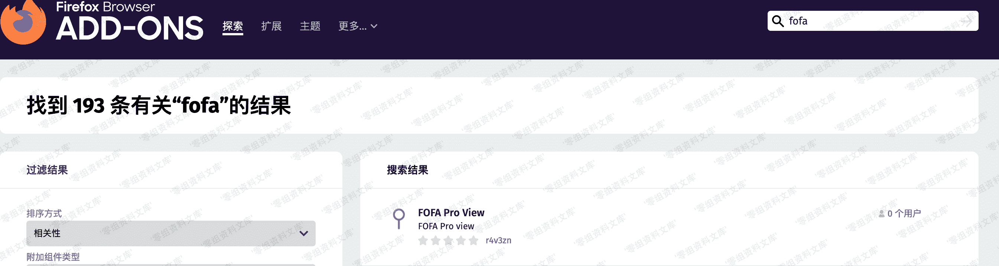

# FOFA Pro 资产展示

> 原文：[http://book.iwonder.run/Tools/游览器插件/FOFA Pro.html](http://book.iwonder.run/Tools/游览器插件/FOFA Pro.html)

## 介绍说明

Fofa Pro View 插件告诉您网站的托管位置（国家、城市）、IP 的所有者以及打开的其他服务/端口。

用于 Chrome 的 Fofa Pro 视图插件会自动检查 fofapro 是否有当前网站的任何信息。网站是否也运行 FTP、DNS、SSH 或一些不寻常的服务，有了这个插件，你可以看到 Fofa Pro 在一个给定的网站/域名上收集的所有信息。

## 下载地址

项目地址：[https://github.com/0nise/fofa_view](https://github.com/0nise/fofa_view)

### 火狐游览器

#### 手动安装

下载版本：[https://github.com/0nise/fofa_view/releases](https://github.com/0nise/fofa_view/releases)

解压插件压缩包，打开 about:debugging#/runtime/this-firefox 点击`临时载入附加组件…`选择下载的插件压缩包。

#### 商城安装

### 谷歌游览器

#### 手动安装

下载版本：[https://github.com/0nise/fofa_view/releases](https://github.com/0nise/fofa_view/releases)

解压插件压缩包，打开 chrome://extensions/ 并且开启开发者模式，点击 `加载已解压的扩展程序` 选择已经解压的插件目录进行加载。

