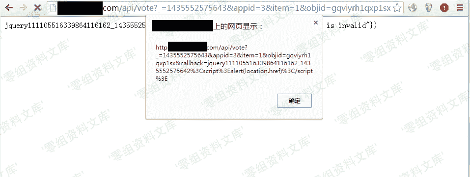
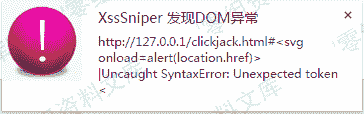
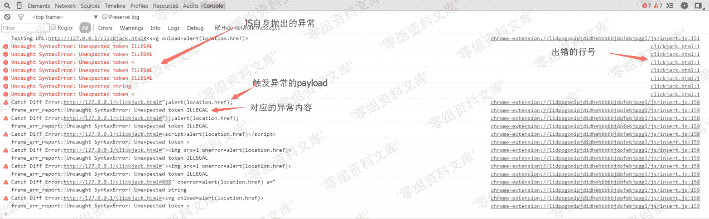

# XssSniper

> 原文：[http://book.iwonder.run/Tools/游览器插件/xss.html](http://book.iwonder.run/Tools/游览器插件/xss.html)

## 介绍说明

一直以来，隐式输出的 DomXSS 漏洞难以被传统的扫描工具发现，而 XssSniper 是依托于 Chrome 浏览器的扩展，通过动态解析可以快速准确的发现 DomXSS 漏洞。

此外，本扩展不仅可以发现隐式输出的 XSS，还可以发现显示输出的 DomXSS，反射式 XSS，自动寻找 JSONP 的 XSS，以及检测 SOME 漏洞（同源方法执行）。

## 下载地址

### 谷歌游览器

[https://chrome.google.com/webstore/detail/xsssniper/pnhekakhikkhloodcedfcmfpjddcagpi?hl=zh-CN](https://chrome.google.com/webstore/detail/xsssniper/pnhekakhikkhloodcedfcmfpjddcagpi?hl=zh-CN)

### 官方下载地址

[https://0kee.360.cn/domXss/XssSniper.crx](https://0kee.360.cn/domXss/XssSniper.crx)

## 使用说明

### 原理

#### XSS 检测原理

本扩展采用了两种方法去检测 DOMXSS。

#### 第一种方法：FUZZ

这种检测方法误报率非常低，只要是检测出来的一定都是都是存在漏洞的。但是代价是漏报率也比较高。 具体来说是在当前页面中创建一个隐形的 iframe，在这个 iframe 中采用不同字符组合截断的 payload 去 fuzz 当前页面中的每个 url 参数，以及 location.hash 参数。如果 payload 执行，说明漏洞一定存在。

#### 第二种方法：监控 js 错误变化

如果 xss 存在方式比较隐蔽，或者需要非常复杂的字符组合来截断的话，payload 是无法正常执行的，然而尽管如此，payload 可能会引发一些 js 语法异常，扩展只需要检测这些异常就可以。然后提示用户错误位置，错误内容，错误的行数，让用户手工去 因此以这种方式检测 XSS，漏报少，但是代价是误报较高。

两种检测方式相互结合，取长补短。

#### 使用方法

打开控制面板

第一次使用的时候请手工更新一下策略，将测试目标填入列表中。tester 并非是主动检测这些列表域名中的漏洞。而是在你浏览这些网站时，检测当前页面中的 XSS 漏洞。 所以，开启 fuzz 后，只需要正常浏览这些网站即可。

##### 第一种报警方式：payload 直接执行

如果在浏览过程中发现弹出了对话框，显示一个带有 xss payload 的 url，如下图，说明该 url 可以触发 XSS 漏洞。

按下 F12 打开 console 控制台，测试过的 URL 都会在里面显示。将刚刚对话框中显示的 url+payload 复制出来即可。

##### 第二种报警方式：payload 使 js 抛出异常

如果在浏览页面时候右下角弹出如下告警，说明 payload 使 js 抛出了不同的异常。

此时打开 F12 打开控制台，依照图示找到异常内容和触发异常的 payload，另外还可以找到抛出异常的文件和行号，方便调试

##### 第三种告警：JSONP 反射式 XSS

若发现如下告警，说明页面中使用的 jsonp 存在 xss 漏洞。url 已经在提示中给出。

##### 第四种告警：SOME 漏洞

当扩展发现当前页面中的参数在 jsonp 也出现时，就会给出以下告警，需要测试者手工确认页面参数能否影响 jsonp 的返回参数。

